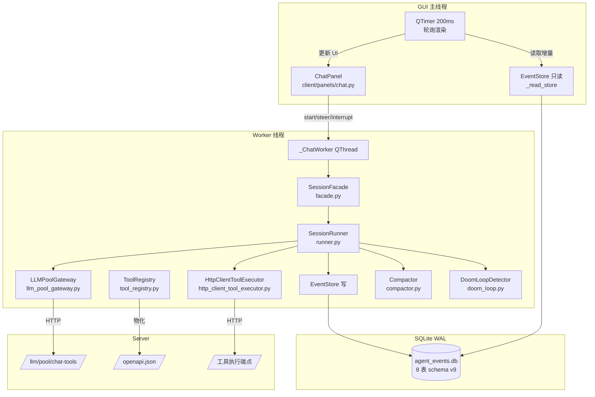

# v6-lite 对话引擎架构

本文档描述 client 端 v6-lite 对话引擎的核心组件、数据存储、与 GUI 面板的桥接机制。引擎设计真源是 `temp/sdd/chat-panel-v2/decisions.md`（D1-D47）和 `temp/sdd/chat-engine-safety-fixes/spec.md`，本档是持久化摘要。

> **范围说明**：v6-lite 是 v6 全量 13 文档的"砍范围开工"版本，EventStore 砍到 4 张核心表 + 后续安全修复阶段扩到 7 张表。详见 [ADR 0006](file:///<project_root>/docs/adr/0006-v6-lite-scope-cut.md)。

## 1. 概述

v6-lite 对话引擎是 client 端的 LLM agent 运行时，负责：

- 接收用户输入 → 调用 LLM → 执行工具调用 → 写回会话事件
- SQLite 持久化所有对话内容（关机/崩溃可恢复）
- L2 上下文压缩（token 超 85% 阈值时摘要 + 保留最近 N 条原貌）
- 死循环检测（thinking_delta 尾重复时中止 + 重试）
- 启动恢复（streaming/awaiting_tools 状态转 interrupted + 补缺失 tool_result）

引擎是**纯 Python 实现**（不依赖 Qt），通过 `SessionFacade` 暴露给 GUI worker 线程调用。GUI 通过 QThread + Signal/Slot 桥接，主线程只读 EventStore 渲染。

## 2. 核心组件

所有组件位于 [client/core/agent/](file:///<project_root>/client/core/agent/) 目录。

| 组件 | 文件 | 类名 | 一句话职责 |
|------|------|------|------------|
| 会话运行器 | [runner.py](file:///<project_root>/client/core/agent/runner.py) | `SessionRunner` | 对话主循环（纯逻辑，所有 I/O 通过 deps 注入）。持有 `has_attempted_reactive_compact`/`has_attempted_nudge` 防死循环标志位（retry 不重置），跨工具追踪 terminal。`run()` 是 wrapper，try/finally 确保 terminal 清理 + 捕获 CancelledError 写 `user_interrupted` transition |
| 事件存储 | [event_store.py](file:///<project_root>/client/core/agent/event_store.py) | `EventStore` | SQLite 持久化对话事件。`threading.Lock` 串行化所有 DB 操作，WAL 模式，`check_same_thread=False` 跨线程访问。建表/迁移幂等（CREATE TABLE IF NOT EXISTS + ALTER TABLE ADD COLUMN） |
| 上下文压缩器 | [compactor.py](file:///<project_root>/client/core/agent/compactor.py) | `Compactor` | L2 上下文压缩。`should_compact()` 估算 token 超 85% 阈值时返回 True；`compact_with_result()` 调 LLM 生成摘要 + 保留最近 `tail_keep` 条原貌，返回 `CompactionResult`（含 `compaction_occurred` 标记防 fail-open 误判） |
| 工具注册表 | [tool_registry.py](file:///<project_root>/client/core/agent/tool_registry.py) | `ToolRegistry` | 从 server `/openapi.json` 物化工具 catalog，4 类分桶存储（builtin/core_mcp/localagent_sub/other_mcp/REST）。加载 `data/client/tool_specs.yaml` 说明书配置，`refresh()` fail-open 保留旧 catalog |
| LLM 网关 | [llm_pool_gateway.py](file:///<project_root>/client/core/agent/llm_pool_gateway.py) | `LLMPoolGateway` | 经 server `/llm/pool/chat-tools` 调用 LLM。实现 `LLMGateway` 协议（`async def call`），不自建 provider client——key 轮换/重试/熔断由 server pool 处理。内置看门狗配置（`stream_idle_timeout_secs`/`stall_detection_window_secs`） |
| 启动恢复器 | [reconciler.py](file:///<project_root>/client/core/agent/reconciler.py) | `reconcile()` 函数 | 扫描 `streaming/awaiting_tools` 状态 session → 标记 `interrupted`；扫描 `pending/running` tool_calls → 无对应 tool_result 时补 `is_error=true` 的 tool_result（yieldMissingToolResultBlocks，防 provider 400）；扫描未合并 streaming 事件 → 合并为完整 Message。幂等可重复运行 |
| 会话门面 | [facade.py](file:///<project_root>/client/core/agent/facade.py) | `SessionFacade` | 纯 Python Facade 封装 SessionRunner。GUI worker 通过它调用引擎，核心逻辑不依赖 Qt。一个 facade 实例对应一次 `run()`。提供 `start/steer/interrupt/events` 接口，`_start_lock` 串行化 start 防并发，保存 `_runner_task` 供 interrupt 时 `task.cancel()` |
| 死循环检测器 | [doom_loop.py](file:///<project_root>/client/core/agent/doom_loop.py) | `DoomLoopDetector` | thinking_delta 尾重复检测。滑动窗口 O(n²) 算法，命中后 mid-stream abort + retry budget disarm + backoff + 重新请求（注入"避免重复"提示）。非线程安全（单 session 单线程使用） |

**辅助组件**：

| 组件 | 文件 | 类名 | 用途 |
|------|------|------|------|
| L0 大结果落盘 | [l0_artifact_store.py](file:///<project_root>/client/core/agent/l0_artifact_store.py) | `L0ArtifactStore` | content > 8KB 阈值时落盘到 `<artifacts_dir>/<session_id>/<tool_call_id>.txt`，返回 preview+path 提示 |
| 模板存储 | [template_store.py](file:///<project_root>/client/core/agent/template_store.py) | `Template` | 对话模板 CRUD（`data/chat_templates.json`）。字段：id/name/prompt/skills/created_at/updated_at |
| 内置工具执行器 | [builtin_tool_executor.py](file:///<project_root>/client/core/agent/builtin_tool_executor.py) | `BuiltinToolExecutor` | 注册 10 个内置工具（file_read/write/edit/grep/glob/ls/delete + web_search/web_fetch + ask_user），按 name 路由执行 |
| HTTP 工具执行器 | [http_client_tool_executor.py](file:///<project_root>/client/core/agent/http_client_tool_executor.py) | `HttpClientToolExecutor` | 经 HTTP 调用 server 端点执行工具。`_denied_cache`：用户拒绝审批后同 (tool_name, args) 再次调用直接返回缓存 |
| 数据类型 | [types.py](file:///<project_root>/client/core/agent/types.py) | `Message`/`Event`/`Session`/`LLMRequest`/`LLMResponse`/`ToolCall`/`ToolResult`/`ToolExecutor`/`LLMGateway`/`RunnerDeps`/`RunnerConfig`/`RunOutcome` | 引擎所有核心数据类型 + Protocol 定义 |

## 3. EventStore Schema

当前 `_SCHEMA_VERSION = 9`（[event_store.py L65](file:///<project_root>/client/core/agent/event_store.py)）。完整 schema 定义在 `_SCHEMA_SQL` 常量（L68-L185）。

> **版本演进**：v5（chat-panel-v2 T01）→ v6（chat-engine-safety-fixes 加 events 表预留字段）→ v7（client_message_ids 幂等去重）→ v8（runner_state 持久化）→ v9（compactions 审计表）

### sessions 表（核心会话元数据）

| 字段 | 类型 | 说明 |
|------|------|------|
| `id` | TEXT PK | 会话 ID |
| `title` | TEXT | 会话标题 |
| `mode` | TEXT | 默认 `'dialogue'` |
| `status` | TEXT | 默认 `'idle'`（idle/streaming/awaiting_tools/interrupted/user_interrupted/idle 等状态机） |
| `created_at` / `updated_at` | REAL | 时间戳 |
| `prompt_index` | INTEGER | v6 预留：当前 prompt 序号 |
| `last_compaction_prompt_index` | INTEGER | v6 预留：上次压缩时的 prompt 序号 |
| `group_name` | TEXT | chat-panel-v2 T01：分组（NULL = 未分组） |
| `pinned` | INTEGER | chat-panel-v2 T01：置顶（0=否，1=是） |

### messages 表（消息流）

| 字段 | 类型 | 说明 |
|------|------|------|
| `id` | TEXT PK | 消息 ID |
| `session_id` | TEXT FK | 关联 sessions.id |
| `seq` | INTEGER | 会话内自增序号 |
| `role` | TEXT | user/assistant/tool/system |
| `content_json` | TEXT | 消息内容 JSON |
| `tool_call_id` | TEXT | tool 消息关联的 tool_call ID |
| `source` | TEXT | 默认 `'user'`（user/assistant/steer/queue/summary/synthetic 等） |
| `visible` | INTEGER | 默认 1（synthetic 消息 visible=0，不显示但参与上下文） |
| `created_at` | REAL | 时间戳 |
| `tool_calls_json` | TEXT | assistant 携带的 tool_calls（OpenAI 格式） |
| `thinking_json` | TEXT | LLM thinking 内容 |
| `model` | TEXT | assistant 消息的模型名（chat-panel-v2 T01） |

### 其他 5 张表（v6-v9 安全修复阶段新增）

| 表 | 用途 | 引入版本 |
|----|------|----------|
| `events` | append-only 事件流（含 `prompt_index`/`invalidated_seq` v6 预留字段） | v6 |
| `tool_calls` | 副作用前先落 durable record（pending → running → ended） | v6 |
| `usage` | 每次 LLM 调用的 token usage 持久化（失败/断流也落库） | v6 |
| `client_message_ids` | 客户端幂等去重 | v7 |
| `runner_state` | runner 关键状态持久化（每 session 一行，含 `has_attempted_reactive_compact`） | v8 |
| `compactions` | 压缩历史审计 | v9 |

## 4. chat-panel-v2 关键设计

实现位于 [client/panels/chat.py](file:///<project_root>/client/panels/chat.py)。设计真源是 `temp/sdd/chat-panel-v2/decisions.md` D1-D47。

### 开始页 `_StartPage`

首次启动 / 点新对话 / 删除当前会话后右侧主区显示。包含输入框（Ctrl+Enter 发送，Enter 换行）+ 模板 tab（默认空白 + "+" 新建）+ 最近 5 对话。`send_requested` 信号携带 text / template_skills[] / group_name。

### 模板管理 `_TemplateManagerPanel`

左侧列表 + 右侧编辑区（name / prompt / skills 复选框）。失焦自动保存（focusOutEvent / editingFinished 信号触发 `template_update`）。数据层复用 `template_store` CRUD。

### 侧边栏

元界面区（新对话/模板管理，固定顶部）+ 置顶区（按 updated_at 倒序）+ 分组列表（UTF-8 顺序排序组名，组内 updated_at 倒序）+ 实时按标题过滤搜索框（D15）。`QTimer` 2 秒低频刷新会话列表。三点菜单：删除（确认对话框）/重命名（行内编辑）/移动到分组/置顶-取消置顶/导出（QFileDialog）。

### 消息时间线块结构

`_MessageTimeline` 容器管理 seq 顺序追加，每段独立块类。基类 `_TimelineBlock` 派生 5 种块类型：

| 块类 | 用途 |
|------|------|
| `_UserBubble` | user / steer / queue 消息。user 右对齐 ACCENT_WASH bubble；steer 右对齐 WARNING 色"用户引导"标记；queue 右对齐 INFO 色"排队中"标记 |
| `_AssistantTextBlock` | assistant 文本回复块（左对齐无 bubble，setMarkdown 渲染） |
| `_ThinkingBlock` | LLM thinking 内容块（默认折叠，展开无滚动） |
| `_ToolCallBlock` | 工具调用折叠卡（默认折叠为单行 tool 名 + 状态点，展开后三部分：原请求 + 原结果 + 格式解析） |
| `_SystemBlock` | 系统消息块 |

### 对话控制三模式（D34）

runner 运行中输入框上方显示 3 tab，单一发送键按当前 tab 触发：

| 模式 | 常量 | 行为 |
|------|------|------|
| 发送 | `MODE_SEND` | runner 中断 + 已生成 assistant 文本保留为中断消息 + start 新 run |
| 队列 | `MODE_QUEUE` | 存排队区单条（D36a 超出禁用 tab），run 完成后自动 start |
| 引导 | `MODE_STEER` | `facade.steer()` 注入消息不打断当前 run，引导消息以 user 样式 + 小字标记展示 |

空闲态只显示"发送"tab；运行态显示全部 3 tab，默认切到"引导"tab。排队区消息有编辑按钮，点击取消排队并把内容追加到输入框末尾。

## 5. ChatPanel 与引擎的桥接

### QThread worker 架构

文件：[client/panels/chat.py](file:///<project_root>/client/panels/chat.py)

- **`_ChatWorker(QThread)`**：后台线程跑 `SessionRunner.run()`（经 SessionFacade 封装）
  - worker 线程内创建自己的 `EventStore`（写）+ `LLMPoolGateway` + `ToolRegistry` + `HttpClientToolExecutor` + `SessionFacade`
  - 通过 Signal 通知主线程，禁止 worker 直接触发 widget
  - `run()` 创建新 event loop，运行 `facade.start()`
  - `interrupt()` 主线程调用，`call_soon_threadsafe` 在 worker loop 内 set interrupt_event
  - `steer(text)` 主线程调用，`call_soon_threadsafe` 在 worker loop 内调 `facade.steer`

### 双 EventStore 架构

- 主线程：`_read_store`（EventStore 只读，QTimer 200ms 轮询渲染中间状态）
- worker 线程：`_ChatWorker` 持有自己的 EventStore（写）+ SessionRunner
- 两个 EventStore 实例共享同一 DB 文件（SQLite WAL 支持并发读不阻塞写）

### 关键调用代码位置

| 操作 | 位置 |
|------|------|
| `from ... import SessionFacade` | chat.py 顶部 import |
| `self._facade = SessionFacade(deps=deps, config=config)` | _ChatWorker.run() 内创建 |
| `template_skills` 注入 system prompt | chat-panel-v2 T04：传 template_skills 给 facade.start |
| `self._worker.start()` | 主线程发送时启动 worker |
| `self._poll_timer.start()` | 主线程启动 200ms 轮询 timer |

## 6. 关键运行时机制

### 6.1 DoomLoopDetector 触发条件

文件：[doom_loop.py](file:///<project_root>/client/core/agent/doom_loop.py)

**配置**（`DoomLoopConfig`）：

| 字段 | 默认值 | 说明 |
|------|--------|------|
| `enabled` | True | 总开关 |
| `tail_size` | 2000 | 检测窗口大小（最近 N 字符） |
| `min_repeat_len` | 50 | 最小重复单元长度 |
| `repeat_threshold` | 3 | 连续重复次数阈值 |
| `max_retries` | 3 | 命中后最多重试次数 |
| `backoff_base_ms` | 200 | 基础退避毫秒 |
| `backoff_jitter_ms` | 300 | 退避抖动毫秒 |

**检测范围**：仅 `thinking_delta` 流的尾重复（不扩展到 `text_delta` / 工具指纹）。

**触发算法**：维护 `tail_window` 字符串，tail 长度 ≥ `min_repeat_len * repeat_threshold` 时启动 O(n²) 滑动窗口检测，从大 L 开始尝试找到第一个匹配的重复单元。

**命中后处理**：mid-stream abort → retry budget disarm → backoff → 重新请求（注入"避免重复"系统提示）→ 最多重试 3 次，连续命中写 error event 终止。`stop_reason` 标记为 `"doom_loop"`，runner 主循环检查此 stop_reason 走 retry 路径。

### 6.2 Reconciler 启动恢复

文件：[reconciler.py](file:///<project_root>/client/core/agent/reconciler.py)

GUI 启动时在 `ChatPanel._init_read_store` 中 `store.init()` 后调用 `reconcile()`：

1. 扫描 `streaming/awaiting_tools` 状态 session → 标记 `interrupted`
2. 扫描 `pending/running` tool_calls → 无对应 tool_result 时补 `is_error=true` 的 tool_result（防 provider 400）
3. 扫描未合并 streaming 事件 → 合并为完整 Message → 标记 `invalidated`

幂等可重复运行。详见 [ADR 0012](file:///<project_root>/docs/adr/0012-session-manager-in-memory-only.md)。

### 6.3 Compactor 压缩策略

文件：[compactor.py](file:///<project_root>/client/core/agent/compactor.py)

- `should_compact()`：估算 token 超 85% 阈值时返回 True
- `compact_with_result()`：调 LLM 生成摘要 + 保留最近 `tail_keep` 条原貌
- `CompactionResult.compaction_occurred` 标记防 fail-open 误判
- `RunnerDeps.doom_loop_config` 注入时创建 detector，None 时禁用
- `has_attempted_reactive_compact` 标志位 retry 不重置（防死循环）

## 7. ADR 引用

| ADR | 标题 | 核心决策 |
|-----|------|----------|
| [ADR 0006](file:///<project_root>/docs/adr/0006-v6-lite-scope-cut.md) | v6-lite 砍范围开工 | v6 全量 13 文档降级为参考库，EventStore 砍到 4 表，6 周垂直切片替代 P0-P6 |
| [ADR 0012](file:///<project_root>/docs/adr/0012-session-manager-in-memory-only.md) | 会话管理层纯内存不持久化 | SessionManager 授权状态纯内存，后端重启重置为 NO_PERMISSION（防幽灵授权） |
| [ADR 0016](file:///<project_root>/docs/adr/0016-chat-engine-bookkeeping-only.md) | chat 引擎只记账不控制 | 删 cost 字段（dead field），新增 `total_tokens` 仅记账，`wall_clock_budget_secs` 是唯一预算控制 |

## 8. 架构图

## 9. 相关文档

- [ADR 0006 - v6-lite 砍范围开工](file:///<project_root>/docs/adr/0006-v6-lite-scope-cut.md)
- [ADR 0012 - 会话管理层纯内存不持久化](file:///<project_root>/docs/adr/0012-session-manager-in-memory-only.md)
- [ADR 0016 - chat 引擎只记账不控制](file:///<project_root>/docs/adr/0016-chat-engine-bookkeeping-only.md)
- [agent-guide.md](file:///<project_root>/docs/agent-guide.md) — 任务路由系统
- [todos-wip.md](file:///<project_root>/docs/todos-wip.md) — 待办与 WIP 系统
- `temp/sdd/chat-panel-v2/decisions.md` — chat-panel-v2 设计真源（D1-D47）
- `temp/sdd/chat-engine-safety-fixes/spec.md` — 引擎安全修复设计真源
