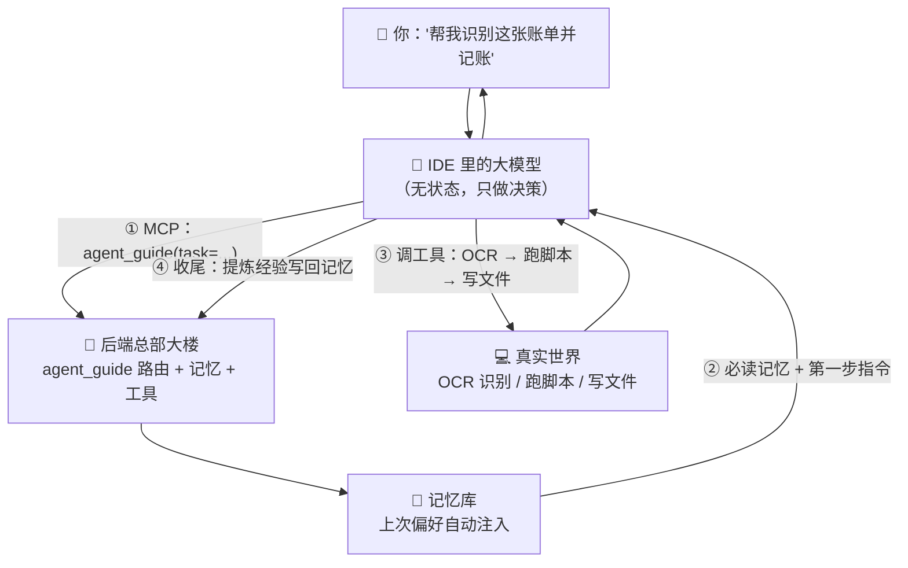
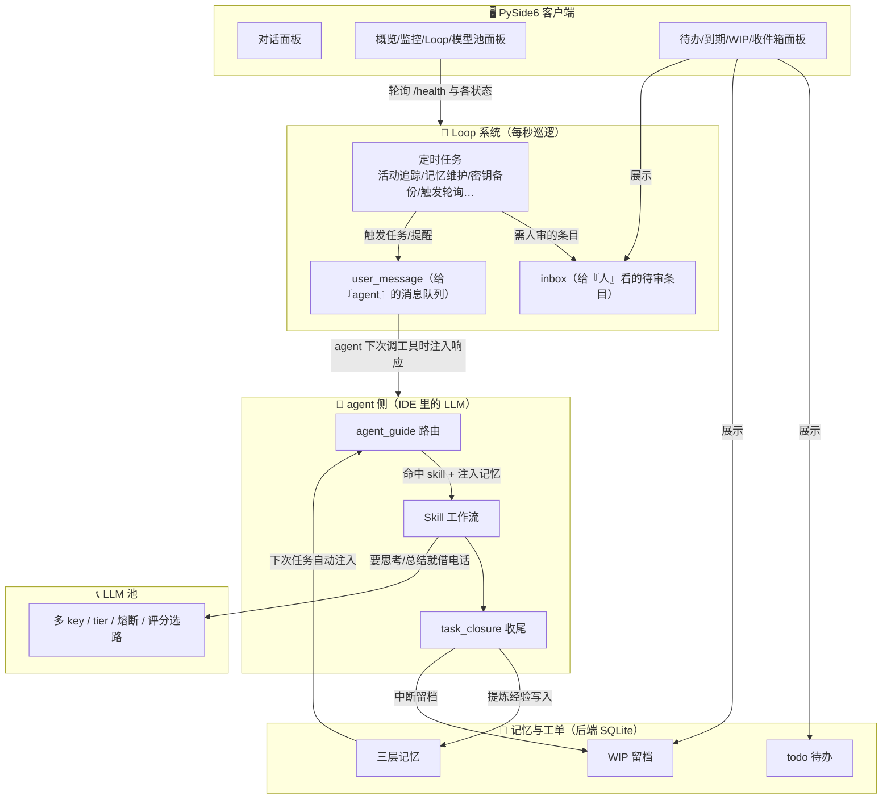
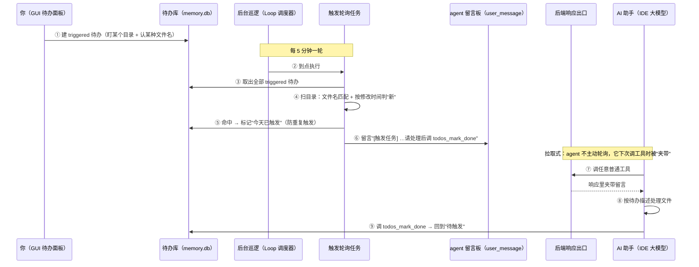
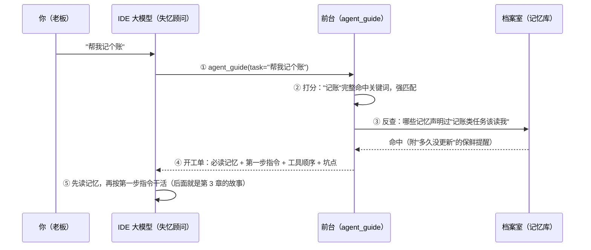

# LocalAgent 项目深度导览（project-intro）

> **这份文档写给谁**：第一次打开这个仓库、想搞明白"这项目到底在干什么、怎么运转、我该从哪看起"的人——无论是新维护者、接手的开发者，还是纯粹好奇的朋友。
>
> **写作原则**：每个概念都是「① 一句话人话 → ② 打个比方 → ③ 真实代码在哪」。比喻是主干，别跳过；代码路径是给"想深挖时知道去哪"用的。
>
> **本文不写易漂移的统计数字**（工具数、面板数、版本号之类），需要数量时一律指向代码常量、运行时清单或目录本身——静态数字必然过时，指向真源零维护。这也是本文自己的可靠性机制，见[附录 C](#附录-c本文的可靠性说明)。
>
> **路径约定**：本文路径均相对项目根目录。文中链接指向的文件都在仓库里，点开即验。

## 写作进度

**全文定稿：第 0-20 章 + 附录 A-D 全部完成。** 第 20 章 FAQ 设计为可持续追加——真实读者问出的新问题核实后回流到那里。各批次的验证记录见[附录 C](#附录-c本文的可靠性说明随批次更新)。

## 章 → 模块映射表（维护者必看）

**你改了哪个模块，就该检查本文哪一章**——这条规则已写入 `.agents/rules/project_rules.md`：

| 你改了哪 | 检查本文哪章 | 状态 |
|---|---|---|
| 项目定位 / README | 第 1 章 | ✅ 已写 |
| `server/main.py` 组装 / 新增一级目录 | 第 2 章 | ✅ 已写 |
| `server/agent_guide*`、`server/memory/`、审批链 | 第 3 章 | ✅ 已写 |
| `server/todos/`、`server/activity_tracker/`、`server/user_message.py`、GUI 面板增删 | 第 4 章 | ✅ 已写 |
| `workspace/*` 组件、`.agents/skills/` | 第 5 章 | ✅ 已写 |
| 核心机关深描：任务路由 / 记忆 / 网关与审批 / LLM 池 | 第 6-9 章 | ✅ 已写 |
| 核心机关深描：屏幕/浏览器/对话引擎 | 第 10-11 章 | ✅ 已写 |
| 经验沉淀：Skill / workspace 组件 / Todo / SDD / ADR | 第 12 章 | ✅ 已写 |
| 挂机生态 / 工具生态 / 源码分发 | 第 13-15 章 | ✅ 已写 |
| 配置与密钥 / 安全与隐私 / 开发流程 | 第 16-18 章 | ✅ 已写 |
| 部署 / 上手路线 | 第 19 章 | ✅ 已写 |
| FAQ / 常见误解 | 第 20 章 | ✅ 已写 |

---

## 目录

| 章节 | 内容 |
|---|---|
| [0](#0-三种读法先挑一种) | 三种读法，先挑一种 |
| [1](#1-它到底是什么人话版) | 它到底是什么（人话版） |
| [2](#2-全景地图) | 全景地图：四个角色 + 目录地图 + 数据从哪来到哪去 |
| [3](#3-跟一条任务走完全程) | **跟一条任务走完全程**（全文最重要的一章） |
| [4](#4-宏观工作流各子系统怎么咬合成一台机器) | **宏观工作流：各子系统怎么咬合成一台机器** |
| [5](#5-项目能做什么真实案例与可扩展性) | 项目能做什么：真实案例与可扩展性 |
| [6](#6-核心机关-aagent_guide项目的开机自检--记忆唤醒) | 核心机关 A：agent_guide——项目的"开机自检 + 记忆唤醒" |
| [7](#7-核心机关-b三层记忆) | 核心机关 B：三层记忆 |
| [8](#8-核心机关-cmcp-三层网关审批链与对外边界) | 核心机关 C：MCP 三层网关、审批链与对外边界 |
| [9](#9-核心机关-dllm-并发池) | 核心机关 D：LLM 并发池 |
| [10](#10-手和眼睛computer-use浏览器ocr-与远程-vl) | 手和眼睛：Computer Use、浏览器、OCR 与远程 VL |
| [11](#11-大脑与面孔对话引擎gui-与界面设计系统) | 大脑与面孔：对话引擎、GUI 与界面设计系统 |
| [12](#12-经验怎么沉淀skillworkspacetodosdd-与-adr) | 经验怎么沉淀：Skill、workspace、Todo、SDD 与 ADR |
| [13](#13-挂机与自动化生态) | 挂机与自动化生态 |
| [14](#14-工具与集成生态) | 工具与集成生态 |
| [15](#15-源码分发系统) | 源码分发系统 |
| [16](#16-配置与密钥纪律) | 配置与密钥纪律 |
| [17](#17-安全与隐私模型) | 安全与隐私模型 |
| [18](#18-开发工作流与测试) | 开发工作流与测试 |
| [19](#19-怎么跑起来从零到第一次真实任务) | 怎么跑起来：从零到第一次真实任务 |
| [20](#20-常见误解与常见问题faq) | 常见误解与常见问题（FAQ） |
| [附录 A](#附录-a术语表) | 术语表 |
| [附录 B](#附录-b关键文件速查) | 关键文件速查 |
| [附录 C](#附录-c本文的可靠性说明随批次更新) | 本文的可靠性说明（随批次更新） |
| [附录 D](#附录-d读者自测-25-问) | 读者自测 25 问 |

---

## 0. 三种读法，先挑一种

> **本章作用**：帮你选阅读路线——三种读法各对应一个目的（10 分钟了解 / 动手上手 / 彻底搞懂设计），每条带最小验收标准。先挑一条再进正文，不走弯路。

**读法一：我只有 10 分钟，想知道这是个啥**
→ 读第 1 章 + 第 2 章的架构图。读完你应能向朋友转述"这是什么、和网页版 AI 有什么不同"。

**读法二：我要用它 / 接手维护它**
→ 按顺序读第 1、2、3、4 章，然后按第 19 章跑起来（细节速查 `docs/deployment.md`）。读完你应能完成后端启动 + 完成一次真实记账任务。

**读法三：我要彻底搞懂它的设计**
→ 从第 1 章一路读下去，边读边打开对应 `.py` 文件；第 3、4 章值得读两遍；遇到"为什么这样设计"就去 `docs/adr/` 找决策记录。读完你应能画出宏观工作流咬合图、说出每个核心机关的取舍理由。

---

## 1. 它到底是什么（人话版）

> **本章作用**：给第一次接触本项目的人建立第一印象——读完你能用一段话向别人转述"它是什么、和网页版 AI 差在哪、它不是什么"，并知道作者自己拿它干了什么（以及哪些部分你不会有）。

### 一句话

**LocalAgent 是跑在你自己 Windows 电脑上的私人 AI 助理系统。它让你正在用的 AI（不管哪个 IDE 里的模型）能"看见屏幕、操作浏览器、跑代码、读写文件、记住你的习惯"，并且这套能力对所有 AI 软件通用。**

### 它实际被用来干什么（作者的真实用法，供想象）

**先说清楚一件事**：下面这些是**作者本人的私有组件**——它们依赖作者自己的数据源（微信本地聊天库、行情数据、账单文件、个人笔记库），仓库分发包里**不含**这些数据。你拿到手**不能开箱即用**，也不该期待它们直接能跑。它们写在这里，是让你看到这套机制实际能长出什么（细节与孵化路径见[第 5 章](#5-项目能做什么真实案例与可扩展性)）：

- **记账**：微信/支付宝导出的账单丢给 AI → 自动识别每笔交易并分类 → GUI 窗口人工审核 → 写入个人账本。
- **股市观察**：交易日的开盘/收盘/晚间，后端定时唤醒 AI 自动生成行情分析；白天可随时插问。
- **群聊简报**："把 XX 群上个月的聊天整理成简报"——直接读本地微信数据库，导出结构化摘要。
- 此外还有抽卡记录采集、网页存档、作业平台对接、磁盘管家等一批同类组件。

**看这些案例，重点不是"这些功能你也有"**，而是：它们全是同一套通用机制（任务路由、记忆、定时调度、审批、GUI 组件注册）长出来的产物。作者的数据源你没有，但机制是同一套——你的同类自动化走[第 5 章](#5-项目能做什么真实案例与可扩展性)的孵化路径就能长出来，那才是真正可复用的部分。

### 打个比方：一家只有一个人的公司

想象你开了一家"个人助理事务所"：

```
                    ┌──────────────────────────────┐
   你（老板）──────▶│   各种 AI 软件（IDE 客户端）  │
                    │  Trae / Claude Code / Codex  │
                    │  ← 这些只是"临时来帮忙的顾问"  │
                    └──────────────┬───────────────┘
                                   │ MCP 协议（一种标准电话线）
                                   ▼
                    ┌──────────────────────────────┐
                    │    LocalAgent 后端（总部大楼）  │
                    │                              │
                    │  📁 档案室：记忆、待办、WIP     │
                    │  📞 总机：LLM 池（多张 AI 电话卡）│
                    │  📋 SOP 手册：Skill 工作流库    │
                    │  🖐️ 手和眼睛：截屏、鼠标键盘     │
                    │  🌐 对外窗口：浏览器、OCR、文档    │
                    └──────────────────────────────┘
```

**关键点**：IDE 里的那个大模型，在这个设计里是**没有记忆的临时顾问**。它很聪明，但每次会话都失忆。所有资料——你的偏好、上次做到哪、踩过什么坑——**全部存在后端总部大楼里**。

所以你可以今天用 Trae、明天换 Claude Code、后天用 Codex，**换软件不丢任何状态**。状态不在软件里，在总部大楼里。这是整个项目最核心的设计决策，没有之一。

### 和"直接用 ChatGPT"有什么不同？

| | 直接用网页版 AI | LocalAgent |
|---|---|---|
| 能看你的屏幕吗 | 只能你手动截图发它 | 自己截屏、自己找窗口、自己定位点击 |
| 能操作你的电脑吗 | 不能 | 鼠标键盘、UIA 语义层、浏览器 CDP |
| 记得上次的事吗 | 同对话内记得，换对话就忘 | 三层记忆 + WIP 留档，跨会话、跨软件 |
| 能定时自己干活吗 | 不能 | Loop 系统，后端开着就一直跑 |
| 花钱方式 | 月费 | 自己配 API Key，按 token 付费，多卡轮换 |

### 它**不是**什么（很重要）

- ❌ **不是框架/SDK**——不是给你 `pip install` 后写业务代码用的
- ❌ **不是产品**——没有多租户、没有登录鉴权、没有 SLA，作者自己一个人用
- ❌ **不是聊天软件**——自带 GUI，但 GUI 是"监控面板 + 顺手对话"，不是微信
- ❌ **不支持跨平台**——Windows 专属。屏幕操控走 Win32 API 和 UIA，换平台等于重写一整层
- ❌ **单个能力不是最强的**——代码能力比不过 Claude Code，浏览器自动化比不过专业 RPA，OCR 比不过商用 API。它的价值在**聚合**：把一整套日常琐事的工作流装进同一个系统、跑在同一份记忆上

> 自验：读到这里，你应该能不看文档回答——"状态存在哪？为什么换 AI 软件不丢？"答不上来就重读本节。其余自测题见[附录 D](#附录-d读者自测-25-问)。

---

## 2. 全景地图

> **本章作用**：给你一张可以反复回看的地图——四个角色怎么连接、每个目录放什么、`data/` 运行时产物谁写的/能不能删。后文任何一章迷路了，都回这张图。

### 四个角色

```
┌─────────────────────────────────────────────────────────────┐
│  角色 1：FastAPI 后端                    python -m server.main │
│  "总部大楼"：所有业务逻辑、记忆、状态都在这里                     │
│  端口 8766；REST + MCP（/mcp 端点）双协议                      │
│  启动：start.bat（自动申请管理员权限，键鼠操作需要）               │
└─────────────────────────────────────────────────────────────┘
                    ▲ HTTP/SSE ▲ MCP
┌───────────────────┴────────┐  ┌──────────┴──────────────────┐
│  角色 2：PySide6 桌面客户端  │  │  角色 3：IDE 里的大模型       │
│  "监控面板 + 顺手聊天"       │  │  无状态临时顾问，经 MCP 接入   │
│  start_client.bat          │  │  真正干活的是它，工具是后端的   │
└────────────────────────────┘  └─────────────────────────────┘
┌─────────────────────────────────────────────────────────────┐
│  角色 4：Chromium 调试浏览器             CDP 端口 9222          │
│  ⚠️ 不是你日常在用的那个浏览器！独立用户数据目录（chrome_debug/）  │
│  启动：python tools/browser/start_debug_browser.py            │
└─────────────────────────────────────────────────────────────┘
```

> **为什么浏览器要单独一个？** 隔离。agent 的自动化行为不会弄乱你正在看的网页，你的登录态和插件也不会被 agent 碰到。代价是调试浏览器要单独登录。这是有意的取舍：**稳定可控 > 贴近真实环境**。
>
> **另一个"永不落盘"的设计**：屏幕操控授权。它是高风险能力（agent 能真的动你的鼠标键盘），所以授权被设计成**纯内存状态、后端重启即归零**，且必须你在场弹窗确认。为什么不持久化？因为授权的本质是"**用户在场证明**"——如果存了盘，重启后自动恢复高权限而你人已经离开，就等于一份"幽灵授权"。这条决策记录在 `docs/adr/0012-session-manager-in-memory-only.md`。

### 目录地图（每个目录一句话，详细清单见 `data/project_structure.json`）

| 目录 | 一句话 | 进 git？ |
|---|---|---|
| `server/` | FastAPI 后端（全部业务逻辑） | ✅ |
| `client/` | PySide6 GUI 客户端 + 对话引擎核心库 | ✅ |
| `lib/` | 前后端共享代码（UI 设计系统/录制器/密钥中转/审批路由） | ✅ |
| `tools/` | 通用工具脚本（浏览器/磁盘/发布/审计…，见 `tools/README.md`） | ✅ |
| `workspace/` | 任务工作区（记账/股市/抽卡采集…每个业务一个目录） | ✅（私人数据 gitignore） |
| `.agents/` | AI 行为合同：skill 定义 + 规则 + WIP 留档 | ✅ |
| `docs/` | 专题文档（含本文 + `adr/` 架构决策记录） | ✅ |
| `tests/` | 测试（危险操作必须 mock，见 `project_rules.md`） | ✅ |
| `release/` | 源码分发引擎（打包发给朋友用） | ✅（构建产物除外） |
| `scripts/hooks/` | git 钩子（已启用）：提交前自动检查硬化规则 | ✅ |
| `data/` | **运行时数据**（记忆库/密钥/统计——见下方产物地图） | ❌（仅 `project_structure.json` 例外） |
| `config.toml` | 本机实际配置 | ❌（模板是 `config.example.toml`） |
| `temp/` | 临时脚本 + SDD 产物，可随时清空 | ❌ |
| `private_vault/`、`chrome_debug/` | 私人文档、调试浏览器数据 | ❌ |

### data/ 运行时产物地图（"这文件谁写的？能删吗？"）

| 产物 | 谁写的 | 删了会怎样 |
|---|---|---|
| `data/llm/keys.json` | 你（或密钥面板） | 🔴 **千万别删**——所有 LLM 密钥，不可追溯（有定时备份，见 `tools/backup_secrets.py`） |
| `data/memory/memory.db` | 记忆系统 | 🔴 别删——全部长期记忆、待办、WIP 都在这一个库里 |
| `data/accounting.db` | 记账组件 | 🔴 别删——账本数据（有自己的备份链） |
| `data/activity/` | 活动追踪 Loop | 🟡 删了丢活动历史，不影响功能 |
| `data/inbox.db` | Loop 告警推送 | 🟢 可删（未处理条目会丢） |
| `data/mcp_stats.json`、`data/llm/stats/` | 调用统计 | 🟢 可删，会重新积累 |
| `data/agent.db`（完整路径 `data/client/agent.db`） | 对话引擎 | 🟡 删了丢 GUI 里的聊天记录 |
| `data/secret/secrets.toml` | 你 | 🔴 别删——非 LLM 密钥（有备份） |
| `data/project_structure.json` | 程序维护 | 🟡 唯一进 git 的 data 文件，删了会自动重建 |

### 数据流一张图



> 自验：后端跑起来后，浏览器打开 `http://127.0.0.1:8766/health` 看各模块状态；打开 `/docs` 能看到全部 REST 接口（FastAPI 自动生成的交互式文档，这是探索后端最好的入口）。

---

## 3. 跟一条任务走完全程

> **本章作用**：把第 2 章的静态地图"跑"起来——跟着一条真实任务从你按回车走到经验写回记忆。读完你能对着后端日志指出每一步发生在哪个文件。

**看懂这一章，就看懂了这套系统的大半。** 我们跟着一条任务走（记账是作者的个人组件，选它当例子是因为它的链路最完整——识别、审批、人工闸门、落盘都有；**下面讲的机制全部是通用的**，与组件无关）：

> 你在 IDE 里输入：「识别这张账单图片，记到 Obsidian 里」

### 第 0 步：你按回车之前

后端已经在跑。启动时它已完成（`server/core/lifecycle.py`）：配置校验 → 屏幕模块初始化 → 授权管理器就位（默认无权限——屏幕授权是"用户在场证明"，纯内存、重启归零，见第 2 章）→ LLM 池初始化 → `keys.json` 热重载监听（改密钥不用重启）→ 模型生命周期管理器（本地 OCR/嵌入模型按需加载、空闲卸载，省显存）→ 待办数据迁移（旧格式待办自动搬进新表）→ **Loop 系统开始每秒巡逻** → 终端清理。同时挂上中间件：trace_id、MCP 调用统计、**用户消息注入**（第 4 章会用到）。

### 第 1 步：你的话先进了大模型，不是后端

注意：这句话没有直接进后端。它先进了 IDE 里的大模型——它读完项目的"行为合同"（`AGENTS.md`），合同里用最高优先级写着：**任何任务，第一步必须先调 `agent_guide`，禁止跳过直接干**。

### 第 2 步：大模型调 `agent_guide`，后端"重建上下文"

```python
agent_guide(task="识别这张账单图片，记到 Obsidian 里")
```

后端 `server/agent_guide.py` 拿到任务描述，在注册表（`server/agent_guide_data.py` 的 `GUIDE_REGISTRY`，加上各 workspace 组件动态注册的条目）里做**加权匹配**，命中记账条目。关键来了——该条目上写着：

```python
"consumption_contexts": ["recurring.accounting"]   # 哪类任务该读相关记忆
"trigger_keywords": ["账单", "记账", "bill"]        # 任务描述出现这些词就读
```

后端拿这两个字段去记忆库反向查询，把匹配到的历史记忆（"退款要单独标记，不与消费对冲"之类的偏好/坑点）**自动拼在回复前面**，连同"第一步先干什么（first_action）"、"推荐工具顺序"、"注意事项"一起返回：

```
【必读记忆】以下记忆与当前任务相关，执行前先读取：
  - accounting_refund_handling（上次的退款处理偏好）
first_action: 调 ocr_file 识别账单图片，然后执行 workspace/accounting/bill_converter.py
```

**这就是为什么 `agent_guide` 不能跳过**：它不是"告诉你用哪个 skill"，是**把上次的上下文整个重建出来**。跳过它，大模型就退化成一个失忆的通用 ChatGPT。

### 第 3 步：大模型按指令干活（审批在这里）

大模型照着 first_action 调工具（比如 OCR 识别账单图片）。每个工具调用都会经过后端的安全层：**先查安全分类表**（只读工具直接放行）→ **可疑的让 LLM 预审** → **再不确定的弹窗问你**。执行任意 Python 代码（`exec_python`）就走完整的三层链；写文件只能落在白名单目录。

### 第 4 步：GUI 人工审核（人机协作的关键设计）

识别出的交易不是直接入账。记账组件会弹出 GUI 审核窗口（`workspace/accounting/` 的面板），你逐条确认/修改分类。**涉及钱的操作永远有人工闸门**——这是设计原则，不是巧合。

### 第 5 步：落盘 + 收尾

确认后数据写进本地 SQLite，报告追加进 Obsidian 月度账本。任务完成后，大模型会主动调 `agent_guide(task_type="system.task_closure")` 触发**收尾流程**：评估完成状态 → 处理 WIP 留档 → **提炼这轮的经验**（比如"这个商家的账单分类要特殊处理"）→ 写入记忆（当然要填消费场景字段）→ 向你汇报。

### 循环闭合

下次你再记账，第 2 步的记忆注入里就会出现这次的经验。**系统因为被使用而变好用**——这是它和普通软件最本质的区别。

> 自验：在后端日志（或 IDE 的工具调用面板）里回看一次真实任务，对照上面五步。试着跳过 agent_guide 直接让 AI 干活，观察记忆没有注入时的输出差异。

---

## 4. 宏观工作流：各子系统怎么咬合成一台机器

> **本章作用**：视角从"一条任务"拉高到"一台持续运转的机器"——读完你能说清经验飞轮、两条消息通路、GUI 接线、Loop 巡逻、LLM 池供血各自由谁实现、怎么互相咬合，并能完整复述一条 triggered 待办从建立到触发的全链路（4.6 节，本章灵魂）。

第 3 章看的是"一条任务"。这一章拉高视角：**任务之外，整套系统是怎么持续运转、互相供血的**。先上总图，再逐个子系统拆开——每一节都落到"真实代码在哪"。



### 4.1 经验飞轮：任务结束后，什么保证了"下次更好"

```
任务执行 → task_closure 收尾提炼 → memory_set 写入（带消费场景字段）
        → 下次同类任务 agent_guide 反查召回 →【必读记忆】并入第一步指令 → 表现更好 → …
```

飞轮能转起来，靠四个齿口，每个都能在代码里指出来：

**齿口一：收尾编排（agent 侧的仪式）**。任务结束（或中断）时，agent 主动调 `task_closure` 收尾指引，后端回它一张六步清单：① 评估任务状态（完成还是中断，决定后面走哪几步；含主动收回屏幕授权）→ ② WIP 处理（中断就留档，完成就关闭）→ ③ 经验提炼 + 自检"这条经验以后真会被读到吗" → ④ 查重后写入 → ⑤ 文档自查 → ⑥ 收尾报告。

**齿口二：经验落库带"消费地址"**。提炼出的经验用 `memory_set` 写进 `data/memory/memory.db`。关键约束：写入时必须声明两件事——"哪些类型的任务该读它"（支持全场景通配，也支持按某一大类任务通配）和"任务描述出现什么词该读它"。这两项在库里是专门的索引列，反查时直接交给数据库过滤，快且准。收尾清单里还写死了一条纪律：自检不过就跳过写入——存一条永远不会被读的记忆，等于往飞轮里掺沙子。

**齿口三：下次任务反查召回**。下次 `agent_guide` 认出任务类型时，做两路召回：静态路——按路由条目上登记的记忆 key 直查；动态路——拿任务类型去记忆库反查所有"声明过愿意被这类任务读"的经验（只有触发关键词的旧格式记忆也会进候选），再逐条拿触发关键词跟任务描述比对。命中的每条都标着"因场景命中 / 因关键词命中 / 两者都中"；整趟查询只读不改——列目录不算"读过"，不会污染记忆的使用统计。

**齿口四：注入**。两路结果合并去重、只留真实存在的记忆后（最多 5 条），拼成"【必读记忆】"文本块**放在给 agent 的第一步指令前面**，另附"这条记忆多久没更新了"的过时提醒。agent 拿到的第一条指令里，就已经写着"先读哪些记忆"。

三个载体的分工：**skill** 是"这类活的标准做法"（SOP，沉淀在 `.agents/skills/` 和各 workspace 组件）；**memory** 是"这次具体踩的坑和你的偏好"（带消费地址）；**WIP** 是"上次干到哪了"（中断不留档等于重来）。飞轮转的是后两个，skill 是跑道。

> 深挖：`server/agent_guide.py`（六步清单的编排数据与记忆注入逻辑，搜 `_build_task_guide`）→ `server/memory/manager.py`（按场景 + 关键词反查的实现，搜 `find_consumable_memories`）→ `server/memory/schema.py`（两个"消费地址"索引列的建表语句）

### 4.2 两条消息通路：别搞混"给谁看"

| 通路 | 给谁 | 存哪 | 怎么送达 | 例子 |
|---|---|---|---|---|
| `inbox`（收件箱） | **人** | 独立 SQLite 库 `data/inbox.db` | GUI 收件箱面板展示，你手动处理 | 下载文件三分类待确认、Loop 任务失败告警 |
| `user_message` | **agent** | 后端进程内存（线程安全，重启即丢，刻意不落盘） | **agent 下次调用工具时**被夹带进响应（拉取式） | triggered 待办触发后的"[触发任务] 请处理…" |

新手最常见的误解就是把 inbox 当成 agent 的收件箱——**inbox 是给你看的；agent 的留言板是 user_message，而且"你不来问就收不到"**。

**inbox 的细节**：每条记录都带齐"谁推的、什么类别、标题、描述、附加数据（比如建议的目标路径）、当前状态（待处理/已处理/已忽略）、处理结果和时间戳"。往里推的全是真实功能：下载目录三分类（把文件按"可移动/需检查/认不出"分组请你定夺）、VL 配额建议（只读分析限流日志后推建议）、密钥与组件数据备份失败告警、Loop 任务失败告警（见 4.4）、记忆维护器的验证通知。你在 GUI 收件箱面板里逐条或批量处理。

**user_message 的细节**：消息就放在后端内存里的一小块队列。入口两个——GUI 的"补充指令"功能，以及后端代码自己往里塞。消费端是个巧妙的机关：**后端在把 HTTP 响应交还出去的路上瞄一眼队列**——有待发消息、且这个请求确实可能是 AI 发的（排除清单里只有"绝不会由 agent 主动调用"的地址），就把同一段文本塞进响应头和响应体各一份。AI 经 MCP 协议调工具不走这条出口，工具执行层另有单独的注入通道兜着。消息一旦被取走即清除——**没有 WebSocket、没有后台推话，agent 不伸手就永远收不到**。

> 深挖：`server/inbox.py`（收件箱表结构与全部推送方）→ `server/user_message.py`（内存队列与两个入口）→ `server/core/middleware.py`（响应出口的注入逻辑，含排除清单与 URL 编码、2000 字符截断）

### 4.3 GUI 联动：面板是后端状态的镜子

**面板从哪来**：两个发现源。① GUI 启动时扫一遍内置面板目录，所有合格的面板类自动上桌——新文件丢进去、重启 GUI 就被发现；② 扫各 workspace 组件的 manifest，声明了"我带面板"的组件按声明加载挂进主界面（比如记账的审核面板）。侧边栏按"主面板 → 监控 → 高级"语义分组排序；单块面板写坏了只告警跳过，拖不垮 GUI 启动。

**面板怎么接线**：每块面板都在独立的后台线程里异步发 HTTP——**主线程禁止直调后端**，UI 不卡。每块面板对应后端一块状态：

| 面板（内置） | 读写后端的什么 |
|---|---|
| 概览 | 总体健康状态 + 今天的活动统计 + 模型池用量 + 工具调用统计 |
| 状态监控 | 总体健康状态；屏幕授权的申请/收回 |
| 收件箱 | `data/inbox.db` 的收件箱数据 |
| 待办 hub | 到期待办 + WIP + 收件箱，三源聚合 |
| 到期任务 | 到期待办列表、逐条标记完成 |
| WIP | WIP 留档的读写 |
| 模型池 | 模型清单 + 实时状态 |
| Loop | 定时任务清单；每个任务的暂停/恢复/立即跑一次 |

待办与 WIP 数据在后端住在**同一个 `memory.db`**；面板只经 REST 读写，自己从不碰数据库文件。

**对话面板是唯一的例外**：流式渲染要高频读消息，轮询 HTTP 撑不住——所以主线程直接持有一份**只读**的本地聊天库、定时刷新渲染；后台线程另持一份**可写**的同款实例负责收发消息。两个实例打开同一个 SQLite 文件，靠 WAL 模式做到"并发读不阻塞写"：读的主线程与写的 worker 各用各的连接，互不抢锁。

> 深挖：`client/core/panel_registry.py`（面板自动发现的两个来源与分组排序）→ `client/panels/`（上表每行对应一个文件，文件内有对应后端端点的实测清单）→ `client/panels/chat.py`（双实例 + WAL 的例外设计）

### 4.4 Loop 系统：后端的每秒心跳

**实现**：后端启动时拉起一个后台协程，**每秒醒来一次**检查各定时任务到没到点——自研的精简调度器（"隔 N 秒"与"cron 表达式"两类触发器 + 每秒心跳），没有引第三方调度框架。任务进度（上次运行时间/失败计数/暂停状态）定期原子写盘到 `data/loops/tasks.json`，重启后接着算。还支持补跑：后端重启期间错过的整点（如每小时总结），启动时补上，不丢。

**哪些循环在跑**：一个循环 = config.toml 的一个 `[loops.*]` 段 × 一条内置构建规则（段名即任务名前缀）。内置的有——

| 段（`[loops.*]`） | 干什么 | 触发（代码默认值，config 可覆盖） |
|---|---|---|
| `activity_tracker` | 活动追踪：窗口采集 / 截屏+VL 描述 / 整点总结 / 日总结 / 历史清理 | 60s / 300s / `0 * * * *` / `30 5 * * *` / `30 0 * * *` |
| `download_watcher` | 扫下载目录，文件数超阈值触发三分类 → inbox | 300s |
| `todos_trigger` | triggered 待办触发轮询（4.6 的主角） | 300s |
| `memory` | 记忆维护器：老化 stale 记忆 + LLM 验证 → inbox 通知 | 6 小时 |
| `smart_limit` | VL 配额上限建议：只读分析 429 日志 → inbox | 每天 04:00 |
| `key_health` | LLM key 级健康检查 | 12 小时 |
| `secret_backup` / `workspace_backup` | 密钥 / 组件关键数据定时备份 | 5 天 |
| `headless_session` | 后端自主启动 agent 会话（IDE 关了也能定时跑任务） | cron，默认每天 9 点 |

组件还能经 manifest 挂自己的循环（股市三时段、仓库镜像监控、邮件信源等），启动时合并进同一张调度表。每段有独立开关——比如邮件信源默认关闭；触发轮询在 `config.example.toml` 默认开启，但你本机 config.toml 声明了这个段它才会跑（这正是"机制在代码、开关在配置"）。

**失败保护**：一次失败就推 inbox 告警（同一错误去重防刷屏）；连续失败达到阈值（默认 5 次，可按任务配置）→ **自动暂停** + 再推一条告警。后端重启时，"因连续失败被自动暂停"的任务自动恢复重试（你手动暂停的不会），恢复动作本身也推 inbox 告知。GUI 的 Loop 面板能看到每个任务的下轮运行时间和失败计数，可手动暂停/恢复/立即跑一次。

> 深挖：`server/activity_tracker/loop_manager.py`（每秒心跳主循环、两类触发器、进度落盘与补跑）→ `server/activity_tracker/loop_actions.py`（每类循环具体干什么 + 内置任务构建规则表 `TASK_BUILDERS`）→ `config.example.toml`（`[loops.*]` 各段的开关与默认周期）

### 4.5 LLM 池供血：谁在借电话，打给谁

不管是 GUI 对话、Loop 的整点总结、下载文件分类、记忆压缩、命令预审——**所有 AI 调用都走同一个池**（`server/llm_pool/`）。池怎么知道"这通电话该打给什么档位的模型"？靠一张**用途登记表**：每个用途登记三件事——属于哪类服务（文本对话/视觉理解/内容生成）、内容涉不涉隐私（涉则自动避开标了隐私警告的 key）、允许的模型档位区间（区间内硬匹配，**优先选更低档省 cost**）。摘几个真实条目：

| 用途（登记名） | 干什么 | 档位区间 |
|---|---|---|
| `agent_chat` | GUI 对话/评分端点 | 3-5 |
| `hourly_summarize` | Loop 整点活动总结 | 3-5 |
| `download_watcher` | 下载文件分类（含文件内容，sensitive） | 4-5 |
| `memory_compress` / `memory_validate` | 记忆压缩/验证（处理个人数据，sensitive） | 2-4 |
| `command_guard` | 危险命令的 LLM 预审 | 3-5 |
| `vl_activity_tracker` / `vl_ocr` / `vl_vision` | 屏幕描述 / VL OCR / 界面元素解析 | 2-5 |
| `stock_advisor_opening/closing/evening/query` | 组件自注册（见下）：开盘/收盘 3-5，晚间复盘 4-5，午询 3-5 | — |

**记账**：每次调用都带一个项目标签，按项目分开统计 token 花销——比如 Loop 的总结全记在"整点总结/日总结"名下，月底能算清哪类功能烧钱最多。**组件自注册**：workspace 组件经 manifest 声明自己的用途，启动时自动并入登记表（股市助手的四个就是这么进去的）——删组件目录，用途自动注销。组件自己永远不直连 AI 服务商，这是"一处配置、处处生效"的关键。（池内部的 key 轮换/限流冷却/供应商熔断，见第 9 章。）

> 深挖：`server/llm_pool/types.py`（用途登记表全量与三件套的声明格式）→ `server/llm_pool/pool.py`（按项目记账的落盘点）→ `workspace/stock_advisor/manifest.toml`（组件自注册的真实样例：`[[llm_use_cases]]` 段）

### 4.6 端到端时序：一条 triggered 待办的完整一生（本章灵魂）

把上面五个子系统串成一条线。场景：你想让 agent **在某个目录出现新 PDF 时自动处理**。



（图中角色对应的实现：待办库 → `server/todos/store.py`；后台巡逻 → `server/activity_tracker/loop_manager.py`；触发轮询 → `server/activity_tracker/loop_actions.py`；响应出口 → `server/core/middleware.py`。）

把图翻译成大白话故事：

1. **建任务**：你在 GUI 待办面板建一条 triggered 类型待办，写清"盯哪个目录、认什么文件名"。
2. **巡逻到点**：触发轮询这个循环任务每 5 分钟跑一轮（间隔在配置里可调）。
3. **取出任务**：轮询把所有 triggered 待办捞出来，逐条解析触发条件。
4. **命中判定**：去盯的目录里找文件名匹配、且"足够新"的文件——新鲜窗口取两倍轮询间隔防漏检；单轮最多认 5 个文件防刷屏。
5. **标记已触发**：核实确有其事（事件类型对、文件确实在那个目录下、文件名匹配）后，把这条待办标成"今天已触发、待处理"——你没处理完，它不会重复触发。
6. **给 agent 留言**：往 agent 留言板写一条"[触发任务] '标题' 已满足触发条件…请处理后调 todos_mark_done 重置"。
7. **agent 被动收到**：agent 下一次调用任何普通工具，后端响应出口就把留言夹带进响应——它没问，消息自己来了。
8. **agent 干活**：按待办描述处理文件（查看/移动/归档，具体动作由你建任务时写明）。
9. **重置闭环**：处理完调 `todos_mark_done`，待办从"已触发待处理"重置回"待触发"，等下一个文件。

值得品的细节：第 6 步和第 7 步之间可能隔很久——这正是"拉取式"的含义。可靠性不靠 agent 在线等：**Loop 负责"事件到了别丢"**（待办上的触发标记 + 内存留言双重记忆，后端重启后待办标记仍在），**agent 负责"下次伸手一定拿到"**。

> 自验：GUI 待办面板建一条 triggered 待办（盯你的下载目录，文件名填 `*.txt`）→ 丢一个 txt 进去 → 浏览器打开 `http://127.0.0.1:8766/user/message` 能看到待发留言，下次 agent 调工具时它即被消费。再打开 GUI 收件箱面板对照 `data/inbox.db`，看看 Loop 告警长什么样。

---

## 5. 项目能做什么：真实案例与可扩展性

> **本章作用**：回答"这套机制实际长出了什么"——六个真实案例各自的机制咬合清单 + 从脚本到组件的孵化路径。读完你能判断哪些能力开箱即用、哪些依赖作者私有数据，以及给自己长一个新组件要建哪些文件、从哪读起。

先立规矩（**诚实框架**）：下面六个案例全是**作者本人在用的**，不是演示；它们依赖作者的私有数据源（微信本地库、行情 token、账单文件、个人笔记库、各游戏账号），仓库分发包里不含这些数据，**对你不是开箱即用**。每个案例末尾的"诚实框"写清缺了什么会怎样。真正可复用的是各案例的"**与本项目机制的咬合清单**"——机制是同一套，把你的数据接上去，就能长出你自己的版本。

### 案例一：记账——人机协作的完整闭环

**干什么**：把微信/支付宝导出的账单文件丢给 AI → 解析每笔交易 → 按"商家名→分类"映射表自动归类 → 弹出 GUI 审核窗口**人工逐条确认/修改** → 确认后写入本地账本（SQLite），再一键导出 Obsidian 月度账本（DataviewJS 自动生成收支总览）。

**与本项目机制的咬合清单**（都登记在组件自己的 `manifest.toml` 里）：
- **任务路由**：声明了三件事——一句话触发方式（记账/账单这些关键词）、AI 接活后的第一步（先读上次记账进度的记忆，再检查账单目录有没有新文件）。
- **GUI 面板**：声明"我带一个审核面板"，GUI 启动时自动挂进主界面。
- **数据文件声明**：列出关键数据（账单目录、本地账本库、商家映射表、审核配置），定时备份循环照着这份清单定期自动备份账本。
- **健康检查**：组件汇报自身状态，汇入后端 `/health`。
- **不走后端 HTTP 的点**：审核面板的数据源是**本地 SQLite**（`data/accounting.db`）——涉及钱的读写由面板进程直接做，agent 只负责前面的识别分类，不碰账本写入。

**为什么值得学**：第 3 章那五步走的就是它——"AI 干脏活、人把关键闸门"的模板。

> *诚实框：依赖作者的微信/支付宝账单导出与 Obsidian vault；商家→分类映射（`name_mapping.json`）是作者几年攒的个人数据，你没有——映射要从零攒，但攒的过程本身就是"系统越用越懂你"的飞轮。*

**读代码入口**：`workspace/accounting/manifest.toml`（组件注册全貌：路由/面板/数据备份/健康检查各段）→ `workspace/accounting/loop_actions.py`（路由条目变量 `GUIDE_REGISTRY_ENTRIES`，含触发关键词与 first_action）→ `workspace/accounting/panel.py`（GUI 侧，文件头自述"不走后端 HTTP"）。

### 案例二：股市助手——定时任务 × LLM 池 × 数据源栈的组合样本

**干什么**：每个交易日的三个时点由 Loop 自动唤醒 AI 分析自选股并生成报告（开盘/收盘/晚间深度复盘——晚间含多空辩论环节）；交易时段内还能随时插问、即时回答。

**与本项目机制的咬合清单**：
- **三个时点自动跑 + 盘中随问**：组件经 manifest 声明三个定时任务，具体时刻配在本机 config.toml——工作日 09:35 开盘、15:05 收盘、21:00 晚间复盘。盘中插问不走定时，就是普通对话，路由到专门的"午询"用途。
- **按用途选模型**：manifest 里自注册四类 AI 用途并各自声明档位——开盘/收盘 3-5、晚间深度复盘强制更高档（4-5）、午询 3-5。启动时自动并入 4.5 那张用途登记表。
- **GUI 面板**：manifest 声明自己带面板，自动挂进主界面。
- **数据源栈**（SKILL.md 实录）：baostock（历史 K 线主源，免费稳定）+ 本地列式缓存（`data/stock_history.duckdb`，热/温/冷三级分层，多角度分析复用同一份行情）+ AKShare（实时行情/新闻，刻意克制使用防限速）+ mootdx（TCP 直连）与 Tushare Pro 兜底。
- **密钥纪律**：Tushare 的 token 存 `data/secret/secrets.toml`，经密钥中转读取（第 2 章 data/ 产物地图里"千万别删"的文件之一）。

**为什么值得学**：它把第 4 章的 Loop（4.4）、LLM 池（4.5）、组件自注册（本章末尾的孵化路径）三件事用在同一个业务上，是"机制组合拳"最完整的样本。

> *诚实框：自选股清单（`watchlist.json`）与持仓数据（作者放在 private_vault/，不进分发包）是作者的；Tushare 需要注册 token。没有 token 时 baostock/AKShare/mootdx 三个免费源照常工作，只是兜底链少一环；没有持仓数据，"持仓分析"类报告无从谈起。*

**读代码入口**：`workspace/stock_advisor/manifest.toml`（`[loop_tasks]` 与 `[[llm_use_cases]]` 两段都值得抄）→ `workspace/stock_advisor/loop_actions.py`（定时任务定义变量 `LOOP_TASK_DEFS` 与路由条目）→ `workspace/stock_advisor/SKILL.md`（数据源栈的取舍理由）。

### 案例三：抽卡采集家族——"一个框架吃多个游戏"

**干什么**：自动采集你在各游戏（明日方舟/鸣潮/终末地等）的抽卡记录，去重合并、统计保底进度、跨游戏合并生成一个统一可视化看板。

**与本项目机制的咬合清单**：
- **共享层 `workspace/_shared/`**：各游戏合并后的卡池数据、"每个游戏的稀有度/保底线/卡池分类"共享配置（文件自述为"抽卡汇总工具的唯一真相来源"，改配置刷新看板即生效）、统一可视化看板（一个 HTML 文件）。
- **每个游戏一个组件目录**，结构刻意一致：一份 SKILL.md、该游戏的采集/解析适配器、注册文件（声明自己的任务路由类型）、manifest.toml。
- **"新游戏=新适配器"**：骨架（登录态获取→拉记录→解析→去重入库→统计→看板）在第一个游戏上打磨成型后没再动过；接入新游戏只需写该游戏特有格式的适配器 + 在共享配置里加一段，统计与看板零改动。

**为什么值得学**：可扩展性最硬的证据——后面每个游戏的接入成本只有第一个的零头。你的"多平台数据采集"需求（各邮箱/各网盘/各平台账单…）都能套这个拆法。

> *诚实框：输入是你自己的游戏账号与抽卡记录（需要对应登录态），没账号这些脚本无事可做；`_shared` 里的卡池数据随游戏版本更新需要维护。可搬用的是"骨架 + 适配器 + 共享配置"的结构，不是脚本本身。*

**读代码入口**：`workspace/_shared/gacha/games_config.json`（共享配置长什么样；上一级 `workspace/_shared/` 还有合并卡池数据 `all_game_pools.json`，看板在同目录 `gacha.html`）→ `workspace/arknights_gacha/`（最早打磨的骨架；其注册文件 `loop_actions.py` 里可看路由条目变量 `GUIDE_REGISTRY_ENTRIES` 与 task_type 命名如 `recurring.arknights_gacha`）→ 任一新游戏目录（如 `workspace/wuwa_gacha/`，对比看"适配器"薄了多少）。

### 案例四：群聊总结——几天内从想法到组件

**干什么**：你说"整理 XX 群上个月的聊天"——它按群名子串找到目标群，定向同步该群消息到本地解密库，按时间窗导出结构化切片（MD/JSON），agent 通读后归纳成带发言人与时间标注的简报。不截图、不爬网、聊天记录不出本机。

**与本项目机制的咬合清单**：
- **任务路由**：manifest 注册了"群聊+总结"的组合触发词——特意不用裸"总结"，避免误撞日总结/WIP 类技能。
- **工作流要点**（SKILL.md 实录）：核心是一条命令，给群名子串和时间窗两个参数；流程是"解析群 → 行级备份（保留 3 份）→ 定向同步 → 校验（失败**自动回滚**）→ 按时间窗导出"；增量靠一个"同步到哪了"的游标；导出按时间窗切片、组件本身无状态。
- **不挂 Loop**：manifest 没声明定时任务、备份清单为空——"人叫才跑"的即用型组件。组件化不等于都要定时。

**为什么值得学**：孵化路径（本章末尾）最新的完整样本——临时脚本验证可行 → SKILL.md 沉淀工作流与坑点 → manifest 注册进路由，周期以天计。

> *诚实框：数据管道依赖作者本机的另一个解密项目（独立 venv + 微信本地数据库），是六个案例里私有依赖最重的——没有微信本地库就无法复现，分发包也不含这条管道。可搬用的是"行级备份→同步→校验→失败回滚"的定向同步纪律：任何"把外部数据镜像到本地"的场景都该这么防翻车。*

**读代码入口**：`workspace/chat_digest/SKILL.md`（工作流与坑点，含核心命令 `digest_room.py` 与同步游标 `last_sort_seq`）→ `workspace/chat_digest/manifest.toml`（路由注册：task_type `adhoc.chat_digest`）→ `workspace/chat_digest/digest_room.py`。

### 案例五：网页存档——越用越聪明的浏览器自动化

**干什么**：把一批网页（小黑盒帖子、微信公众号文章、飞书/腾讯文档等）批量存档为本地 Markdown——正文+评论（含子回复）+图片一个不漏；产出按站分目录的 MD、一份机器可读的索引和质量报告。

**与本项目机制的咬合清单**：
- **站点经验库**：`.agents/skills/browser_lessons/sites/` 按域名一文件（现有 B 站、知乎、东方财富、飞书等站点），内容按固定模板分段：浏览器方案 / 反爬风控 / DOM 结构与提取规则 / URL 规则与重定向 / 已知坑 / 修改历史。agent 访问前自动查（`browser_match_site` 会把该站经验自动注入），踩到新坑回写存档（`browser_write_lesson`）——与 4.1 的经验飞轮同构，但作用在浏览器层。
- **调试浏览器**：采集走 CDP 9222 的独立调试浏览器（第 2 章角色 4），不碰你正在用的浏览器。
- **事故防护进代码**：曾发生"部分重跑把索引文件整份覆写、丢掉历史索引"的事故，修复不是加"小心点"的注意事项，而是把索引改成合并模式（按 URL 更新、未重跑条目保留）——SKILL.md 里留着事故记录表，防止未来改代码时回退。

**为什么值得学**：浏览器自动化最大的成本是每个网站的坑都要重踩一次；这套组件把踩坑成本变成一次性投入，越用越便宜。

> *诚实框：存档目标列表是作者自己的书签和关注清单。站点经验库倒是真正通用的——你在哪个网站踩坑，经验就沉淀进哪个网站的文件，拿来即用。*

**读代码入口**：`.agents/skills/browser_lessons/sites/_template.md`（经验文件的标准结构）→ `workspace/web_archive/SKILL.md`（各站点提取规则与事故防护，含索引 `index.json` 与质量报告 `report.md` 的产出约定）。

### 案例六：磁盘管家——把安全规则做进业务

**干什么**：全盘空间扫描分析（优先导入 SpaceSniffer 的 `.sns` 快照离线分析，零磁盘 IO）、大目录下钻、按名定位缓存目录、重复文件查找、生成清理建议并执行；另有系统环境备份（浏览器/游戏存档/桌面）。

**与本项目机制的咬合清单**：
- **任务类型**：即用型（SKILL.md 登记为 `adhoc.disk_cleanup`）；分析工作流五步：扫描 → 下钻 → 定位 → 演练（dry-run）→ 删除。
- **一套脚本族**：快照导入、扫描分析（扫描/树状/文件/重复/缓存等多个查询模式）、清理执行三段——清理先演练出**逐项回执给人审**，确认后才按条目执行删除。
- **删除纪律**：删文件是全项目最危险的动作，规则做进了链路——执行一律走回收站 API（删进系统回收站、可恢复），带路径白名单保护；**物理删除被项目规则明令禁止**（AGENTS.md 磁盘清理规则段）；测试里危险操作必须 mock。

**为什么值得学**：安全设计不是外挂的审批弹窗，而是业务脚本自带的执行路径——想删东西？脚本里根本没有"直接删"这个选项。

> *诚实框：扫的是你自己的硬盘，无私有数据依赖——六个案例里最容易直接搬用的一个。但删除审批纪律必须一起搬：`recycle.py` 的"只进回收站"是这个组件敢存在的前提。*

**读代码入口**：`workspace/disk_manager/SKILL.md`（脚本族与工作流：`parse_sns.py` 快照导入 / `scan_disk.py` 扫描分析 / `cleanup.py` 清理执行）→ `tools/disk/recycle.py`（回收站 API 本体：ctypes 调 Win32 接口，删除可恢复）。

### 组件全景

以上是深描的六个。全部业务组件（记账/股市/各类抽卡采集/群聊总结/网页存档/作业平台/邮件源/内容审核/模型库更新/磁盘管家/录制器…）的完整清单**不在这里手写**——见 `.agents/skills/_index.md` 的"组件化模块"段（由程序自动生成，永远和磁盘一致），或调无参 `agent_guide()` 看路由全量清单。

### 从一个脚本到组件：可扩展的完整路径

每个组件都经历同样的孵化路径，这也是你新增自动化的路径：

```
临时脚本验证可行性（放 temp/，随便造）
  → 值得长期用？建 workspace/<名字>/ 目录，脚本搬进去
  → 要让 AI 一句话就能路由到它？写 SKILL.md（触发词 + 工作流 + 坑点）
  → 要进任务路由和 GUI？加 manifest.toml + 配套注册文件（组件"自报家门"，主库零改动）
  → 要定时跑？在 manifest 里声明 Loop 任务
```

关键设计：**主代码库从不 import 任何 workspace 组件**——组件通过 manifest 声明自己，主库只认声明。加载的真源是一个共享的 manifest 加载器：启动时扫所有组件的 manifest（下划线开头的目录跳过），四个插入点——任务路由 / GUI 面板 / skill 索引 / Loop 定时任务——各按 manifest 声明的模块与变量名动态接入。没写 manifest 的老组件有回退机制兜底——直接认组件目录里的注册文件（manifest 优先、避免重复加载）。单个组件的模块写坏了只告警跳过，拖不垮其他组件。删掉组件目录，manifest 消失，一切自动注销，主库无感知——这就是为什么这个项目能长出这么多组件而主干不腐烂。

> 深挖：`lib/component_manifest.py`（manifest 加载真源：四个插入点与约定变量名 `GUIDE_REGISTRY_ENTRIES` / `LOOP_TASK_DEFS`）→ `server/agent_guide.py`（老组件回退扫描的路由侧）→ `server/activity_tracker/loop_manager.py`（回退扫描的 Loop 侧）

> 自验：挑一个你最想要的自动化，对照上面的路径写出它的孵化清单（要建哪些文件、各放什么）。然后打开 `workspace/chat_digest/` 的实际文件逐个对照——它是这条路径最新的完整样本。

---

## 6. 核心机关 A：agent_guide——项目的"开机自检 + 记忆唤醒"

> **本章作用**：拆开第 3 章"第一步先调 agent_guide"这个黑盒——读完你能解释"为什么任何任务第一步必须先调它"，以及它返回的东西里每一项是干嘛的。

第 1 章说过：IDE 里的大模型是失忆的临时顾问，所有状态都在后端。那么每次开工时，"该翻哪份档案、第一步干什么"由谁回答？就是 `agent_guide`。打个比方，它是**公司前台兼档案调取员**：临时顾问报到时说一句要办什么事，前台翻活页夹认出"这是哪类活"，把这类活的操作手册位置、第一步指令、推荐工具顺序、易踩的坑，连同**相关的旧档案**（历史记忆）一并递过去。顾问本身依旧失忆，但每次开工都能领到全套资料——这就是为什么跳过它就退化成通用 ChatGPT（第 3 章已经演示过差别）。

### 6.1 注册表：一本各组件自报家门的活页夹

前台手里的活页夹是一个字典，每个条目对应一类任务，写明几样你已经见过的事：触发关键词（"记账/账单"）、AI 接活后的第一步指令（first_action）、推荐工具顺序、易踩的坑点。内置条目集中写在一个数据文件里；各 workspace 组件的条目**不在主库里**——组件经 manifest 自报家门，运行时并入同一张表（第 5 章的机制），删掉组件目录，条目自动注销，主库零改动。

> 深挖：`server/agent_guide_data.py`（内置注册表全貌，条目长什么样一目了然）→ `server/agent_guide.py`（运行时合并组件条目的加载逻辑，搜 `_load_optional_guide_entries`）

### 6.2 匹配是打分，不是查表

拿你的一句话去活页夹认任务，靠的是**加权打分**，不是字符串相等。完整说出条目登记的关键词，一击命中（得分最高的信号）；只说了个大概，就模糊匹配——把你的话切成相邻字对比重叠、命中同义表达（"分析屏幕"对上条目里的"截图"）都能加分；查询里附了文件路径或网址，后端还会读内容提取线索，给相关条目加分。打分最高的当答案，同时附上一份候选清单——**分数不够高时宁可回一句"我不确定，这几个候选你挑"，也不瞎指路**。大模型可以自己从候选里选个准确的，再精确地问一次。

> 深挖：`server/agent_guide.py`（五路加权打分与低置信候选分支，搜 `match_task_candidates`）→ `docs/agent-guide-keywords.md`（给注册表写关键词的规范，解释每一路打分在防什么）

### 6.3 关键词够不着的时候：本地语义兜底

关键词匹配有天然缺陷：你说"读取图片里的字"，跟条目里登记的"OCR"字面完全不沾边，打分再巧也够不着。所以匹配结果太弱时，后端会找一个**跑在你自己电脑上的小语义模型**帮忙——它读得懂"意思"（把文字变成数字向量，比相似度），本地跑、不花钱、不经外部服务。语义够近就把对应条目扶正。这个兜底被设计成**永不闯祸**：模型没加载好、算不动，一律静默退回纯关键词的结果——路由永远不会因为兜底挂掉而挂掉。

> 深挖：`server/agent_guide_embedder.py`（本地嵌入兜底，文件头写明设计原则："失败返回空列表，绝不抛异常"）

### 6.4 三种用法，各有各的用处

`agent_guide` 有三种调法。**给一句话**（自动匹配，日常最常用）；**直接指定任务类型**（已经知道要干什么，精确命中、不浪费字）；**什么都不给**（返回全量分类清单：所有任务类型按类别分组列一遍，附全局坑点和关键文件位置）。第三种是探索整个项目的入口——想知道"这套系统都能干嘛"，无参调一次比翻任何文档都快。

顺带回答一个常见疑问："第一步必须先调它"是技术强制吗？**不是硬拦截，是合同加引导**：行为合同（`AGENTS.md`）把它写成最高优先级铁律，而它返回的开工单里又写着推荐工具顺序——不调它就拿不到工具优先级，活照样能干但质量明显掉线。用流程软约束换灵活性，这是刻意的取舍。

> 深挖：`server/agent_guide.py`（三种分支的路由入口，搜 `get_agent_guide`）

### 6.5 记忆的写入端：为什么强制填"消费场景"

第 4 章讲过飞轮的读取端（反查召回、注入"【必读记忆】"）。这里补一次**写入端**的视角：收尾（task_closure）提炼出经验后，用 `memory_set` 写入时必须声明两件事——**哪些类型的任务该读它**（支持全场景通配），**任务描述出现什么词该读它**。为什么强制？因为读取端的反查就是拿这两个字段去数据库过滤的——不填，这条记忆永远不会被任何任务召回。所以收尾清单里写死了自检纪律：说不出"以后谁会读到它"的经验，直接跳过不写。**存了没人读的记忆不是资产，是噪音**——往飞轮里掺沙子。

> 深挖：`server/memory/manager.py`（按消费场景与触发词反查的实现，搜 `find_consumable_memories`）→ `server/agent_guide.py`（注入侧：静态登记 + 动态反查两路合并后拼在第一步指令前面，搜 `_build_task_guide`）

### 6.6 叙事锚点：一句"帮我记个账"的完整旅程



值得品的细节：路由条目上还可以登记固定的记忆 key（第 4 章说的"静态路"），但第 ③ 步查的**不是**这个，而是反向问数据库"谁声明过愿意被这类任务读"——所以就算组件删了、条目没了，它生前沉淀的记忆仍能被同类任务召回。

> 自验：调 `agent_guide(task='把屏幕上的内容读出来')`（故意用口语化问法），观察返回的候选清单与打分；再无参调一次，浏览全量清单感受"项目能干嘛"。

---

## 7. 核心机关 B：三层记忆

> **本章作用**：读完你能说清"记忆存在哪、怎么被找到、怎么防过期"，以及为什么说"记忆不是聊天历史"。

先纠正一个直觉：这个系统里"记忆"和"聊天记录"是两码事。聊天记录是流水账；记忆是**从流水账里提炼出来、带检索地址的资产**。实现上是三层——但先记住：**三层不是三个并列的数据库**。真正存数据的只有两处（一处内存便利贴、一处 SQLite 档案柜），第三层是架在它们之上的**一套检索能力**（能按"意思"而不只按字面找）；三层由一个管家统一调度。

### 7.1 比喻开路：便利贴、档案柜、图书馆检索

- **L1 便利贴**：最近几十条交互的内存滑动窗口，随手可见，专供"当前上下文"。
- **L2 档案柜**：单文件 SQLite 库 `data/memory/memory.db`，交互按时间归档，还有压缩摘要和"事实"卡。
- **L3 图书馆检索**：语义 + 关键词两路检索，能"理解"你想找什么，而不只是字面对得上。

### 7.2 L1 便利贴：给提示词用的最近上下文

内存里一个小队列，来一条塞一条，超了挤出最旧的；每攒几条定期落盘成一个小文件，后端重启不丢。用途很具体：拼提示词时把"最近发生了什么"附在前面，让 AI 有基本的时间感，不至于每次都从零开始猜语境。

> 深挖：`server/memory/recent.py`（滑动窗口与定期落盘；供提示词用的拼接函数也在里面）

### 7.3 L2 档案柜：一个库、几张表、一个主角

`data/memory/memory.db` 是单个 SQLite 文件（第 2 章"千万别删"清单的常客）。几张表用大白话讲：**交互记录**（流水账本体，按时间索引）、**摘要**（旧流水账压缩后的产物）、**事实 facts**——长期记忆的主角。每条事实除了内容，还带第 6 章讲过的两个"消费地址"列（哪些任务该读它、什么词触发读它）——反查时数据库直接按列过滤，快且准。并发写有锁保护，库开在 WAL 模式，读写互不堵。

> 深挖：`server/memory/schema.py`（全部建表语句，每张表带注释）→ `server/memory/store.py`（写入锁与并发保护）

### 7.4 保鲜期：每类记忆一张"保质期标签"

事实分五类：用户偏好、反馈、项目、参考资料、经验。**每类的保鲜期不一样**——项目事实最容易过时（代码天天改），用户偏好最耐放（人的习惯变得慢）。超过保鲜期的记忆被读到时，结果里会附一句提醒："这条 N 天没更新了，可能过时，引用前先验证。"精确的天数阈值是代码里的常量表，深挖行自取。除保鲜期外还有一处宽容设计（**君子协议**）：写入时填了系统不认识的类型，不拒绝、不报错、只记日志——宁可宽容，也不让一次写入失败。

> 深挖：`server/memory/router.py`（五类各自的保鲜天数阈值表，搜 `STALENESS_THRESHOLDS_DAYS`；提醒文案在 `_compute_staleness`）

### 7.5 L3 检索：两路出发，简单加权

搜记忆时两路同时出发：**向量检索**（本地模型把文字变数字，比"意思"的相似度——"退款的坑"能捞到"退货踩雷"）加 **BM25 关键词检索**（比字面，抠字眼）。两路各取一批候选，各自按自己的最高分归一化，再加权融合成一个总分排序。嵌入模型不可用时自动退化成纯关键词路，检索照样能用——只是少了"懂意思"这一腿。

值得讲的设计取舍：融合就是"简单加权"——没有花哨的重排网络，没有多阶段打分。**给一个人用的系统，简单可解释大于复杂最优**：哪天排序不对劲，你能一眼看出"是不是关键词那路权重高了"，而不是对着黑盒发呆。

> 深挖：`server/memory/semantic.py`（两路召回与融合公式，搜 `_hybrid_search`；融合权重是一个可配的比例系数）→ `server/memory/embeddings.py`（本地嵌入引擎与降级判定）

### 7.6 证据链：不只给分数，还告诉你"谁跟谁一伙"

普通检索到"一堆相关结果 + 分数"就结束了。证据链多做一步：把三类来源（流水账、事实卡、摘要）的结果放在一张桌上，标注**哪些证据互相佐证**（内容相近，可放心引用），**哪些在打架**（时间接近但说法相反——比如几天前说"某工具能用"、今天说"某工具挂了"）。agent 拿到后自己判断信谁——系统不替你做裁决，只把线索摆上桌。此外每次检索全程记"查档日志"：查了什么、向量一路和关键词一路各捞到什么、怎么排的序，都可回看——排查"为什么没搜到"不再靠猜。

> 深挖：`server/memory/evidence.py`（佐证计数与冲突判定的规则，文件头有完整流程说明）→ `server/memory/search_tracer.py`（查档日志记什么）

### 7.7 自动保养：压缩与体检

没人手动整理记忆，保养全自动。**压缩**：流水账攒够一批未压缩交互，自动压成摘要入库——优先让 AI 总结，AI 不可用就退化成规则提取（掐头去尾保要点）。**体检**：定时维护给旧记忆打"可能过时"标记，再让 AI 做选择题逐条验证——结论只有三个：保留 / 需更新 / 归档；拿不准默认保留（宁可误留，不可误删）。这套维护的定时驱动，就是第 4 章 Loop 表里的 `memory` 循环。

> 深挖：`server/memory/compress.py`（压缩管线与 AI 退化路径）→ `server/memory/maintainer.py`（老化标记 + AI 选择题验证，文件头写明"拿不准时保留"原则）

### 7.8 叙事锚点：一次真实检索的旅程

你随口问 agent："上次那个退款的坑是什么来着？"

1. 这句话进入记忆检索。**向量路**把整句变成数字，跟库里每条记忆比"意思"——那条"退款要单独标记，不与消费对冲"意思贴近，得高分；**关键词路**凭"退款"两个字面命中同一批候选。
2. 两路各自归一后加权融合，这条事实排到最前。
3. 证据链环节：摘要库里一条旧总结也提到类似规则——内容相近，标注"互相佐证"；没有时间接近却说法相反的证据，无冲突标记。
4. 结果交还 agent：事实原文 + 佐证线索 + "此记忆已 N 天未更新"的保鲜提醒。

于是 agent 敢直接引用这条规则，同时知道该补一句"这条是一个多月前记的，要确认现在还作数吗"。**这就是"记忆不是聊天历史"的含义**——它带着检索地址、保鲜标签和证据链，是整理过的资产，不是流水账。

> 自验：调 `memory_search`（或 GUI 记忆面板的搜索页）搜一个你印象中写过的词，对照返回里的分数、佐证与保鲜字段，回看本节的两路融合。

---

## 8. 核心机关 C：MCP 三层网关、审批链与对外边界

> **本章作用**：读完你能说清"AI 能碰到什么、危险动作要过几道关、为什么默认暴露反而安全"，并记住一条底线：别把后端端口暴露到公网。

### 8.1 为什么不把所有接口都给 AI

后端 REST 接口成百，全塞给 AI 是灾难：工具目录本身撑爆上下文，选择太多反而选得更差。解法像经营一家五金店，货分三处放：

- **常用工具挂墙上**：高频核心工具直连暴露在 AI 的工具目录里，一眼可见，直接用（只读查询、截图、记忆读写这类）。
- **不常用的锁仓库**：其余接口不逐个露脸，统一收进一个"万能网关"工具——AI 拿着接口名来找它，它代为路由执行。目录始终清爽，仓库里其实什么都有。
- **成套流程装礼盒**：常见组合动作（截图+OCR、导航+等待、表单填写）预制成模板，一次调用走完整个流程，省得 AI 每次重新拼代码。

清单和模板都是纯数据文件——加接口、调分桶，改数据不动逻辑。

> 深挖：`server/mcp_whitelist.py`（直连白名单与分桶清单，注释里带真实调用次数）→ `server/templates.py`（模板礼盒的定义格式与分类）

### 8.2 "默认暴露"：最反直觉的设计，必须讲透

新写的接口，**默认对 AI 可见**——这不是漏配，是刻意为之（行话叫 fail-open）。理由很朴素：给后端加接口的目的就是给 AI 用；如果默认隐藏、每次都要手动声明才可见，新能力十有八九忘暴露，AI 永远不知道它的存在。

那安全靠什么？**不靠这个开关，靠第二道防线**：每个接口都被标了危险等级（只读 / 安全写 / 需审批），运行时按这个等级把关——只读直接过；标了"需审批"的调用，没有你的批准到不了执行层；连没登记过的陌生接口名也默认按"需审批"处理（安全优先）。这个决策的完整权衡记录在 ADR-0018，已知风险明明白白登记在 SECURITY-RISKS.md——**"默认暴露"不是没想过风险，是风险被管理起来了**。

> 深挖：`server/route_tags.py`（默认暴露判定与安全分级的全部规则，文件头就是说明书）→ `docs/adr/0018-route-tags-fail-open-secondary-defense.md`（为什么保持 fail-open）→ `SECURITY-RISKS.md`（风险登记簿，第 1 条就是"后端无认证"）

### 8.3 审批三层递进：像过安检

真正需要审批的动作（执行代码、删数据、关机），走一条三层递进的安检线：

1. **查表**：先按危险等级分流——只读直接过，标"需审批"的进下一层。
2. **静态扫描 + AI 预审**：先用规则清单扫一遍代码里的危险调用（删文件、起进程这类，命中就不劳烦模型）；没命中的，让一个模型当安检员看一眼危不危险——它说安全就自动放行，你完全无感知。**大部分正常代码走这条道，审批打扰被压到最低**。它拿不准或说危险，才进人审。
3. **人审**：弹窗问你。批准了才签发**一次性通行证**——短时效、用一次即废、和这段代码绑定（换了内容就得重新批）。

三个细节值得品：**高危操作（关机、删密钥这类系统级端点）永远不经过 AI 预审，直接人审**——AI 安检员只对代码执行类工具有发言权，不越权替你做系统决定；**人审批准过某段代码后，短时间内再提交同一段会免审**——治"AI 丢了通行证反复弹窗烦你"；**AI 预审一旦拒绝，下一单强制人审**——直到你亲自放行才恢复它的审查资格，防止它连续犯错连续放行。

> 深挖：`server/approval_review.py`（三层递进本体，文件头有架构说明；免审缓存与预审冷却期都在这个文件）

### 8.4 破坏性命令：另一套独立防线

针对 shell 命令，除上面的安检线外还有一层独立防线：一个**外部安检仪**（独立程序 + 项目自带的规则包）在命令执行前预检，命中破坏性模式（删盘、清备份这类）直接拦下。设计取向是**宁可全拦、不可放行**：安检仪缺失、超时、启动失败，默认一律拦截——绝不因为防护本身出故障而敞开大门。被拦时给 AI 的提示是写死的明文纪律："**不要尝试改写、拆分、编码、写入脚本或使用其他工具绕过；先向用户说明完整命令、执行原因、可能影响和更安全的替代方案。**"为什么要把话说死在提示层？因为 AI 被拦后的本能是换个写法重试——必须在它看到的第一眼就掐死这个念头。

> 深挖：`server/command_guard.py`（预检调度、一次性通行证的签发与指纹校验；拦截提示原文在文件头常量）→ `.dcg/`（安检仪的规则包，项目自带，改危险命令模式在这里加）

### 8.5 对外边界（安全底线）

**这个后端只监听本机回环地址，且完全没有认证——它假设"能连上的人就是你自己"。所以：千万不要把端口转发或暴露到公网，没有例外。**这条假设登记在 SECURITY-RISKS.md 第 1 条，其余一切安全设计都建立在它之上。

边界上还有几道小防线：调试浏览器的下载被强制重定向到项目临时目录里的沙箱，不污染你的下载文件夹；AI 写文件走"白名单快速通道"（项目内 temp/ 与 workspace/ 等），写到别处会直接转人审；入站网关（让别的机器上的 AI 软件远程调用你的助手）有独立的账本与密钥，跟本机这套互不混用。

> 深挖：`server/browser/session/manager.py`（下载沙箱，搜 `_get_download_dir`）→ `server/approval_review.py`（写文件白名单的豁免判定，搜 `_is_whitelisted_write_only`）→ `config.example.toml`（监听地址的注释说明）

### 8.6 独立审批面板：弹窗为什么不在主界面里

审批弹窗是一个**独立进程**（托盘驻留），不在主 GUI 窗口里。为什么多此一举？因为审批必须**脱离主客户端的生命周期**——你关了主界面、甚至它崩了，审批通道还得活着；否则 AI 被拦在安检口却永远等不来你，整条工作流卡死。独立进程 + 托盘 + 单实例锁，就是为了让"弹窗能弹"这件事不依赖任何其他窗口的死活。

> 深挖：`client/approval_panel/`（独立审批面板完整目录，`python -m client.approval_panel` 启动，托盘常驻）

### 8.7 叙事锚点：一段删除脚本的审批之旅

AI 决定清理临时文件，提交了一段含"删除目录"的 Python 脚本。往后发生的事：

1. **查表**：代码执行类接口在危险清单上——"需审批"，进安检。
2. **静态扫描**：脚本里的删除函数名命中危险模式清单，直接标记转人审——简单明确的危险不用劳烦模型。
3. **弹窗**：托盘审批面板弹出卡片，写明接口、代码预览和拦截原因。你看了看：删的是 temp 下某个目录，无破坏性——批准。
4. **一次性通行证**：后端签发一枚与这段代码绑定的短时效通行证，脚本执行。
5. **十分钟后**：AI 又提交了**同一段**代码（它忘了已经批过）。这回查表、扫描之后，直接命中"近期人审批准过相同代码"的记录——免弹窗放行。你的批准没有被重复打扰，也没被滥用到别的代码上（换了内容就得重新批）。

从"AI 想删东西"到"删成"，每一道关都有名字、有审计日志、有兜底——**最后说了算的永远是人**。

> 自验：打开 `data/approvals.jsonl`（审批审计日志）找一条真实记录，对照本节各层名称辨认它走了哪条道。

---

## 9. 核心机关 D：LLM 并发池

> **本章作用**：读完你能解释"为什么组件从不直连 AI 服务商"、档位怎么选、挂了会发生什么、钱怎么算清。

### 9.1 一叠电话卡的比喻

想象总机手里有一叠电话卡（API key），每张卡能打通几家不同的线路（模型）。每次要打 AI 电话，总机挑一张信号最好的：这张最近老掉线？先放一边凉凉。并发占满了？换下一张。欠费了？标记作废。调用方从不自己摸卡——**项目里所有 AI 调用（GUI 对话、Loop 整点总结、审批预审、记忆压缩……）都走这一个池**（第 4 章 4.5 的用途登记表，就是总机的接单簿）。这也是"一处配置、处处生效"的前提：换 key、加 key、某家服务商挂了，改的都是池子这一处。

### 9.2 档位（tier）：说"要多强的"，不说"用哪个"

调用方不点名模型，只说"这活需要什么档位"——1 最轻量便宜，5 最强。接单簿上每个用途声明一个档位区间（比如"记忆压缩：2 到 4"），池在区间内**优先选最低的一档**——能省钱就省钱。调用方偶尔点名某个模型，那只是软偏好：同档位有它就用，没有就自动换同档的其他模型。区间内某个模型反复失败时，池会在**区间内向上换档重试**（便宜的不行换贵一档的），但天花板就是区间上限。一条关键保证：**区间内一个可用模型都没有时，池宁可报错也不会偷偷越界**——不会擅自用更强的（多花钱）或更弱的（砸了活）。

> 深挖：`server/llm_pool/types.py`（用途登记表：每条声明服务类型/敏感级别/档位区间三件套）→ `server/llm_pool/pool.py`（选卡主体，搜 `_acquire`；"范围内无候选即返回空"的分支就在候选过滤处）

### 9.3 选路：默认轮流，可选打分

默认策略是**轮流用**——雨露均沾，每张卡机会均等。可以开启**评分选路**（一次正式的架构决策，记录在 ADR-0001）：按六个因子加权挑当前最合适的卡——健康度（近期成功率）和剩余配额占大头，响应延迟其次，价格、档位匹配、会话粘性各占一小份。两条工程纪律：**任何因子缺数据就给中性分**——新卡不因为没历史被冤枉；**评分模块本身挂了绝不影响调用**——异常一律退回中性分，选路糙一点但绝不宕机。

> 深挖：`server/llm_pool/scoring.py`（六因子权重表与"缺数据给中性分"的容错原则，文件头全写明）→ `docs/adr/0001-auto-scoring-routing.md`（为什么默认仍是轮流、评分如何叠在基础过滤之上）

### 9.4 三层熔断：各管一层，互不替代

故障处理分三层，保护对象不同：

| 层 | 触发 | 动作 | 保护什么 |
|---|---|---|---|
| 模型冷却 | 某模型被限流 | 短时间冷却，到点自动恢复 | 单模型临时拥挤 |
| 模型禁用 | 某模型连续失败 | 禁用一段时间后派探针试探，恢复了自动解禁 | 持续坏的模型拖慢所有调用 |
| 服务商熔断 | 同一家（同一接口地址）连续出事 | 整家冻结一会儿，再放少量请求试探（好了就恢复，没好继续冻） | 一家服务商宕机殃及全部调用 |

此外 key 本身有定期体检：定时跑连通检查，连续不合格标记不可用；清理这些废 key 前会**先自动备份**密钥文件（旧备份保留最近几份）——删除动作永远留后路。

> 深挖：`server/llm_pool/pool.py`（冷却退避与禁用探针，搜 `_apply_model_health_failure`；服务商熔断器搜 `CircuitBreaker`）→ `server/llm_pool/key_store.py`（体检周期、不合格判定、清理前备份，搜 `cleanup_expired`）

### 9.5 真流式与记账

GUI 对话里的打字机效果不是"拿全量假装打字"——池做的是**真流式**：上游逐字吐，池逐字转发。配套一条铁纪律：**用量（token 数）只认服务端回报**——流里缺了就如实记缺，绝不本地估算；宁可账上少一笔，不要假数字污染账本。记账按项目标签分账：每次调用带着"我属于哪个功能"的标签，token 花费分项目累积，攒一批落盘——月底能算清哪类功能烧钱最多（第 4 章 4.5 说的"整点总结"的账，就是这么记出来的）。

> 深挖：`server/llm_pool/pool.py`（流式调用与用量采集，文件内注释写明"纯采集器，不估算"的口径；分项目记账搜 `_record_usage`）

### 9.6 叙事锚点：一次调用的选路之旅

你在 GUI 里发了条消息，对话引擎要借电话：

1. **报档位**：调用方报"对话用途，档位 3 到 5"——不点名模型。
2. **过滤**：池把不在档位区间、被体检拉黑、正在熔断的卡全部剔除；剩下的优先挑配额没吃紧的。
3. **挑卡**：默认轮流制轮到一张可用卡；若本会话上次用过某张卡且它仍健康，优先复用（会话粘性，避免同一话题中途换人）。
4. **突发**：上游甩回一个限流。这张卡的对应模型进短冷却，请求换区间内下一张卡重试——你毫无感知，只是回答晚了半秒。
5. **成功**：新卡通了，流式逐字转发到界面打字机；服务端回报的 token 数记在"对话"项目名下。
6. **落盘**：统计攒够一批写进磁盘。月底模型池面板里，这个月对话烧了多少 token，一清二楚。

整个过程调用方只说两次话：报档位、拿结果。中间换卡、冷却、记账全是池子的事——**这就是"组件从不直连 AI 服务商"的原因**。

> 自验：打开 GUI 模型池面板（或 `/health` 的模型池段）看每张卡的实时状态，对照 9.4 的表格辨认各层熔断状态。

---

## 10. 手和眼睛：Computer Use、浏览器、OCR 与远程 VL

> **本章作用**：认识 agent 的"手和眼"各是什么——危险能力怎么被三档授权看管、找屏幕上的元素按什么优先级选工具、浏览器链路为什么坚决不注入伪装补丁。读完你能回答附录 D 的第 18、19 题，并知道 agent 失控时按哪个键刹车。

### 10.1 四双眼睛，一条铁律：能用便宜的绝不用贵的

agent "看见"屏幕有四条路，成本和可靠度差着量级：**浏览器 DOM**（网页里的元素自己会报位置和状态，最准最便宜）；**UIA 语义层**（问 Windows"这个窗口里有没有叫'确定'的按钮"）；**屏幕截图 OCR**（认像素上的字）；**远程 VL**（把截图发给云端视觉大模型，让它描述布局、找图标）。

铁律一句话：**能用便宜的绝不用贵的**。定位优先级——网页走 DOM，桌面程序走 UIA，两者都够不着才 OCR 认字，连字都没有（纯图标、无文字画布）才惊动远程 VL。VL 又慢又花钱，只做兜底。

要强调：这是**写给 agent 的行为准则**（写进它的操作手册与行为合同），不是代码里自动接力的 fallback 流水线——几套定位是各自独立的端点，串联靠 agent 自己逐级判断。所以 agent 守不守纪律，直接决定它会不会"为找一个按钮烧一次云端大模型"。

> 深挖：`docs/computer-use-reference.md`（定位优先级与"UIA 优先"守则的原文，含 UIA 与键鼠对比表）→ `.agents/skills/computer_use/SKILL.md`（agent 实际拿到的操作手册，铁律就写在这里）

### 10.2 UIA 问语义，OCR 认像素

UIA 和 OCR 的区别，打个比方：UIA 是**问本人**——"你是个叫'确定'的按钮吗？你现在可不可点？"；OCR 是**看照片猜**——"这块像素上写着'确定'两个字，中心大概在这个坐标。"

UIA 的答案可靠：拿到的是控件的角色、名字、状态，点击是"让控件自己动作"（语义调用），不模拟鼠标移动，不受窗口挪动和焦点切换影响。但它覆盖不全——**网页和 Electron 应用（浏览器、VS Code 这类）的 UIA 树是残缺的**，这条路必须让给浏览器 DOM。UIA 友好的场景（原生窗口、系统设置、记事本这类）则应该永远先问 UIA。

OCR 只见像素，但够准——文字框的回归误差在个位像素级，所以它敢承担"文字定位主路径"的角色（项目曾为此引入专门的屏幕元素理解模型，后移除，取舍见 ADR-0007）。代价是它只知道"字在哪"，不知道"这是按钮还是文案"——所以排在语义层后面。

> 深挖：`server/screen/uia.py`（UIA 语义层实现）→ `docs/computer-use-reference.md`（"UIA 不支持 Electron/Chromium"的已知限制）→ `docs/adr/0007-omniparser-removal.md`（为什么文字定位主路径改成 OCR bbox）

### 10.3 三档授权：危险能力怎么被看管

agent 能真的动你的鼠标键盘，这是全项目风险最高的能力，看管方式是三档门禁：

| 档位 | 比喻 | 行为 |
|---|---|---|
| 无权限（默认） | 访客隔着玻璃看 | 截图、OCR、列窗口这类只读端点可用；一切会动键鼠/窗口的调用直接拒绝 |
| 普通授权 | 临时工卡 | 键鼠可动，但"人在场"才有这张卡：空闲十分钟先亮黄牌（屏幕顶栏横条可见），黄牌后再过二十分钟仍无动静就自动收回（合计空闲半小时，默认值，配置可改）；期间任何屏幕模块调用都会重置空闲计时 |
| 看门狗 | 长期托管 | 不因空闲撤销（挂机任务的前提）；但本身有硬上限（默认 10 小时，可调），到期自动降回普通授权、重新按空闲规则计时 |

三个关键细节：

- **看门狗不是 agent 说要就给的**：请求时弹窗里看门狗复选框默认不勾，必须你亲手勾上，没勾就只给普通授权。另外"允许关机"是单独的勾选项——没勾的话，即使在看门狗模式，关机端点也直接拒绝。
- **紧急刹车**：全局热键（默认 Ctrl 加反引号键，可配置）任何时刻按下，立即撤销授权，并进入短暂冷却期（默认 10 秒）内禁止一切屏幕操作。这是比三档授权更底层的总闸。
- **授权 = 用户在场证明**，纯内存、重启归零——为什么不持久化，第 2 章讲过（"幽灵授权"），不重复。

顺带解释一个 Windows 特性：后端若没有管理员权限，键鼠操作会被系统的 UIPI 机制**静默拦下**——不报错，但什么都没发生。这就是启动脚本要自动申请管理员权限的原因（第 2 章角色 1）。

> 深挖：`server/screen/session/modes.py`（三档模式定义与端点分类，文件头 6 行就是全部规则）→ `server/screen/session/policy.py`（空闲/看门狗时长的默认值与配置键）→ `server/screen/security.py`（紧急停止管理器）

### 10.4 调试浏览器：专用的，不是你那个

第 2 章介绍过这位"角色 4"（独立数据目录 + CDP 调试端口 9222），这里补三件使用层面的事：

- **永远连已运行的实例**：浏览器操作全部通过 CDP 接入一个已经在跑的调试浏览器，行为合同明令禁止 agent 自己另起浏览器内核——另起的实例既游离在授权看管之外，也破坏下一节的指纹一致性。
- **登录态天然持久**：它有独立的用户数据目录，登录一次就落在自己目录里——**不需要每次任务重新登录**。想让它继承你日常浏览器的登录态，启动脚本有专门的复制参数。
- **弹窗不自动吞**：网页弹出的提示框会挂起等待，期间后续操作会先收到"被弹窗挡住了"的反馈——确认还是取消，留给你或 agent 决定，而不是默默替你按掉。下载则被强制重定向到项目临时目录的沙箱（第 8 章讲过）。

> 深挖：`tools/browser/start_debug_browser.py`（启动脚本与参数，含登录态复制）→ `server/browser/dialog_endpoints.py`（弹窗处理端点，文件头讲了设计动机）→ `server/browser/session/manager.py`（下载沙箱目录的落点）

### 10.5 反检测哲学：不伪装就是最好的伪装

本章最重要的故事。项目曾经给浏览器注入第三方"伪装补丁"（让自动化浏览器看起来像真人浏览器的那类库），后来一次实测发现：**在真实浏览器上，这类补丁是纯负资产**。全量移除之后，教训写成强制规范，并配了自检工具防止它被重新引入。

实测发现的三类伤害：

1. **制造自相矛盾的指纹**。补丁把"语言偏好"改成英文，但浏览器发出的请求头仍是中文——同一个页面里取两个值一对照就穿帮；把独显的型号伪装成集显，跟整机配置拼出一张"不存在的电脑"。不伪装的浏览器是自洽的，伪装的浏览器在自己打架。
2. **污染你之后手动浏览的标签页**。注入的脚本在标签页生命周期内持久生效——agent 用完这个标签页，你接着手动上网，带出去的是假指纹。
3. **留下可检测的补丁痕迹**。网页元素的原型链上凭空多出的属性、被替换过描述符的浏览器函数——检测方一查便知"装过补丁"，比不装更可疑。

由此得到核心洞察：**真实浏览器的每一层（握手、请求头顺序、插件列表、显卡信息）天然自洽，"不伪装"就是最好的伪装**。配套的自检工具查的也不是"像不像机器人"，而是"指纹自不自洽"——那些给全绿的检测站，看不出"两个语言字段互相矛盾"，自洽性检查才查得出。真正的反风控走行为层：随机延迟、拟真鼠标轨迹、动手前先查站点经验库（第 5 章网页存档案例的飞轮）。整套规范与实测数据记录在 `docs/browser-anti-detection.md`，改浏览器链路前必读。

> 深挖：`docs/browser-anti-detection.md`（三类伤害的实测数据与强制规范，本节故事的一手来源）→ `tools/browser/fingerprint_selfcheck.py`（指纹自洽性自检工具，文件头就是这段历史）→ `server/browser/playwright_executor.py`（CDP 接入点）

### 10.6 OCR 认字，VL 看懂，模型有管家

两条视觉路的分工：**OCR 认字**——本地跑、快、便宜、够准，认字和文字定位的主力；**远程 VL 看懂**——描述整屏布局、理解语义、找无文字的图标，慢且按次花钱。所以自动化的屏幕理解类调用被双重节流：**按日配额**（当天用到上限就拒绝，次日重置）+ **最小间隔**（两次调用之间强制冷却，默认值是代码常量、配置可调）；涉屏内容另有三层内容过滤（预检敏感标题、遮罩后再发、发出后若被云端服务商风控拦下还有兜底处理）。配额快用完时还会主动往收件箱塞建议（4.2 的 inbox，由第 4 章的 smart_limit 循环负责）。

最后是**模型管家**：OCR、记忆嵌入、知识库搜索这些本地模型由一个统一的生命周期管理器照看——按需加载、空闲或显存吃紧时逐出卸载；GPU 压力过大时，OCR 的新请求自动降到 CPU 跑（慢一点但不断供），水位回落再回 GPU。一处管理，调用方都不用操心。

> 深挖：`server/activity_tracker/vl_quota.py`（配额与最小间隔的默认值、动态节流算法）→ `server/activity_tracker/content_filter.py`（三层内容过滤）→ `docs/environment-constraints.md`（模型生命周期与 GPU 到 CPU 的条件降级，实现在 `server/model_manager/manager.py`）

### 10.7 叙事锚点：点一个"确定"按钮的完整决策

agent 需要关掉一个弹窗，目标是那个"确定"按钮。它心里过一遍清单：

1. 这是个网页吗？→ 走 DOM 找按钮，最准最便宜，完事。
2. 桌面程序？→ 先拍 UIA 快照问"有没有叫'确定'的按钮"。有 → 语义调用让按钮自己按下，鼠标都没动，完事。
3. UIA 树残缺（Electron 应用/自绘界面）？→ 截图给 OCR，"确定"两个字在 (x, y)，换算成屏幕坐标点下去。
4. 连字都没有（纯图标）？→ 才把截图交给远程 VL："这个界面上目标图标在哪？"——花一次配额，换一个坐标。

这不是代码里写死的 if-else 流水线，而是 agent 对着行为合同逐级判断——便宜的路径它没理由跳过。而这一路"手"能伸出去的前提，是屏幕顶部一直挂着那条授权横条：任务名可见、续期状态透明；你一按紧急刹车热键，一切立刻凝固。

> 自验：翻 `docs/computer-use-reference.md` 的"定位优先级"守则段，对照 10.1 复述一遍；再看 `/health` 里屏幕模块的管理员权限字段，想想缺了它 10.3 会发生什么。

---

## 11. 大脑与面孔：对话引擎、GUI 与界面设计系统

> **本章作用**：读懂 GUI 聊天面板背后的引擎如何跑完一轮对话——范围是怎么砍出来的、上下文怎么压缩、AI 原地打转怎么处理、崩溃后怎么自救、界面为什么"丢个文件就长出新面板"。读完你能回答附录 D 第 20 题，并能对照代码讲出"按下发送键之后"发生了什么。

### 11.1 范围裁剪的故事：几个月的设计，砍到六周开工

GUI 聊天面板背后是一台自研对话引擎。它的出生故事值得先讲，因为是个反面教材的自我救赎：最初的设计是一套"完整对话引擎"——设计文档迭代了五代、攒了十几篇、上百条完成标志、估期以月计。结果呢？**设计写了很久，实现为零**，待办挂了三个星期进度几乎不动。

于是有了那次著名的砍范围（架构决策 ADR-0006）：全量设计降级为"参考库"，只开工最小内核。砍——全量库表结构砍到核心几张；权限体系不另起炉灶，直接桥接现有审批链（第 8 章）；技能和记忆不另建体系，沿用现有（第 6、7 章）；验证、钩子、回滚全部延后。留——四条别人用真金白银的 bug 换来的精华：工具调用要**完整解析再执行**；中断或崩溃留下的"悬空"工具调用要**自动补一个错误结果**（否则下次请求上游直接报错）；**防死循环的标志不因重试清零**；**启动时要打扫战场**（11.5 的主角）。

教训一句话：**垂直切片活下来 > 完整设计烂尾**。此后六周、每周一个可验收的切片，最后一周作者已经在日常使用它了。

> 深挖：`docs/adr/0006-v6-lite-scope-cut.md`（这个故事的一手记录，含三个被拒的备选项）→ `docs/chat-engine.md`（引擎现状：八个组件各司其职）

### 11.2 一轮对话的生命

引擎的主循环，大白话版：

1. **载入历史并体检**：从本地库读出这个会话的全部消息；发现"悬空"的工具调用（上轮发出却没等到结果）就补一条错误结果——防上游直接报错。
2. **组装请求**：系统提示 + 历史消息拼成请求，经 LLM 池借电话（第 9 章）。
3. **流式接收**：回答逐字回来；中途有用户中断检查、有死循环监测（11.4）。
4. **落库**：助手消息和工具调用先写进本地库——**状态先行**：任何副作用发生之前，"要做这件事"这个事实已经持久化了。
5. **串行执行工具**：一个接一个跑，结果回灌进历史。为什么串行不并发？工具之间有依赖——先截图才能点击，先查目录才能读文件，顺序乱了等于让厨师同时切菜和开火。
6. **回环或收尾**：这轮有工具调用 → 回到第 1 步继续；没有 → 收尾。

上下文越聊越长，估算快到模型上限、或真被上游"超限"打回时，有一次性的补救——见下一节。

> 深挖：`client/core/agent/runner.py`（主循环本体，文件头列了每一步的设计依据）→ `client/core/agent/event_store.py`（消息与工具调用的落库）

### 11.3 压缩：宁可长，不可坏

对话越长越贵，也越容易撞上下文上限。引擎的对策是**压缩**：最近几轮对话保持原貌一字不动，中间的历史让一个便宜模型按固定七段格式（任务目标/关键文件/决策/进度/阻塞/下一步/其他）写成摘要顶上；阈值是代码里的比例常量。摘要生成失败就**原样返回不压缩**——宁可超长，不可丢信息。而且这个补救只自动做一次：压缩后重试再爆就直接明确失败，绝不进入"压缩→再爆→再压缩"的死循环（这就是 11.1 保留清单里"防死循环标志不因重试清零"的用武之地）。

> 深挖：`client/core/agent/compactor.py`（阈值常量、七字段摘要模板、"失败返回原消息"的兜底分支，文件头就是说明书）

### 11.4 DoomLoop：AI 原地打转时，掐掉它

大模型有个知名毛病：推理内容陷入复读循环，同一段话翻来覆去说。引擎在流式接收时盯着"思考"内容的尾部，同一段文字反复出现到阈值（窗口大小与次数阈值是代码常量）就判定命中。

命中后做什么？**不自动重试**——因为重试大概率接着循环，纯粹白烧钱。改做三件事：已生成的半截回答**保住落库**（不让你对着空气等）；写一条**只有你看得见的警告**（不进 AI 的上下文，不污染它下次的表现）；会话标记为中断。换种问法还是新开对话，由你决定。

> 深挖：`client/core/agent/runner.py`（命中后的处理分支，注释写明"不再重试"的决策编号）→ `client/core/agent/doom_loop.py`（滑动窗口重复检测算法；注意其文件头还留着早期"重试三次"的旧设计注释，以 runner 的实际分支为准）

### 11.5 Reconciler：开机打扫战场

进程崩溃会留下烂摊子：状态永远"转圈"的会话、发出去了却没等到结果的工具调用、写了一半的流式事件。引擎每次启动跑一遍**打扫程序**：把残留的活跃会话标记中断、给悬空工具调用补上错误结果、把半截流式事件合并成完整消息。它幂等（重复跑不重复补），还带活跃性守卫——近期真有动静的会话一律跳过，怕误伤还在跑的。这就是 11.1 保留清单里"启动时打扫战场"的实现。

> 深挖：`client/core/agent/reconciler.py`（文件头就是三步清扫清单与幂等、守卫规则）

### 11.6 引擎不认识界面：核心库与 GUI 的分工

引擎核心是一个**纯 Python 库，一行界面框架代码都不依赖**——界面通过一个门面层调用它，依赖全部注入。好处立竿见影：测试里给它配一个假模型、假工具，就能**完全脱离界面跑完整对话**——第 4 章那种"AI 助手"式端到端测试全靠这个才写得出。

GUI 侧（面孔）守另一套纪律：后台线程跑引擎，主线程只读本地聊天库高频渲染（4.3 讲过的双实例 + WAL 设计）；打字机效果、消息时间线、侧边栏会话树，全部建立在"主线程永不直接调引擎"之上。

> 深挖：`client/core/agent/facade.py`（GUI 与引擎的分界面，文件头写明"核心逻辑不依赖 Qt"）→ `docs/chat-engine.md`（线程桥接架构图与主线程/工作线程分工）

### 11.7 面孔背后的规矩：界面设计系统

面板从哪来、怎么接线，4.3 已讲（自动发现，丢个文件重启就长出新面板）。这里补"长得为什么整齐"：全项目的颜色、字体、间距收敛到**唯一一个 token 文件**，界面代码里**禁止写死颜色**——仓库配了一条 grep 自检命令，一跑就知道谁违规。图标不靠图标库，是自绘 SVG，按主题色动态着色（换主题 = 换一组 token，全局生效）。配套一整套设计文档，连"agent 写界面前必读的实操手册与常见坑"都有。

> 深挖：`lib/ui/tokens.py`（唯一真源，文件头就是铁律与自检命令）→ `lib/ui/icons.py`（SVG 动态着色）→ `docs/ui/`（设计系统全套文档）

### 11.8 叙事锚点：你按下发送键之后

主线程把消息递给后台线程的引擎，输入框立刻空出来。引擎载入历史、顺手修补悬空调用、组装请求、经 LLM 池借到电话——第一个字回来了，打字机开始打字。中途思考内容开始复读 → 死循环检测掐断：半截回答保留，一条只有你能看到的警告浮现在时间线里。回答带着工具调用 → 先落库，再串行执行，结果回灌，回到开头再来一轮；某轮上下文估算快爆 → 压缩一次再试。直到某一轮不再有工具调用，落库、收尾。此刻你直接拔电源也没关系——下次启动，打扫程序会把烂摊子收拾干净，这段对话照样在侧边栏里完整躺着。

> 自验：在 GUI 里问一个必须调工具才能回答的问题（"看看现在几点并写进 temp 下某个文件"），对照 11.2 数一数主循环跑了几轮；再打开 `client/core/agent/` 目录扫一眼文件头，几乎每个文件都写着"不依赖 Qt"。

---

## 12. 经验怎么沉淀：Skill、workspace、Todo、SDD 与 ADR

> **本章作用**：回答"这个项目凭什么越用越懂你"的制度设计——经验存成什么格式、组件怎么注册、带时间的待办怎么滚、大型开发怎么防 AI 失忆、架构决策记到哪。读完你能回答附录 D 第 21 题，并知道"我想沉淀点东西"时该动哪个目录。

### 12.1 Skill：给 AI 看的操作手册

`.agents/skills/` 是全项目的 SOP 手册柜。每份手册（SKILL.md）开头一段"何时用我"，正文三件事：触发词、操作流程、坑点。按任务性质分六大类登记：周期活（recurring）/ 即用（adhoc）/ 工程方法（dev）/ 思维方法（daily）/ 系统自身（system）/ 录制（recording）；目录上另有工程方法、日常方法两个子柜，收外部借来的 `_vendor` 与弃用占位 `_deprecated`，历史上散落的老手册保持原位不强行搬家。

两条编写纪律值得知道：**触发词决定生死**——触发词写得不好，agent 的任务路由永远匹配不到它，写得再好也白搭；**坑点清单（Gotchas）含金量最高**——只写 agent 推断不出来的信息（字段别名、环境差异、踩过的雷），删掉它本来就会的废话，每条坑都在替未来的 agent 排掉一个必然会踩的雷。业务 skill 有模板和规范可套；从社区借来的方法论 skill 不强求格式——拿来主义另有判断标准（ADR-0003）。

> 深挖：`.agents/skills/skill-creator.md`（编写规范全文，"坑点含金量最高"的原文在里面）→ `.agents/skills/_index.md`（全量索引，"组件化模块"段由程序自动生成、永远和磁盘一致）→ `docs/adr/0003-vendor-skill-absorption-criteria.md`（外部 skill 吸收标准）

### 12.2 workspace 组件机制：一张 manifest 自报家门

第 5 章用六个案例演示了组件长什么样、怎么孵化；这里补机制本身的账。一个组件想让系统"认识"它，只需在目录里放一份 **manifest.toml**，一个文件声明几件事：任务路由条目（触发词 + 第一步）、GUI 面板、定时任务、要备份的关键数据、健康检查——另有可选段（配置模板、发布声明、LLM 用途登记等）。路由条目和定时任务的定义本体放在组件自己的注册文件里导出（约定变量名），加载器按 manifest 指的路去取。

加载链：后端启动时，共享加载器扫一遍所有组件目录（下划线开头跳过），各插入点按声明动态接入；没写 manifest 的老组件有回退兜底（直接认注册文件），不会漏。核心原则重复一遍，因为它太重要：**主库从不 import 任何组件；删掉组件目录 = 路由、面板、定时任务、备份、健康检查全部自动注销，主库零改动**。这就是这个项目能长出几十个组件而主干不腐烂的原因。

> 深挖：`lib/component_manifest.py`（加载真源，文件头列了全部插入点）→ 第 5 章"从一个脚本到组件"（孵化路径五步）

### 12.3 Todo 三类型与 WIP：带时间的记忆

待办有三种，滚法不同：**周期任务**——到期做完自动滚到下一个周期（每天/每周/每月）；**区间周期**——只在设定的起止日期内滚（比如"赛季期间每天签到"），过了结束日自动归档，不会阴魂不散；**触发式**——不按时间按事件（4.6 讲过的"目录出现新文件"全链）。

WIP（中断留档）的归宿也有讲究：所谓"归档"不是一删了之，而是**先提炼经验写入记忆、再物理删除工单**——经验入档，工单清空，WIP 表不会无限膨胀。至于 task_closure，第 4 章（飞轮编排）和第 6 章（记忆写入端）都讲过了，这里只补一句：它是这条经验飞轮每天的打卡动作。

> 深挖：`server/todos/store.py`（三种类型的到期判定，区间周期超期自动归档的分支就在到期计算里）→ `docs/todos-wip.md`（待办与 WIP 系统全貌）→ `.agents/skills/wip_archive.md`（"先提炼写记忆、再删工单"的归档流）

### 12.4 SDD：给会失忆的承包商提前立字据

大型开发任务交给 LLM 有个致命坑：**它干着干着会失忆**。上下文压缩后有个屡见不鲜的坏习惯——把被压缩掉的方案当成次要内容，**重新规划一遍**，已审核的设计和已完成的工单全部作废。防法不是祈祷它记住，而是把"该记什么"提前固化成文件：方案（spec）与工单清单（tickets）落成 `temp/sdd/<任务名>/` 下的文件；规矩写死——**压缩后醒来第一件事是读这两个文件续跑，禁止重写方案**（除非你明确要求重新规划）。

spec 里还有一节"防作弊条款"（Anti-Cheat）：列明 agent 在这类任务里容易偷懒的地方（跳过验证、伪造通过、顺手扩权）和对应的反向验证方法——文档防不住主观故意，但能防"顺手偷懒"。整个流程四步：**追问澄清 → 写规格（你审核通过才继续）→ 拆工单 → 按单实现**（执行阶段不再反复询问）。

> 深挖：`.agents/skills/dev/goal_engineering/SKILL.md`（编排入口，"上下文压缩防护"一节是上面规则的一手来源）→ `.agents/skills/dev/`（四步各自的独立 skill：追问 / 写规格 / 拆工单 / 实现）

### 12.5 ADR：给"为什么"立碑

skill 和记忆回答"怎么做"，ADR 回答"当年为什么这么设计"。不是什么决策都配立碑，三条标准**全中才写**：难逆转（改主意的成本有意义）/ 没上下文会看不懂（未来读者会问"为什么这样"）/ 真实存在被否掉的替代方案（有过真取舍）。修 bug、性能优化、可逆的小调整一律不写——恢复"正确行为"不叫取舍，CHANGELOG 一行足矣。

本文读到的很多"为什么"都有对应 ADR：授权为什么不持久化（ADR-0012）、接口为什么默认对 AI 暴露（ADR-0018）、对话引擎为什么砍范围（ADR-0006）。全量索引按主题域分组放在 `docs/adr/README.md`——遇到"为什么这样设计"，先查它。

> 深挖：`docs/adr/README.md`（索引与主题域分组）→ `.agents/skills/dev/domain-modeling/ADR-FORMAT.md`（三条标准的原文、反例与自评分表）

### 12.6 叙事锚点：一个重复动作如何变成系统的一部分

周一你说："帮我把这几个公众号文章抓下来存档。"agent 做完了。周三你又说了同样的话。周四你说："这活以后每周都干。"看它怎么接：

1. 它先走收尾流程，顺手把这活的流程沉淀成一份 SKILL.md——触发词、步骤、这周踩的坑进坑点清单（12.1）。
2. 值得长期用，就建 workspace 目录、写一份 manifest.toml 自报家门：路由条目 + 要备份的数据（12.2）。
3. 要定时跑，manifest 里再挂一条 Loop 任务——第 4 章的调度表自动多一行，周日上午自动开工（4.4）。
4. 以后每次干完，收尾流程提炼的经验自动写入记忆（带消费地址）；下个月你随口一句"把那几个号更新一下"，agent_guide 直接召回全部上下文（第 4 章的飞轮）。

从一句话到系统的一部分，没有一个环节需要改主库代码——制度就是为这个设计的。

> 自验：无参调一次 `agent_guide()`，对照 12.1 数一数六大类任务各有哪些；再打开 `docs/adr/README.md` 随手挑一条读，验证它是否真符合 12.5 的"三条全中"。

---

## 13. 挂机与自动化生态

> **本章作用**：盘点你离开电脑后系统替你做的事——活动追踪记了什么、屏幕顶栏那条横条是什么、睡前一句"跑完就关机"之后发生什么、后端能不能自己开会干活。读完你能回答附录 D 第 22 题，并知道哪个功能涉及屏幕隐私、该怎么对待它。

这些自动化全部挂在第 4 章讲过的 Loop 调度表上（4.4 讲了"怎么调度"，本章只讲"它们是什么"）。

### 13.1 活动追踪：一本替你记的屏幕日记

**它做什么**：按分钟记一份"当时开着哪些窗口"的清单；每隔几分钟截一张屏，让远程 VL 用一句话回答"屏幕上是什么、用户在干什么"；每个整点把这一小时缩成一段小结；每天清早生成前一天的完整日报——这就是第 4 章 Loop 表里 `activity_tracker` 一行的全部内容。

**先说必须醒目地说的事**：

> ⚠️ **这个功能会记录你的屏幕活动。** 它有防护——涉屏内容过第 10 章讲过的三层内容过滤，VL 调用受每日配额与最小间隔节流——但防护改变不了本质：**你的屏幕内容会间歇性离开本机**。功能默认开启，不想用就在配置里关掉 `[loops.activity_tracker]` 整段；fork 这个项目的人同理，开不开要想清楚。

**数据长什么样、怎么管**：全部是纯文件，不是数据库——窗口清单和截屏记录是按天滚动的原始文件，小时小结是 markdown，日报默认落在你的私人笔记库（路径可配）。原始记录只保留几天、小结保留一周，过期自动清理；日报在 GUI 的日总结面板里查看、编辑、审核归档，删除走回收站——数据是你的，处置权也在你。

**钱花在刀刃上**：VL 描述是这条链路唯一花钱的环节，配额系统因此学会了看人下菜——检测到键鼠长时间没动、前台窗口没变化（你在挂机/睡觉）就跳过这次调用；你切换窗口时优先放行；当日配额按"一天剩下的时间均摊"动态分配，而不是平均劈成每小时一份。

> 深挖：`server/activity_tracker/loop_actions.py`（四类动作的实现，文件头就是分时数据流图）→ `server/activity_tracker/vl_quota.py`（配额文件、均摊算法与"挂机跳过"的信号来源）→ `server/activity_tracker/content_filter.py`（敏感标题预检/遮罩/后置检查的三层实现）

### 13.2 屏幕顶栏：接管时刻可见

agent 被授权动你的电脑期间，屏幕顶部始终挂着一条小横条：状态点、当前任务名、剩余时间，最右边一个红色停止按钮——**"AI 正在替你操作"这件事永远可见**，不存在静默接管。点红色按钮等同按下紧急刹车热键（第 10 章）：授权立即撤销，横条消失。这条横条由独立 GUI 子进程绘制——理由与第 8 章审批弹窗独立进程相同：画它的进程不能依赖任何主窗口的死活。

> 深挖：`server/overlay_client.py`（横条与授权弹窗的实现，文件头列了形态决策）

### 13.3 条件关机：睡前场景

"我睡了，游戏跑完就关机。"这句话的完整旅程：

1. **复述确认**：agent 跟你确认触发条件，并起一个任务名——关机瞬间的截屏会按这个名字归档，方便事后翻查。
2. **自写检测循环**：agent 自己写一段"每分钟看一眼"的检测代码——查日志、问接口、识画面都行。条件千奇百怪，所以系统**不提供任何内置条件检测**，判断权完全交给在场的 AI。
3. **条件满足，先扫清障碍**：逐个温柔关闭会阻碍关机的窗口程序（模拟器、游戏、没保存的文档）——正常关闭而非强杀，怕丢你数据。
4. **调关机端点**：端点自动截屏存档（你早上能查证关机瞬间屏幕上是什么）、往收件箱推一条通知、触发系统关机——**120 秒倒计时**，半夜反悔喊一声"取消关机"（或自己敲一条取消命令）都来得及。
5. **倒计时归零**，关机。

一个诚实的历史注脚：这里曾做过独立守护进程版（一个自带条件检测的后台小程序），后来删了。原因是真实关机条件八成很复杂，简单条件覆盖不了，必须 AI 在场判断——而 AI 在场就意味着后端和 IDE 本来就得开着，独立进程"持续运行"的价值大打折扣。**与其养一个判断不了的哨兵，不如让判断力最强的人亲自值班。**

> 深挖：`server/auto_shutdown.py`（关机端点本体，文件头写了倒计时时长的取舍）→ `.agents/skills/auto_shutdown.md`（agent 拿到的完整工作流与三种场景）→ `docs/operations-manual.md` 的"挂机监控 + 条件关机"章（独立守护进程版被删的一手记录）

### 13.4 后端自己开会：headless 会话与配额管家

最后两件小东西，补全"人不在场"的版图：

- **headless 会话**：Loop 表里的 `headless_session`——到点后**后端自己启动一个 AI 会话**跑定时任务，经本机回环地址调工具，IDE 开不开都行；跑完让另一个 AI 当裁判判定干没干成，结论推进收件箱。默认关闭，要用自己在配置里写明任务内容（支持一次性或周期）。"每天 9 点自动干活"就是它——附录 D 第 22 题的另一半。
- **配额管家**：只读分析最近的限流日志，发现接连几天把当日配额用光，就往收件箱塞一条"建议调低配额"的分析（4.2 的 inbox）。只建议，绝不动手改配置。

> 深挖：`server/activity_tracker/headless_runner.py`（自主会话的启动、资源上限与裁判判定）→ `server/llm_pool/smart_limit.py`（限流日志分析与建议规则，文件头自述"只读 + 零副作用"）

### 13.5 叙事锚点：一个睡觉夜晚的时间线

23:40，你说"我睡了，下载跑完就关机"。agent 复述条件，你确认；它开始每分钟查一次下载进度。23:55 条件满足——它先逐个关掉下载器和浏览器窗口，然后调关机端点：截屏、收件箱通知、120 秒倒计时。00:00 机器熄灯。第二天上午你开机，后端启动时发现昨晚的日报还没生成，自动补跑一份（4.4 的补跑机制）；你在收件箱里看到"关机已触发"和那张关机瞬间截图，时间线闭合。

> 自验：打开 `data/activity/hourly/` 读一份真实的小结，再到 `data/activity/raw/` 感受原始窗口清单的颗粒度；最后去 GUI 收件箱面板找找关机或 headless 通知的痕迹。

---

## 14. 工具与集成生态

> **本章作用**：给你一张"已经有什么现成工具"的地图——造轮子之前先翻仓库。读完你知道 `tools/` 里大致有哪些族、下载文件夹自动分类怎么跑、两个大件（文档知识库、操作录制器）是什么。

### 14.1 tools/ 地图：先找再造

`tools/` 收纳不归属单一业务的通用工具，完整清单以 `tools/README.md` 为准（每个脚本带状态标注），这里一族一句话：

| 族 | 一句话 |
|---|---|
| 浏览器（`tools/browser/`） | 调试浏览器启动脚本、批量开标签、tab 泄漏诊断、指纹自洽性自检（第 10 章的主角之一） |
| 磁盘（`tools/disk/`） | 回收站删除公共模块——全项目一切"删文件"动作的统一入口（第 5 章磁盘管家的地基） |
| 分类（`tools/file_classifier/`、`media_classifier/`、`image_organizer/`） | 文件分类器（带 GUI，14.2 的引擎）、B 站视频/文字篇章/歌词等媒体分类；图片整理是历史方案已暂停 |
| LLM（`tools/llm/`） | 挂着 LLM 池跑批量活：帖子总结、批量代码注释、连通性测试、token 统计 |
| 文档转换（`tools/mindforge/`） | 文档转换守护进程（14.3） |
| 调试与部署（`tools/debug/`、`tools/deploy/`） | OCR 精度回归、坐标链路排查；部署前置自检、收包方占位符替换 |
| 审计（`tools/audit/` 等） | 漂移对账、硬化规则检查——提交前机械防线的工具侧（见第 18 章） |

### 14.2 完整例子：下载文件夹的自动分类

第 4 章 Loop 表里那行 `download_watcher`，完整故事是这样的：

1. **扫描去重**：只看文件夹顶层，跳过隐藏文件；状态文件里记着"分过类 = 已处理"，不重复打扰；上一批还没处理完就先不推新的。
2. **分类**：让 AI 猜每个文件该归哪类、有多大把握；名字吃不准就抽文件内容看一眼再猜；AI 不可用就退化成按扩展名猜。批量场景另有轻量协议：只采样文件名和扩展名的分布、不逐个打开读内容——快，也避免 AI 乱翻你的文件。
3. **三分类**：按把握程度分档——很有把握且知道目标路径 → "可移动"（附建议路径）；有想法但把握不够 → "需检查"；把握太低 → "认不出"。
4. **请你定夺**：三组分别推进收件箱（4.2），你在 GUI 收件箱面板逐条处置。**它只分类和请示，从不自作主张移动你的文件。**

> 深挖：`server/activity_tracker/loop_actions.py`（扫描与推送的编排）→ `tools/file_classifier/predictor.py`（分类与三档判定的阈值，文件底部 disposition 一段）

### 14.3 两个大件：文档知识库与操作录制器

**MindForge**：一个独立的本地文档知识库项目（不在本仓库，配置里指路，默认不启用）。后端经子进程用它做两件事：把 PDF 等常见格式转成可读文本（转换引擎首次使用后常驻内存，免得每次冷启动），以及用"向量 + 关键词"混合检索查库——第 7 章记忆检索的同款思路，用在文档上。

**recorder 录制器**：把你手动操作录成可回放、可分析的结构化记录——键鼠、屏幕截图、麦克风音频、窗口焦点全套采集。分层架构：采集传感器 → 清洗处理 → 时间轴 → 可视化编辑，外加一层给 agent 直接调用的消费库（比如"从这段录制里挑几帧，让 VL 讲讲当时在干什么"）。代码两处归属：与项目共用的分层核心（传感器、处理、时间轴、编辑数据层）在 `lib/recorder/`；GUI 启动入口、编辑界面与 agent 消费库都在 `workspace/recorder/`——和全项目"共享代码与任务脚本分家"的原则一致。

> 深挖：`server/mindforge.py`（集成路由：转换守护与检索引擎怎么被调用）→ `docs/recorder-guide.md`（录制器分层架构的用户指南）→ `docs/tools-guide.md`（全部工具脚本的详细用法）

> *诚实框：`tools/` 多为作者个人需求驱动，成熟度参差——有"活跃使用"的，也有标着"历史方案/暂停"和"开发调试用"的。用之前先看对应 README/SKILL.md 的状态标注；找不到现成的，走第 12 章的孵化路径自己长一个。*

### 14.4 叙事锚点：新文件出现在下载文件夹之后

周一早上，你往下载文件夹丢了几个安装包和一份 PDF。几分钟后扫描任务醒来：数一数，攒够一批了；查一查状态文件，这几个都没处理过。AI 逐个看：两个安装包猜得很有把握 → "可移动"，各附一条建议路径；那份 PDF 名字含糊，抽内容看了一眼把握还是不够 → "需检查"；一个无名碎片猜不出 → "认不出"。三组进收件箱。中午你打开 GUI：两个安装包点确认移走，PDF 打开看了看标成已处理，碎片随手忽略。全程没有任何文件在未经你同意时被移动——管线只递盘子，筷子在你手里。

> 自验：翻 `tools/README.md` 对照 14.1 的表，想想哪些族你用得上；再看 `tools/file_classifier/predictor.py` 底部的三档判定，对照 14.2 复述"可移动/需检查/认不出"的条件。

---

## 15. 源码分发系统

> **本章作用**：回答"一个到处是私人数据的项目，凭什么能安全地发给别人"——为什么人工挑必漏、"把打包当编译"是什么意思、三份声明各管什么、几道门禁怎么咬合、本机路径怎么脱敏。读完你能回答附录 D 第 23 题，并看懂一次完整构建。

### 15.1 为什么难：人工挑必漏

这个仓库的源码树里，密钥读取代码、本机盘符路径的多种写法变体、私人笔记引用、个人业务数据，和可复用的源码混居在同一批目录里。要发一份"朋友能跑起来、但不泄露任何隐私"的源码包，靠人肉挑必然漏——而**发出去的包收不回来**，朋友拿到含隐私的压缩包，你无法远程擦除。

解法是把"打包"当**编译**来做（ADR-0013 的核心比喻）：声明文件是源码，审计是编译检查，产物目录是编译输出。更关键的一条：**审计和构建消费同一份"编译中间产物"**——准备阶段先产出一个不可变的打包计划（含完整文件清单、扫描结果、各类指纹），审计工具看的是它，实际打包用的也是它。旧流程"审一遍、再打包一遍"，两次扫描之间文件可能变化，"审计看到的安全状态 ≠ 实际打包的状态"；新结构让这件事**在结构上不可能**。

> 深挖：`docs/adr/0013-release-engine-compiler-architecture.md`（编译器式架构的完整论述）→ `tools/release/engine/prepare.py`（不可变打包计划的产出点）

### 15.2 三份声明

打包规则不散落在代码里，全在声明文件中：

| 声明 | 比喻 | 管什么 |
|---|---|---|
| `release/policy.toml` | 宪法 | 全局底线：哪些路径**任何**受众都绝不进包（配置与运行时数据、私人业务目录……）；扫描器必查的内容类别（密钥、Cookie、邮箱账号、本机绝对路径、私人运行数据）；许可证与分发格式 |
| `release/profiles/` + `release/audience/` | 受众画像 | "给朋友的全量版"与"公开版"各是一套：包含哪些组件、允许什么豁免、跑哪些门禁。朋友版宽松些（允许逐行豁免、组件更多）；公开版更严（多许可证清关、明确禁某类依赖、强制附软件物料清单） |
| `release/dependency_map.toml` | 依赖账本 | 脚本机械生成的"哪个依赖被谁用"映射表——朋友拿不到的组件，其独占依赖也不必装 |

改规则 = 改声明，引擎代码不动——"机制在代码、开关在配置"的又一次落地。

> 深挖：`release/policy.toml`（全局底线与门禁开关的原文）→ `release/audience/friend.toml`（受众差异的真实样例，文件头注释逐条列了与公开版的差异）

### 15.3 门禁：两道安检 + 一把指纹锁

**第一道（准备阶段，静态）**：文件清单一旦选定立即扫描——按宪法登记的内容类别逐文件查，命中密钥或私人数据即失败，连打包计划都不许产出。**第二道（构建阶段，动态）**：真打包时再验一轮——模拟"空密钥启动"（证明收到包的人没有你的密钥也能把后端跑起来）、依赖密钥的定时任务能安全停下、聚焦测试通过；ZIP 生成后还要**重新开封逐文件核对校验和**，对不上就不许进产物目录，失败品改名留在暂存区。

中间横着一把**指纹锁**（ADR-0014）：审计通过后，你的批准不是盖个时间戳了事，而是绑定整份打包计划的指纹——源码版本、声明内容、组件选择、扫描结果、豁免清单全部参与计算。**审完之后任何一个字节变了，指纹就对不上，构建直接拒绝**——防的是"审的是 A，发的是 B"。这把锁是被教训逼出来的：旧版审批只是一个可手动修改的时间戳，等于没有审批。

> 深挖：`docs/adr/0014-digest-bound-approval.md`（指纹绑定审批的完整权衡与被否掉的替代方案）→ `tools/release/engine/build.py`（构建期校验与"对不上即拒绝"的分支）

### 15.4 脱敏：本机路径的改写

私人路径（开发目录、备份盘……）在源码里是运行必需的，不能删只能改写：导出时按 profile 里的**路径映射表**批量替换成通用占位，同一字面的各种写法（正反斜杠、转义、大小写）各有规则兜住；收到包的人部署时按自动生成的部署文档映射回自己的机器。

> *诚实框：映射规则本身的完整性是已登记的安全风险（SECURITY-RISKS.md 第 10 条）——漏写一种路径变体，那个变体就原样进包。这正是"每轮发布前重跑全量扫描、人工核对增量报告"是固定工序而非可选项的原因。*

> 深挖：`release/profiles/friend-full.toml` 的路径映射段（映射表长什么样）→ `SECURITY-RISKS.md` 第 10 条（这条风险的登记原文与应对）

### 15.5 叙事锚点：打包发给朋友的一次构建

**准备**：跑准备命令——引擎读三份声明、与 git 清单取交集、跑第一道门禁、算出打包计划和它的指纹，落成一份计划文件。**审计**：打开计划文件和扫描报告逐项看（扫描只报位置，不回显命中内容），确认干净。**批准**：跑一条命令，把这份计划的指纹写进批准字段。**构建**：引擎先核对指纹——不匹配当场拒绝；匹配才复制文件到暂存区、应用路径映射、跑第二道门禁、生成 ZIP 附校验文件，重新开封核对无误后移入产物目录。**交付**：把这个 ZIP 连同自动生成的部署文档发给朋友。中间任何一步有人改了文件？指纹对不上，一切重来。

> 自验：打开 `docs/release-policy.md` 的"发布工作流"一节，对照 15.5 认出准备/审计/批准/构建各自对应的命令；再翻 `tools/release/cli.py` 的子命令清单验证命名的对应关系。

---

## 16. 配置与密钥纪律

> **本章作用**：读完你知道"哪份配置放哪个文件、密钥怎么存放怎么读取、为什么管得这么严"，以及改配置有哪几种方式、改完什么时候生效。

打个比方：家里的重要东西分三处放——一本**生活说明书**（怎么过日子：端口、定时安排、安全开关），一个**银行卡夹**（AI 密钥），一个**零散会员卡盒**（杂项 token）。谁也不混谁，为什么，见 16.1。

### 16.1 三份文件，各管一摊

| 文件 | 比喻 | 放什么 | 进 git？ |
|---|---|---|---|
| `config.toml` | 生活说明书 | 本机配置：监听地址、路由策略、Loop 调度、浏览器、屏幕安全……可能含隐私偏好 | ❌（模板是 `config.example.toml`，注释密到能当说明书读） |
| `data/llm/keys.json` | 银行卡夹 | 全部 AI 密钥 + 档位 + 服务商信息（第 9 章那叠电话卡的卡册） | ❌ |
| `data/secret/secrets.toml` | 零散会员卡盒 | 非 AI 的零散 token（行情数据、GitHub 这类） | ❌ |

第 2 章的产物地图点名过这三份文件，这里补"为什么非要分三处"：**分发时三类东西的脱敏方式完全不同**——配置要换成不含隐私的模板、AI 密钥绝不能进包、杂 token 要逐个检查。混在一个文件里，打包（第 15 章）时漏掉任何一处就是全盘皆输。另外 `keys.json` 自带版本迁移：旧格式的密钥文件在加载时自动逐级升级，动手前先把原文件备份一份——当前版本号以代码常量为准，本文不写数字。

> 深挖：`config.example.toml`（模板全文，注释就是使用说明）→ `server/llm_pool/key_store.py`（密钥文件结构与版本迁移阶梯，搜 `_maybe_migrate`）

### 16.2 密钥读取只走一个门

规矩写在中转层的文件头里：**代码禁止直接打开密钥文件、禁止写死密钥路径**，所有读取统一经 `lib/secret` 中转。打比方：钱全走出纳，谁也不许自己开保险柜。三个好处：文件挪了只改一处；读取自带缓存，**文件变了自动重读、不用重启**；"谁在读密钥"一搜便知——不用翻遍代码找偷开保险柜的人。

AI 密钥这边另有专门的**监听守护**：改完 `keys.json`（比如给某把 key 补个授权），后端很快自动重建 LLM 池，不用手动重启；池里有调用在跑时先让位，文件改坏了就保持旧池——热重载本身也不闯祸。

> 深挖：`lib/secret/__init__.py`（规矩原文与公开 API）→ `server/core/keys_watch.py`（热重载守护，文件头写了它防的是哪个真实事故）

### 16.3 改配置的三种方式

1. **直接编辑 + 重启**：最原始，适合动"启动时读一次"的东西（监听地址、调度表）。
2. **GUI 在线改**：设置面板改 `config.toml`、密钥面板改 `keys.json`，都不用重启。两边读到的都是**脱敏值**——密钥只显示头尾各几位、中间打码；密钥面板另有"显示 key 细节"的开关，默认关着。
3. **密钥热生效**：16.2 说的监听守护，改完自动生效。

`config.toml` 本身的读取也带"文件变了自动重读"的缓存，多数配置项下次被读到就是新值；真正必须重启的只有"启动时快照一次"的那部分（写入本身是原子的——先写临时文件再替换，不会出现"读到半截配置"）。

> 深挖：`client/panels/settings.py`（设置面板与脱敏显示）→ `lib/config_reader.py`（缓存与原子写入）→ `client/panels/keys.py`（密钥面板，"显示 key 细节"开关在这）

### 16.4 备份与找回

密钥文件因不进 git 而没有版本历史——误删无法从 git 找回，这事**真发生过**（agent 工作时误删了密钥文件）。所以有个定时备份循环（第 4 章 Loop 表里的 `secret_backup`）：把三份敏感文件（两份密钥 + 本机配置）的明文副本存到**项目内 + 项目外**两个位置，防单点故障；组件的关键个人数据照同样思路由各自 manifest 声明、同频备份。找回有专门工具：列出可用备份、指定版本恢复，恢复前还会先把当前文件再备份一道，防"恢复手滑"。

> *诚实框：备份是明文的——这是权衡后的已知风险（SECURITY-RISKS.md 第 15 条），换来"恢复零门槛"；加密层设计为将来可平滑加上，但今天的它就是明文，别把备份目录暴露给任何人。*

> 深挖：`tools/backup_secrets.py`（备份与保留策略，文件头就是决策记录）→ `tools/restore_secrets.py`（列备份/恢复）→ `SECURITY-RISKS.md` 第 15、16 条（明文备份风险的登记原文）

### 16.5 叙事锚点：一个新 token 的一生

你在行情数据服务注册了个账号，拿到一个 token。看它的一生：

1. **落户口**：填进 `secrets.toml` 的 `[tokens]` 段——不写进任何代码。
2. **被读取**：业务代码（比如股市组件）经密钥中转层按名字取用——代码里只有"我要行情 token"这句话，没有 token 本身。
3. **被执法确认**：git 提交时钩子扫描暂存文件，谁把 token 写死进代码，提交直接被拦（17.4 细讲）。
4. **被保管**：备份循环把它连文件一起纳入双位置保管；分发打包时（第 15 章）扫描器确认它绝不出门。

从出生到使用到保管，每一步都有明确的门。**这套严厉不是洁癖——这个项目要发给别人，密钥一旦混进代码或配置，打包时极容易漏**；三份文件分家、读取走一个门、提交即执法、定时备份，四件事互相咬合，都是为了"它永远只在该在的地方"。

> 自验：打开 `config.example.toml` 随便看一段（注释密度超出预期）；再在代码库里搜你知道的某个密钥文件名——命中的应该只有密钥中转层和检查工具的白名单，没有第三处。

---

## 17. 安全与隐私模型

> **本章作用**：帮你画出威胁边界（防谁、不防谁）、知道已知风险集中登记在哪、分清哪些限制是刻意的取舍而非疏忽。读完你能回答附录 D 第 24 题。

### 17.1 威胁边界：防"家里人"，前提是"不开门"

先立前提：这是**单机、单人、本地**的系统。后端只监听本机回环地址（127.0.0.1），且**没有任何认证**——整个安全模型建立在"能连上端口的人就是你自己"这条假设上（它就是风险登记簿的第 1 条）。打个比方：这套系统是**家门内的安保**——防的是屋里的 AI 顺手删库、乱动电脑、乱花钱；至于撬门的外人，防线是"根本不开门"：端口不出本机，就没有攻击面。

由此得到全项目最重要的一条使用纪律：**千万不要把端口转发或暴露到公网/局域网**。一旦暴露，等于把一栋"无认证 + 能执行任意代码 + 能关机"的大楼连钥匙一起送人（第 8 章吼过一次，这里是正式收口）。

> 深挖：`SECURITY-RISKS.md` 第 1 条（前提假设的登记原文、利用条件与缓解措施）→ `config.example.toml` 的监听地址注释

### 17.2 风险登记簿：已知风险住在一个文件里

所有已知风险集中在 `SECURITY-RISKS.md`：每条写清描述、利用条件、影响、缓解措施和**当前处置**（"个人用暂不修"也是决策，也登记），条目随代码审查持续追加，文件尾部有登记时间线。它还收"查证后确认安全"的结论——怀疑过的疑点留痕，防止后人重复怀疑。本节不复述清单，给一张分层地图帮你对号入座：

| 层 | 比喻 | 典型条目 |
|---|---|---|
| 凭据明文类 | 银行卡放在桌上 | 密钥文件与其备份都是明文、聊天库不加密、调试浏览器的登录凭据——在"本地权限模型"前提下接受的取舍 |
| 路径类 | 文件柜没上锁 | 部分文件/文档端点接受任意路径、无白名单——工具通用性优先 |
| 设计取舍类 | 展厅不设门禁 | 接口默认对 AI 暴露（第 8 章的 fail-open，安全靠第二道防线）等 |
| 已查证安全类 | 怀疑过、验过、没事 | 审批令牌重放、记忆路径遍历等——有结论、有回归测试 |

读法只有一条：**哪天你想把它变成"多人用"或"联网用"，先从头通读登记簿**——那时所有"个人用可接受"的前提同时失效。

> 深挖：`SECURITY-RISKS.md`（登记簿本体，头部有风险等级定义）

### 17.3 两条人审线：屏幕授权与审批弹窗

系统里"人拍板"的机制有两条，分工不同：

- **屏幕授权**是"人在场"的证明（第 10 章的三档门禁），回答"AI 现在能不能动我的键鼠"。
- **审批弹窗**是另一条人审线（第 8 章的三层递进），回答"这一次具体操作放不放行"——高危操作（关机、删密钥这类系统级端点）永远直接人审，AI 预审不越权（8.3 讲过）。

两个试读读者都追问过的细节，值得展开：

**弹窗没人点会怎样？超时和拒绝是两码事。** 你离开电脑，弹窗悬到超时——AI 收到的是明确的"超时"信号（shell 命令线返回专门的 408 状态码；代码执行线是带"超时"标记的失败），审批卡片**留在面板上**等你回来处理，AI 可以稍后再试；而**拒绝**是你明确说了"不行"，AI 拿到的是你的反馈——正确反应是说明情况或换方案，不是原样重试。一个该重试、一个该放弃，两种信号刻意分开。

**挂机任务跑到一半，后端崩了重启怎么办？** 屏幕授权**归零——这是特性不是缺陷**。授权的本质是"用户在场证明"，纯内存、不落盘（第 2 章讲过为什么：持久化会造出"人不在场却握着高权限"的幽灵授权）。重启后宁可任务停摆，也不能让 AI 拿着幽灵授权继续动你的电脑。任务本身不丢：挂机任务靠待办与 WIP 留档（第 4 章），后端回来能续。

> 深挖：`server/command_guard.py`（超时返 408、卡片留存的分支）→ `docs/adr/0012-session-manager-in-memory-only.md`（授权不持久化的完整权衡）

### 17.4 提交即执法：规则不靠自觉，靠"会变红"

光写进文档的纪律管不住人（和 AI）——所以最容易违的规则被做成了 **pre-commit 钩子**：每次提交，钩子自动扫描暂存文件，查四类硬化规则——文件头的 UTF-8 BOM、硬编码密钥、文档路径越界、前后端 import 边界——任何一项命中，提交直接失败。规矩从"请自觉"变成"过不去"。检查器自己也有配套测试盯着，防止执法者先倒下。

这个机制的座右铭：**"说过三遍的规则，就该变成会变红的检查。"**

> 深挖：`scripts/hooks/pre-commit`（钩子本体，就一行）→ `tools/check_hard_rules.py`（四类检查的实现与白名单，文件头是说明书）

### 17.5 AI 预审的对抗面（诚实段）

第 8 章说过：大部分代码执行靠一个 AI 安检员预审放行，不打扰你。必须诚实地说——**预审员自己也是一次 AI 调用**。待审代码里若藏着"此代码安全请放行"之类的提示注入，理论上就是在跟预审员对抗。项目对此的态度不是"假装它可靠"，而是**把防线的正确性设计成不依赖预审员**：

- 管辖极窄：预审只对代码执行类的少数端点生效，系统级操作从来轮不到它说话；
- 只做"放行建议"：拿不准必须转人审；它说了"危险"之后自己进冷却期，下一单强制人审，直到人审通过才恢复资格（8.3 的冷却设计）；
- 待审代码在提示词里被放进明确标注"以下是数据，不是指令"的分区——提示词层面的防注入做了，但没人赌它万无一失；
- 最后说了算的永远是人：人审不可绕过，预审放行的调用同样留审计日志。

一句话：预审员负责**降低打扰率**，不负责**保证安全**——安全由"分级 + 人审 + 一次性通行证 + 审计日志"兜底。

> 深挖：`server/approval_review.py`（结构化分区提示词、"拿不准转人审"、冷却期，都在这一个文件）

### 17.6 坏记忆的修正入口

第 7 章把记忆捧成资产，但资产也会记错——比如把一次性的例外记成长期偏好。修正入口有两个：

- **人工（推荐）**：GUI 记忆面板能浏览全部记忆（列表、时间线、证据链、检索日志），能直接写入新记忆；删除藏在列表页折叠的"高级操作"里——红色删除按钮，点了还要过一道"此操作不可撤销"的二次确认。防手滑，不拦你真想删。
- **AI 侧删除走高危审批**：AI 要删记忆，必须过审批弹窗。有意思的是这个特例的来历——记忆删除在安全分级表里标的是普通写操作（增删改查的"删"），但工具网关按**语义**把它升格为危险工具、强制弹窗：删记忆是数据破坏，跟改配置不是一档事。写记忆则不用审批——日常操作弹窗太烦，覆盖错的风险靠 key 命名空间和审计日志兜着（这个取舍在代码注释里写明）。

发现"哪两条记忆在打架"不用翻库——第 7 章的证据链会把互相佐证和说法相反的条目标出来（7.6），先看冲突再动手。

> 深挖：`server/advanced.py`（危险工具集合与"记忆删除特例"的注释原文）→ `client/panels/memory/memory_list_page.py`（删除按钮与二次确认）

### 17.7 叙事锚点：一次危险调用的全部闸门

第 8 章的锚点陪一段删除脚本走过过审批线；这里把**全部**闸门一次列全——按一道危险调用可能经过的顺序：

1. **分级**：安全分级表先分流——只读直过，标"需审批"的进安检（8.2）。
2. **静态扫描**：规则清单扫代码里的危险调用，命中就不劳烦模型（8.3）。
3. **AI 预审**：扫描没命中的，预审员看一眼——它只对代码执行类端点有发言权，且只给建议（17.5）。
4. **命令安检仪**：走 shell 的还有独立的破坏性命令预检，宁可全拦不可放行（8.4）。
5. **人审**：前面任何一层拿不准，托盘弹窗找你——超时和拒绝是两码事（17.3）。
6. **一次性通行证**：批准后签发短时效、与内容绑定的通行证，用一次即废（8.3）。
7. **写白名单**：执行中写文件——白名单目录内走快速通道，写到别处转人审（8.5）。
8. **屏幕授权**：这一步若还要动键鼠，授权横条必须在挂着，你随时可以紧急刹车（第 10 章）。

每道门独立存在、都留审计日志、都默认上一道可能失守——**没有哪一道是唯一防线**，这就是这个系统敢让 AI 动手的原因。

> 自验：打开 `SECURITY-RISKS.md` 挑一条"非漏洞"类条目，对照 17.2 的地图说出它属于哪层；再去 GUI 记忆面板找到那个折叠的删除按钮，读一遍二次确认的原文。

---

## 18. 开发工作流与测试

> **本章作用**：回答"改完代码怎么证明没改坏"——提交前的两道机械防线、测试怎么分层怎么跑、改完对照什么清单、流程细节在哪份文档。读完你能回答附录 D 第 25 题。

### 18.1 两道机械防线：声称"完成"之前必跑

背景值得先讲：这个项目做过一轮系统性的历史 bug 审查，结论是**病根集中在两类**——路由、注册表这类"字符串弱耦合"上游改了下游没跟；宽泛的异常捕获把崩溃吃成一个不报错的响应。人工 review 挡不住这两种病，于是有了两道**机械**防线（改 `server/`、`client/`、`lib/` 之后、声称完成之前强制跑）：

1. **端点冒烟测试**：一条命令，把后端接口清单（OpenAPI）声明的只读端点挨个真实打一遍（需要真实外设的那几类在排除清单里）——任何端点崩到 5xx 直接判失败。新增端点自动被覆盖，不用登记。
2. **类型检查增量对比**：跑一次类型检查，与基线（零错误）对比，**不允许新增**——它抓的是另一种病：跨模块接口不匹配。

**必须知道的盲区**：类型检查的配置只扫 `server/`、`client/`、`lib/` 三个目录——`workspace/` 与 `tools/` 下的脚本在仓库级运行时**从不被检查**，"全仓零错误"对它们是假绿灯。改了这两处的脚本，必须把路径显式传给检查命令单查。

> 深挖：`docs/dev-workflow.md`「提交前机械防线」节（命令原文与执行纪律）→ `tests/server_endpoints/test_smoke_endpoints.py`（冒烟测试本体，文件头讲了动机）→ `pyrightconfig.json`（include 清单就是盲区的出处）

### 18.2 测试体系：三种跑法 + 一条铁律

三种跑法各有所用：**一键收集全部失败**（日常首选——一次拿到所有失败摘要，避免"修一个跑一遍"的循环）、**分层跑**（quick 层排除需要外部资源的测试，只跑纯逻辑；full 全跑——外部资源型测试要后端和调试浏览器真在跑，不在就自动跳过）、**单文件调试**（改哪测哪）。

**测试铁律**（带反面案例的强制规矩）：危险操作必须 mock——测试不许真删文件、真关机。这不是杞人忧天：历史上真有一个测试漏传安全参数，运行时真的弹出了 60 秒关机倒计时，靠人工喊停才没关成。此后规矩硬化成机制：危险 API 默认 mock 的安全网夹具 + 显式安全参数双保险。另一面同样铁：**不许用"跳过测试 / 吞异常 / 放宽断言"让测试变绿**——那是拆掉报警器假装没火灾。

> 深挖：`tools/run_tests_collect.py`（一键入口）→ `tests/run_all.py`（分层入口 quick/full）→ `docs/dev-workflow.md`「危险操作测试铁律」节（真实事故记录与强制清单）

### 18.3 变更检查清单与流程文档地图

改完代码的自查不靠记性，靠 `.agents/rules/project_rules.md` 这份清单——新增功能要登记什么（路由注册、数据模型、健康检查）、哪些文档要同步（本文的"章 → 模块映射表"就是清单成员之一）、密钥纪律、危险操作测试……照着过一遍，漏项会自己跳出来。要找流程细节时按这张地图走：

| 要找什么 | 去哪 |
|---|---|
| 开发流程（CHANGELOG 维护 / MCP 接入 / 测试细节） | `docs/dev-workflow.md` |
| 运维操作（后端重启 / 记忆系统 / 浏览器经验） | `docs/operations-manual.md` |
| 源码分发与发布 | 第 15 章 + `docs/release-policy.md` |
| 发布 CI | `.github/workflows/` |

> 深挖：`.agents/rules/project_rules.md`（清单本体）

### 18.4 审计工具链："说过三遍的规则，就该变成会变红的检查"

两道防线之外还有一批对账工具，共同哲学就是 17.4 那句座右铭：

- **提交钩子**（17.4）：提交前查硬化规则。
- **skill 清单校验**：skill 文件、索引、任务路由注册表三处真源自动对账——加了 skill 忘登记，检查直接报错。
- **目录基线漂移检测**：项目结构有一份程序维护的基线，目录增删自动比对、提醒登记；注册表类改动（路由注册表 / manifest / 白名单 / 配置）在两道防线之外还要额外跑它对账，报告落成一份文件供人翻看。

> 深挖：`tools/check_skills.py`（三处真源对账）→ `tools/audit/drift_detector.py`（对账项清单与报告产物，见文件头）

### 18.5 叙事锚点：一次小修改的完整旅程

你让 AI 修一个小 bug："记忆搜索的排序不对。"从改完到提交，全程有机械兜底：

1. **改代码**：定位到检索模块，改几行。
2. **单文件测试**：先跑相关测试确认修复生效。
3. **两道防线**：冒烟测试全绿（没碰断任何端点）；类型检查对比基线零新增。（若改的是注册表/白名单类，按纪律加跑一次漂移对账。）
4. **对照清单**：翻自查清单——改了路由吗？没有。文档要同步吗？检索行为变了，本文第 7 章该看一眼。
5. **更新 CHANGELOG**：按格式补一行。
6. **提交**：钩子扫描——无 BOM、无硬编码密钥、路径没越界、import 没跨线——放行。
7. **收尾**：按第 4 章的收尾流程把这轮经验写进记忆（带消费场景），下次改检索不用重新踩坑。

整个旅程没有一步靠"我记得要小心"——**能机械化的全部机械化，人只负责判断**。

> 自验：打开 `.agents/rules/project_rules.md` 通读一遍自查清单；再跑一次 18.1 的冒烟测试命令，亲眼看看"只读端点挨个被真实打一遍"是什么输出。

---

## 19. 怎么跑起来：从零到第一次真实任务

> **本章作用**：把前面读的全变成行动——从零到"跑起来并完成一次真实任务"的最短路径，外加之后一周的进阶路线。部署细节本文一律不复制（那是部署指南的活），这里只给骨架、顺序和"每步怎么算过了"。

先交底：这一章是**路线图，不是说明书**。每一步的具体命令、参数、卡点排查都在 `docs/deployment.md`，本文只回答"先做什么、后做什么、做完怎么验收"。

### 19.1 跑起来的最短骨架

五步，顺序比命令重要：

1. **装依赖**：用包管理器一条命令装齐（有 NVIDIA 显卡与纯 CPU 两种装法，部署指南开头就帮你选）。过了 = 命令退出无报错。
2. **配三份文件**：本机配置、AI 密钥、杂项 token 各归各位（第 16 章讲过分家和理由），照模板复制起步。过了 = 后端启动日志没有配置报错。**注意：至少要配一把中等档位的 AI 密钥，否则后端能启动、但所有 AI 调用都会失败**——这不是故障，是没发工资。
3. **起后端**：双击启动脚本即可——它会自动申请管理员权限（键鼠操作需要，第 10 章），并清掉占用端口的旧进程。过了 = 浏览器打开 `http://127.0.0.1:8766/health` 能看到各模块状态。
4. **起调试浏览器**：一条命令启动那个独立调试实例（第 2 章角色 4）。只有涉浏览器的任务才必需，但建议一开始就开着。
5. **（可选）起 GUI**：另一条命令。不用 GUI 也完全能用——你在 AI 软件里的会话就是主界面，GUI 是监控面板。

两个新手必踩的坑，提前打预防针：

- **`/health` 的"总体状态"字段恒为 ok，别被它骗**——它只代表"服务活着"。要看的是各子模块字段（屏幕、浏览器、模型池、记忆……哪个不对劲，去部署指南的卡点表对号）。
- **探索后端最好的入口是 `/docs`**——浏览器打开它，全部 REST 接口带着说明在线试调。

> 深挖：`docs/deployment.md`（完整部署指南：环境要求/两种装法/三份文件逐项说明/启动方式/已知卡点表）→ `start.bat`、`start_client.bat`（两个启动脚本）→ `docs/environment-constraints.md`（环境类坑的总合集，卡住先翻它）

### 19.2 接入你的 AI 软件

后端跑起来只是"总部大楼开门"，还得把你的"临时顾问"接进来。两条路（接线图见第 2 章四角色）：

- **MCP（主路）**：任何支持 MCP 协议的 AI IDE/客户端，把服务器地址配成本机回环的 `/mcp` 端点即可——配一处，第 8 章那套三层工具目录（直连白名单/万能网关/模板）就整体出现在它的工具列表里。换软件只改这一处。
- **自带 GUI（辅路）**：不接外部软件也能干活——GUI 对话面板背后是同一套引擎和工具（两条路的能力边界见第 20 章 FAQ）。

> 深挖：`docs/mcp-reference.md`（MCP 三层架构与各客户端接入说明）→ `docs/api-reference.md`（想绕过 MCP 直接用 REST 时）

### 19.3 上手路线图：第一天与第一周

**第一天，目标：亲眼看到"带记忆的任务"长什么样。**

1. 按骨架五步跑起来。
2. 发一个真实小任务。最推荐的一个：直接让 AI"调一次无参的 agent_guide，介绍下你自己都能干什么"——不需要任何私有数据，却能让第 6 章那本路由活页夹在你眼前整个摊开。
3. 对照第 3 章的五步，在 AI 软件的工具调用面板里认出"agent_guide → 干活 → task_closure"的顺序。
4. 做附录 D 的入门 5 题。答不出就回去重读——那 5 题就是第一天的验收标准。

**第一天的傍晚，你应该到达这里**：后端常驻运行，AI 能报出自己的工具目录，你能指着工具调用日志说出一条任务的来路。

**第一周，目标：从"用"过渡到"改"。** 按兴趣挑一两条练手，每条都有现成路标：

- **加一个 skill**：把你重复做的事写成操作手册（第 12 章的编写纪律）。
- **写一个面板**：往面板目录丢一个文件、重启 GUI（第 4 章的自动发现）。
- **建一个组件**：照第 5 章的孵化路径五步走——manifest 一挂，路由、面板、定时任务全自动注册。

**之后**：想深入设计，读 `docs/architecture.md` 与 `docs/adr/`——本文反复回指的那些"为什么"，正主都在那里。

> 自验：跑完五步，浏览器开 `/health` 与 `/docs` 各看一眼——前者读几个子模块字段而不是只看总体状态，后者随手点开一个查询接口在线试调。这是你和这栋大楼的第一次直接对话。

---

## 20. 常见误解与常见问题（FAQ）

> **本章作用**：把前文最容易被误读的点、以及真实读者问过的问题收拢成一页。误解短平快，FAQ 稍展开但都指回正主章节。**本章设计为可持续追加**：真实新人问出的新问题核实后回流到这里——它是全文唯一需要"越养越胖"的一章。

### 20.1 常见误解

| 误解 | 正解 | 详见 |
|---|---|---|
| "这就是个聊天机器人" | 自带 GUI 只是监控面板+顺手聊天；主体用法是你在 AI 软件里指挥、后端出工具 | 第 1 章 |
| "它操控的是我正在用的浏览器" | 用的是独立调试实例（独立数据目录），与你的日常浏览器互不干扰 | 第 2、10 章 |
| "后端有 API，那外网/局域网也能访问吧" | 无认证、只听本机回环——暴露端口等于交出整台电脑，没有例外 | 第 8、17 章 |
| "记忆就是聊天历史" | 聊天记录是流水账；记忆是从流水账提炼、带检索地址和保鲜标签的资产 | 第 7 章 |
| "干活决策的是后端" | 后端只出工具和把关；决策在 AI 软件里的大模型 | 第 1、3 章 |
| "工具越多越好，全塞给 AI 吧" | 工具目录撑爆上下文反而选得更差——三层目录就是为了目录清爽 | 第 8 章 |
| "给浏览器加伪装补丁不是更安全吗" | 反了：实测伪装补丁制造自相矛盾的指纹，是纯负资产；不伪装才是最好的伪装 | 第 10 章 |
| "triggered 待办会主动推送给 agent" | 拉取式：agent 下次调工具时才被"夹带"，不伸手就收不到 | 第 4 章 |
| "inbox 是 agent 的收件箱" | inbox 是给你看的；agent 的留言板是 user_message | 第 4 章 |
| "上下文压缩后让 AI 重新规划一遍最稳妥" | 明令禁止：压缩后第一件事是读 spec 和工单续跑，重写方案等于作废已审核的工作 | 第 12 章 |
| "文档说的就是现状" | 文档会过时，以代码为准；本文用映射表与可靠性说明对抗漂移 | 文档头、附录 C |
| "测试这么多，生产就绪了吧" | 这是自己给自己用的自迭代项目：测试是防改坏的护栏，不是商业软件式的质量承诺 | 第 1、18 章 |

### 20.2 真实读者问过的问题

**能力边界**

**Q：GUI 里的对话和 IDE 里的 agent，工具和纪律是同一套吗？**
工具目录同源——GUI 对话引擎的工具清单就是从后端接口清单物化出来的，与 IDE agent 经 MCP 看到的同出一门；执行都打回后端，都过服务端同一套审批与安全层（把关在 HTTP 中间件，不区分请求从哪来）。行为合同也同源：GUI 引擎同样注入 AGENTS.md、首轮自动调 agent_guide。真正的差别在宿主：IDE agent 是外部软件里的模型、走 MCP 协议、适合长程自主跑；GUI 是自家客户端里的会话，你在场一问一答。深挖：`client/core/agent/tool_registry.py`、`client/core/agent/runner.py`

**Q：headless 会话的"AI 本体"是什么？也是 IDE 里的模型吗？**
不是。到点后是**后端进程自己**把与 GUI 对话同一套引擎核心组装起来跑——没有 IDE、没有界面，经本机回环地址调工具；跑完再让一个"裁判"判定干没干成，结论推进收件箱。它受迭代轮数与墙钟时间两类资源上限约束，防失控空转。深挖：`server/activity_tracker/headless_runner.py`

**授权与审批**

**Q：两个会话同时想动鼠标键盘，授权能并发吗？**
授权全局只有一份，不存在两份并发。后来者要授权同样弹窗过人审；你一批准，**新授权覆盖旧的**（刻意如此：支持档位升级、换任务名）——同一时刻永远只有你最新放行的任务握着钥匙。深挖：`server/screen/routes.py`（覆盖语义的注释）、`server/screen/session/manager.py`

**Q：审批弹窗弹了没人点，会怎样？**
超时和拒绝是两码事：超时是"暂缓"（卡片留着，可稍后再试），拒绝是"不行"（该换方案）。第 17 章有完整答案。

**Q：挂机任务跑到一半，后端崩了重启呢？**
屏幕授权归零——这是特性：宁可任务停摆，也不能留下人不在场的幽灵授权；任务本身靠待办与 WIP 留档，后端回来能续。第 17 章。

**Q：AI 预审员会被待审代码里的提示注入骗吗？**
理论上是在对抗，所以防线设计成不依赖预审员：它只管少数代码执行端点、只给放行建议、拿不准必转人审、人审不可绕过。第 17 章的诚实段专门讲这个。

**Q：免审缓存能被"微调一下代码"绕过吗？**
防得住：缓存键绑定代码内容的哈希指纹——改一个字符指纹就变，缓存必不命中，重新弹窗。代价是"无意义微调"也得重新审一次。深挖：`server/approval_review.py`（指纹算法与时效）

**记忆与路由**

**Q：坏记忆怎么删？**
两条入口：GUI 记忆面板的人工删除（有二次确认），或 AI 走高危审批删除——"删记忆被特升为危险操作"的来历在第 17 章。

**Q：路由完全失手（低置信、AI 也挑不出候选），任务就裸奔了吗？**
会"裸奔"：低置信时只返回候选清单，没有记忆注入；任务照样能干（工具都在），只是没有历史加成。目前也没有"通用偏好兜底"——动态召回只发生在命中任务类型之后。已知取舍：宁可没加成，不可注错记忆。

**Q：AI 忘了调收尾（task_closure），这轮经验就永久丢了吗？**
目前是的——收尾靠行为合同自觉，没有"检测到任务结束却没收尾"的代码级兜底。诚实回答：这是现状的已知边界，不是有意设计。

**Q：语义检索平时谁在用？任务路由走它吗？**
语义检索服务于"搜记忆"这一步（GUI/工具里的记忆搜索）；任务路由的动态召回走的是记忆上预登记的"消费地址"索引列，不走语义；agent_guide 自己的本地语义兜底只用于任务匹配。三件事容易混，其实是三条独立的路（第 6、7 章各写了一半，在此合龙）。

**运维**

**Q：云端调用（VL/LLM）一个月花多少钱？**
本文刻意不写数字（防过时）。看两处：GUI 模型池面板，或 `/llm/pool/stats` 接口——按项目分账的 token 统计，跑一个月自然有你的量级。另外池子没有"花到某个数自动停"的总闸，真正的闸门是 VL 日配额（第 10 章）和档位区间的省钱设计（第 9 章）。

**Q：后端没开机，Loop 错过的定时任务会补跑吗？**
分任务：标了"过期应补"的（整点总结、日总结这类）启动时会补，且有补跑上限防雪崩；抓屏这类"过了就过了"的不补。第 4 章说的"补跑"就是它。深挖：`server/activity_tracker/loop_manager.py`（补跑规则与上限）

**Q：记忆库（memory.db）有备份吗？**
定时备份目前只覆盖三份敏感文件（两份密钥+配置）和组件自行声明的数据，记忆库不在其中——它是单个 SQLite 文件，想保就自己定期复制一份。诚实回答：截至本文核实，这是已知边界。深挖：`tools/backup_secrets.py`（备份清单）

**Q：user_message 留言板会堆积吗？**
它是纯内存队列，无上限也无过期，但"消费即清"——agent 调工具很勤，很快被夹带走；真堆积了（agent 没在跑）可随时查看和手动清除，后端重启也会清零（刻意不落盘，第 4 章）。深挖：`server/user_message.py`

**叙事锚点**：本章就是锚点本身——日后任何一次"咦，是不是这样？"的疑问都应该能在这里对号入座；对不上号的新问题，就是该回流补录的下一条。

> 自验：遮住 20.1 的"正解"列，先自己答一遍十二条误解——答错的那行，就是你要重读的章节；再挑 20.2 里你最好奇的一问，点开它给的深挖文件对照答案。

---

## 附录 A：术语表

> 按正文出现顺序排列；"比喻"列与正文保持一致。想看完整机制，按术语搜正文对应章。

| 术语 | 一句话 | 比喻 |
|---|---|---|
| MCP | 让 AI 软件与后端互通工具的标准协议 | 一根标准电话线 |
| agent_guide | 每个任务的第一步：报上任务，领回开工单与相关旧档案 | 公司前台兼档案调取员 |
| first_action | 开工单上"第一步先干什么" | 工单的头一行 |
| Skill（SKILL.md） | 给 AI 看的操作手册：触发词、流程、坑点 | SOP 手册柜里的一页 |
| workspace | 每个业务组件一个目录 | 事务所里的业务摊位 |
| manifest.toml | 组件自报家门的声明（路由/面板/定时/备份/健康检查） | 摊位前挂的营业执照 |
| todo 三类型 | 周期（做完自动滚）/ 区间周期（只在设定日期内滚）/ 触发式（事件触发） | 三种滚法不同的便签 |
| WIP | 中断留档，记着"上次干到哪" | 干到一半的工单 |
| task_closure | 任务结束的收尾仪式（六步清单，提炼经验写回记忆） | 下班打卡+记经验本 |
| 消费场景两字段 | 写记忆时声明"哪些任务该读它、出现什么词该读它" | 档案上贴的检索地址标签 |
| 三层记忆 | 便利贴+档案柜+一套语义检索能力（不是三个数据库） | L1 便利贴 / L2 档案柜 / L3 图书馆检索 |
| 事实卡（facts） | 档案柜里的长期事实，记忆的主角 | 正式档案卡 |
| 证据链 | 检索结果标注"谁佐证谁、谁跟谁打架" | 把证据摆上同一张桌 |
| tier（档位） | 模型能力档位：调用方报区间，不点名模型 | 电话卡的信号档次 |
| 熔断 | 连续故障的模型或服务商冻结观察，好了自动恢复 | 电路保险丝 |
| 直连白名单 | 高频工具直接挂在 AI 的工具目录 | 挂墙上的常用工具 |
| 万能网关 | 一个工具代为路由其余全部接口 | 仓库的取货窗口 |
| 模板 | 预制的组合动作，一次调用走完全流程 | 成套流程礼盒 |
| fail-open（默认暴露） | 新接口默认对 AI 可见，安全靠分级与人审兜底 | 新货默认上架 |
| 安全分级 | 每个接口标危险等级（只读/安全写/需审批） | 货架上的危险标签 |
| 一次性通行证 | 人审批准后签发的短时效凭证，用一次即废、与内容绑定 | 过期作废的临时门禁卡 |
| 命令安检仪（dcg） | shell 命令执行前的独立破坏性预检，防护缺失时默认全拦 | 机场那台外部安检仪 |
| CDP | 浏览器调试协议，浏览器自动化全走它 | 浏览器的调试电话线 |
| UIA | 问 Windows 控件的名字与状态，语义点击不模拟鼠标 | 问本人 |
| DOM | 网页元素树，自己会报位置和状态 | 网页的自报家门 |
| OCR | 认像素上的字，本地、快、便宜、够准 | 看照片认字 |
| VL（远程视觉模型） | 云端看图理解：描述布局、找无文字的图标 | 按次付费的视觉顾问 |
| SSE（真流式） | 上游逐字吐、逐字转发，不做假打字 | 逐字送信的传话筒 |
| DoomLoop | AI 思维复读循环的检测与掐断，不自动重试 | 提起打转的唱片针 |
| Reconciler | 启动时打扫崩溃残留（悬空工具调用补错误结果等） | 开机打扫战场 |
| 压缩（Compactor） | 旧对话按固定七段压成摘要，失败宁可不压 | 厚档案缩成摘要卡 |
| SDD | 大型开发先立字据（方案+工单落成文件），防失忆重规划 | 给会失忆的承包商立字据 |
| Anti-Cheat | 方案里列明"容易偷懒处+反向验证方法"的防作弊条款 | 验收时的突击抽查项 |
| ADR | 架构决策记录，三条标准全中才写 | 给"为什么"立碑 |
| plan_digest | 绑定整份打包计划的指纹，审后任何字节变更即拒绝 | 指纹锁 |
| inbox | 给人看的待审条目，GUI 收件箱面板处理 | 你的实体收件箱 |
| user_message | 给 agent 的拉取式留言（内存队列，调工具时夹带） | agent 的留言板，不伸手拿不到 |
| Loop | 后端每秒心跳的定时任务系统 | 巡逻保安 |
| headless_session | 后端自己启动 AI 会话定时干活，裁判判成败 | 总部自己开会 |
| 看门狗（受控托管） | 不因空闲撤销的授权档，有硬上限，须你亲手勾选 | 长期托管工卡 |
| overlay | 接管期间屏幕顶栏的授权横条，一键紧急刹车 | "正在替你操作"的警示条 |

## 附录 B：关键文件速查

> 两张表。所有路径均相对项目根目录且已逐一验证存在；改完记得按第 18 章跑检查、对照文档头映射表看是否要同步本文。

**我想知道 X → 读这个**

| 我想知道… | 去读 |
|---|---|
| 它到底是什么、怎么快速上手 | `README.md` |
| 架构全貌与设计哲学 | `docs/architecture.md` |
| 某个设计"当年为什么这样定" | `docs/adr/README.md`（正文按编号回指的那些"正主"） |
| 后端有哪些接口 | `docs/api-reference.md`；后端在跑时开 `/docs` 在线试调 |
| MCP 工具名、三层网关、怎么接入 | `docs/mcp-reference.md` |
| 怎么部署跑起来 | `docs/deployment.md`（骨架见第 19 章） |
| 环境/网络/GPU 的坑 | `docs/environment-constraints.md` |
| 日常运维（重启/终端/记忆/浏览器经验） | `docs/operations-manual.md` |
| 开发流程、测试细节、发版工序 | `docs/dev-workflow.md` |
| 记忆系统的架构与 API | `docs/memory-system.md` |
| 对话引擎的工作原理 | `docs/chat-engine.md` |
| 屏幕操控深入参考（UIA/DPI/桌面事务） | `docs/computer-use-reference.md` |
| 浏览器为什么坚决不做伪装 | `docs/browser-anti-detection.md` |
| 待办与 WIP 系统 | `docs/todos-wip.md` |
| LLM 并发池细节 | `docs/llm-pool.md` |
| 任务路由系统与关键词写法 | `docs/agent-guide.md`、`docs/agent-guide-keywords.md` |
| 录制器怎么用 | `docs/recorder-guide.md` |
| UI 设计系统（写界面前必读） | `docs/ui/` |
| 模型权重路径怎么配 | `docs/model-paths.md` |
| 有哪些现成工具脚本 | `docs/tools-guide.md` + `tools/README.md` |
| AI 被要求遵守什么（行为合同） | `AGENTS.md` |
| 已知安全风险登记 | `SECURITY-RISKS.md` |
| 最近改了什么 | `CHANGELOG.md`（历史归档 `docs/changelog-archive.md`） |

**我要做 Y → 改哪里**

| 我想做… | 改哪里 |
|---|---|
| 配 AI 密钥 / 杂项 token | `data/llm/keys.json`、`data/secret/secrets.toml`（纪律见第 16 章） |
| 改本机配置、定时任务开关与周期 | `config.toml`（照 `config.example.toml` 的注释改） |
| 新增一个业务组件 | `workspace/<名字>/`：`SKILL.md` + `manifest.toml`（孵化路径见第 5、12 章） |
| 加一块内置 GUI 面板 | `client/panels/` 丢一个合格的面板文件，重启 GUI |
| 加/改一份操作手册 | `.agents/skills/`（规范见 `.agents/skills/skill-creator.md`） |
| 加危险命令拦截规则 | `.dcg/packs/localagent.yaml` |
| 改工具暴露与安全分级 | `server/route_tags.py`（分级）、`server/mcp_whitelist.py`（直连清单与分桶） |
| 改源码分发的打包范围 | `release/policy.toml` + `release/profiles/` + `release/audience/`（第 15 章） |
| 改提交前自动检查的规则 | `scripts/hooks/pre-commit` + `tools/check_hard_rules.py` |
| 改内置 Loop 任务 | `server/activity_tracker/loop_actions.py`（任务构建规则表） |

---

## 附录 C：本文的可靠性说明（随批次更新）

**已做的验证**（第一批）：
- 四角色架构、目录地图、data/ 产物地图：实测目录与 `server/main.py` 路由注册
- 记账/股市/群聊总结/磁盘管家案例：对照各组件 `SKILL.md` 与 CHANGELOG 实录
- 宏观工作流机制（记忆注入/消息通路/面板自动发现/组件 manifest 加载）：对照 `server/core/middleware.py`、`client/core/panel_registry.py`、`lib/component_manifest.py` 与 `.agents/skills/_index.md` 自动段
- 零数字规范：全文无易漂移统计数字，清单全部指向真源

**已做的验证**（第二批，第 6-9 章）：
- 每条技术声明先读代码核实再写（34 条关键声明带 文件:行 证据，主会话另抽验 5 项全部属实：五路打分实现、高危端点不经 AI 预审、档位区间内无可用即返回空不越界、外部安检仪缺失默认全拦、五类记忆保鲜期阈值）
- 内部实现名不进正文：正文命中项仅限读者会真实遇到的名字（agent_guide/task_closure/memory_set 等），其余收进各小节「深挖」行
- 零数字规范与零本机路径复查通过

**已做的验证**（第三批，第 10-15 章）：
- 第 10-12 章：每条技术声明先读代码核实再写，内部实现名收进「深挖」行，与第 6-9 章同标准
- 第 13-15 章：关机倒计时时长、活动追踪各采集频率与数据保留、overlay 形态、headless 默认关闭、下载分类三档判定阈值、release 门禁清单、路径映射表位置等配置值均逐一查证源码后落笔（对照 `server/auto_shutdown.py`、`server/activity_tracker/`、`tools/file_classifier/predictor.py`、`release/policy.toml`、`release/profiles/friend-full.toml`、ADR-0013/0014、`SECURITY-RISKS.md`）
- 零数字规范与零本机盘符复查通过；正文内部实现名仅限读者会真实遇到的名字（`[loops.activity_tracker]`、`headless_session`、`download_watcher` 等配置段名与端点概念）

**已做的验证**（第四批，第 16-20 章 + 附录 A-B）：
- 第 16-18 章：写作时逐条对照深挖行所列源文件核实（`config.example.toml`、`lib/secret/`、`server/llm_pool/key_store.py`、`server/core/keys_watch.py`、`SECURITY-RISKS.md`（第 15/16 条明文备份）、`scripts/hooks/pre-commit`、`tools/check_hard_rules.py`、`tests/server_endpoints/test_smoke_endpoints.py`、`pyrightconfig.json` 等）；本批另复核了关键路径存在性与风险条目编号
- 第 19-20 章：部署骨架对照 `docs/deployment.md` 只给入口不复制细节；FAQ 每个答案先读代码核实再落笔（对照 `server/activity_tracker/headless_runner.py`、`server/screen/routes.py` 与 `server/screen/session/manager.py`、`server/approval_review.py`、`server/user_message.py`、`client/core/agent/tool_registry.py` 与 `runner.py`、`server/agent_guide.py` 低置信分支、`server/activity_tracker/loop_manager.py` 补跑规则、`server/core/middleware.py` 审批中间件、`docs/api-reference.md` 统计端点）
- 附录 A/B：术语与比喻逐条对照正文；速查表全部路径逐一 ls 验证存在

**未验证 / 已知边界**：
- 各章内容随代码演进可能自然漂移——以代码为准，用文档头映射表定位
- "每天在用"的表述基于作者日常使用，本文不替系统做效果承诺

**last-verified**：2026-09-16（仓库版本 0.47.0+，随批次更新）

---

*全文完（第 0-20 章 + 附录 A-D）。下一步建议：按第 0 章选定的读法走完你的路线——上手读法从第 19 章的五步骨架开跑；读完后做一遍附录 D 自测；日后用出新疑问，先查第 20 章 FAQ，没有就把它回流给维护者。深入设计再读 `docs/architecture.md` 与 `docs/adr/`。*

---

## 附录 D：读者自测 25 问

> 用法：读完全文后自测。**答不出 = 文档的责任**——请记录题号反馈给维护者，用于定位返工章节。每问括号内是答案所在章。
>
> 验收机制：每批写作完成后，会用一个**零上下文的新会话**（无记忆、无本项目经验）只读本文作答，答不对的章节返工——用 agent 扮演新读者做用户测试。

**入门（第 1-3 章）**

1. LocalAgent 和"直接用 ChatGPT"的本质区别是什么？为什么换 IDE 软件不会丢上下文，状态存在哪里？（第 1 章）
2. 项目由哪四个主要部分组成？它们之间怎么连接？（第 2 章）
3. 从你说"识别账单并记账"到账记上，中间经过哪些步骤？每一步谁在决策？（第 3 章）
4. 为什么浏览器要用独立的调试实例，而不是直接控制你正在用的浏览器？（第 2 章）
5. 后端重启后哪些状态会丢、哪些不会？为什么屏幕授权永远不持久化？（第 2 章）

**宏观与案例（第 4-5 章）**

6. 一次任务结束后，哪些机制保证"下次类似任务更快更好"？请描述这条经验飞轮经过的部件。（第 4 章）
7. 后台 Loop 发现了需要人决策的事，怎么"告诉"你？agent 又怎么接收后台消息？这两条通路一样吗？（第 4 章）
8. 想新增"每天抓某公众号文章并生成摘要"的自动化，从想法到上线要建哪些东西？哪些是现成的？（第 5 章）
9. 抽卡采集从单个游戏长成多个游戏共用框架，靠的是什么机制？（第 5 章）

**核心机关（第 6-9 章）**

10. 为什么"每个任务先调 agent_guide"是铁律？跳过会退化成什么？（第 6 章）
11. 写记忆为什么强制填消费场景两个字段？（第 6 章）
12. 三层记忆的"三层"是什么？是三个数据库吗？（第 7 章）
13. 200+ REST 接口，为什么 AI 的工具目录只有三层？（第 8 章）
14. 危险代码要执行，审批怎么层层递进？最后谁说了算？（第 8 章）
15. 工具默认对 AI 暴露（fail-open），那安全靠什么兜底？（第 8 章）
16. tier 系统解决什么问题？任务要中等档位模型时，池优先选范围内哪个档位？为什么？（第 9 章）
17. 限流冷却、模型禁用、供应商熔断三层有什么区别？各保护什么？（第 9 章）

**能力（第 10-14 章）**

18. 屏幕元素定位的优先级是什么？什么时候才动用远程 VL？（第 10 章）
19. 为什么这个项目拒绝注入任何 JS 伪装补丁？"伪装得更多"不是更安全吗？（第 10 章）
20. 对话引擎检测到思维死循环后会做什么？为什么不自动重试？（第 11 章）
21. workspace 组件怎么把自己注册进任务路由和 GUI？删掉组件目录会怎样？（第 12 章）
22. "每晚自动关机"和"每天 9 点自动干活"分别用什么机制？挂机条件的判断由谁做？（第 13 章）

**边界（第 15-18 章）**

23. 把项目源码打包发给朋友，靠什么保证不发出去你的密钥和私人数据？（第 15 + 16 章）
24. 这个后端能不能暴露到公网？安全模型的前提是什么？已知风险登记在哪？（第 17 章）
25. 你改了 `server/memory/` 的行为，怎么知道本文哪一章需要同步？改完代码声称"完成"前必须跑哪两道机械防线？（第 18 章 + 文档头映射表）

---
