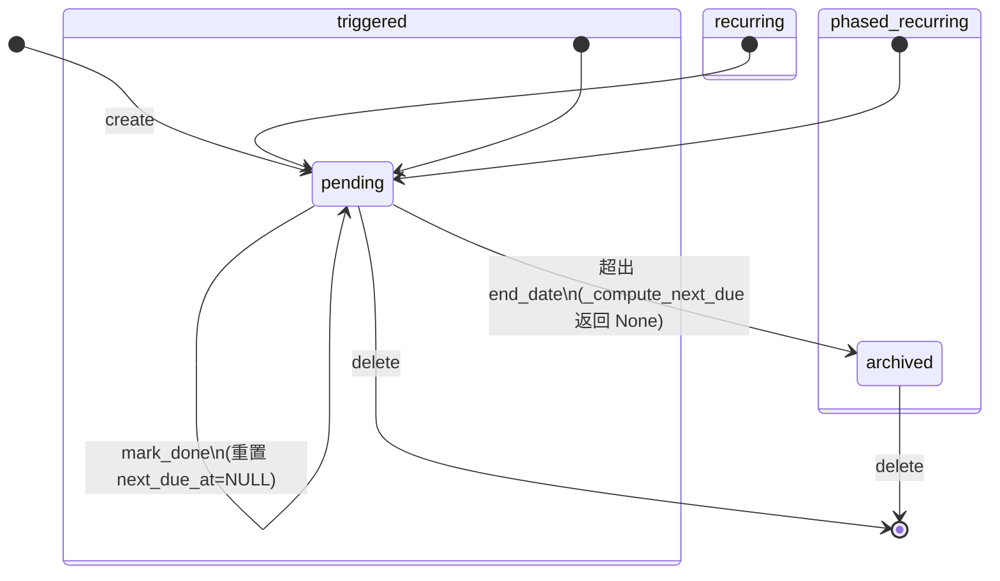
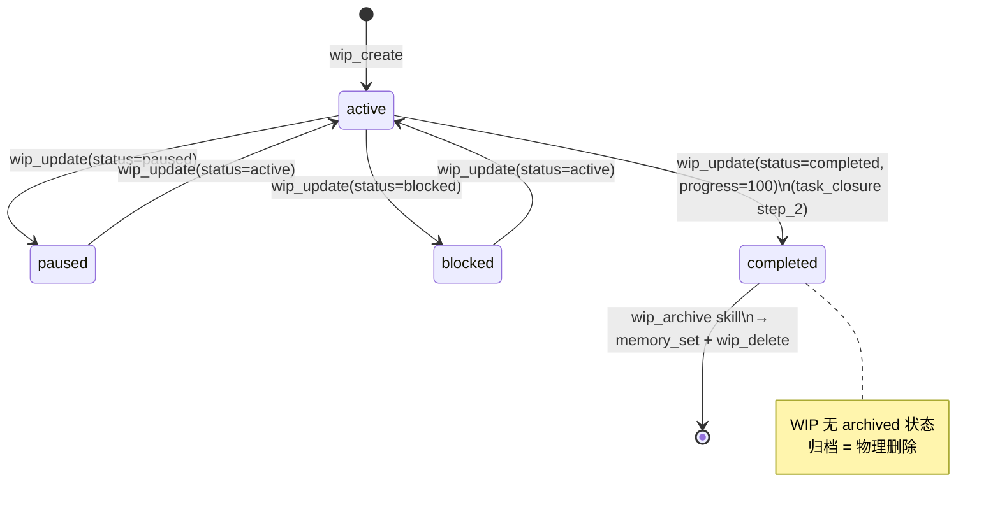

# 待办与 WIP 系统

本文档描述 server 端 todos（待办任务）和 WIP（Work In Progress，进行中工作）系统的架构、数据模型、生命周期、API 端点、与 task_closure 的整合机制。

## 1. 概述

todos 和 WIP 是两类不同的待办管理工具，**集成在同一模块** `server/todos/` 内（共享 memory.db，store 共享、router 同文件拆分为 wip_router）：

- **todos**：周期性或触发式任务，按 frequency 递推到期或事件触发
- **WIP**：一次性未完成工作，状态机管理（active/paused/blocked/completed），归档时物理删除

两者都通过 `related_memory_keys` JSON 数组与 memory facts 关联，task_closure 收尾时自动调用相关 API。

## 2. 模块结构

文件位置：[server/todos/](file:///<project_root>/server/todos/)

| 文件 | 类名/职责 |
|------|-----------|
| [__init__.py](file:///<project_root>/server/todos/__init__.py) | 模块导出 `TodosStore`、`router`、`wip_router`、`get_todos_store`。包含两类待办：Todos（周期性任务）和 WipTasks（一次性未完成工作），数据存于 memory.db 的 todos / wip_tasks 表 |
| [models.py](file:///<project_root>/server/todos/models.py) | Pydantic 数据模型层。定义 `TodoFrequency`（daily/weekly/monthly/quarterly）、`TodoStatus`（pending/in_progress/done/blocked/skipped/archived）、`WipStatus`（active/paused/blocked/completed）三个枚举，以及 `TodoCreate`/`TodoUpdate`/`TodoDoneRequest`/`WipTaskCreate`/`WipTaskUpdate` 五个请求模型。`TodoCreate` 含 `validate_type_specific_fields` 校验器按 type 强制专属字段 |
| [store.py](file:///<project_root>/server/todos/store.py) | SQLite 存储层 `TodosStore` 类（共享 memory.db）。负责 todos + wip_tasks 两张表的 CRUD，含 schema 定义（`TODOS_SCHEMA_SQL`）、幂等迁移（`_migrate_schema`）、JSON 字段序列化、到期计算（`_compute_next_due`）、触发检查（`check_trigger`）、统计（`get_stats`）。线程安全（`_write_lock`），WAL 模式 |
| [router.py](file:///<project_root>/server/todos/router.py) | FastAPI 路由层。定义 `router`（prefix=/todos）和 `wip_router`（prefix=/wip）两个 APIRouter。含 `get_todos_store()` 单例工厂（懒加载）。所有端点用 `asyncio.to_thread` 包裹同步 store 调用 |
| [migration.py](file:///<project_root>/server/todos/migration.py) | 从旧记忆系统迁移数据。`migrate_from_memory()` 幂等迁移 task_reminders→todos、wip_index + .agents/wip/*.json→wip_tasks（检查 schema_info 'todos_migrated' 标志） |

> **重要**：不存在独立的 `server/wip/` 目录，WIP 功能完全集成在 `server/todos/` 模块内。

## 3. Todo 三类型

枚举与校验位置：[models.py 第 31-66 行](file:///<project_root>/server/todos/models.py)（`TodoCreate.type` 字段 + `validate_type_specific_fields` 校验器）

### 3.1 类型对比

| 类型 | 触发机制 | 生命周期 | 示例 task_type |
|------|----------|----------|----------------|
| **recurring**（周期性） | 按 `frequency`（daily/weekly/monthly/quarterly）递推 `next_due_at`，`get_due_todos()` 判断 `next_due_at <= today` 或 `last_done_at` 为空 | pending → (mark_done) → pending（计算下次 next_due）→ ... 循环 | `recurring.daily_summary`、`recurring.life_design`、`recurring.accounting` 等组件化模块 |
| **phased_recurring**（分阶段周期性） | 同 recurring 递推，但限制在 `[start_date, end_date]` 区间内；`start_date > today` 时不 due；超出 end_date 后 `_compute_next_due` 返回 None → 置 `archived` | pending → (mark_done 循环) → 超出 end_date 后 archived（不再到期） | （强制需要 start_date + end_date + frequency 三字段） |
| **triggered**（触发式） | 不进 `todos_due` 列表；由 `TodosTriggerCheckAction`（loop 轮询）扫描 `trigger_condition.watch_dir` 下匹配 `pattern` 的新文件，调 `store.check_trigger` 触发；触发时置 `next_due_at=today` 标记"已触发待处理"，通过 `add_message` 推送 `/user/message` | pending → (触发，next_due_at=today) → pending（agent 处理后 mark_done 重置 next_due_at=NULL）→ 等下次事件 | 首版仅支持 `event=file_arrived` |

### 3.2 到期判断核心逻辑

[store.py 第 271-303 行](file:///<project_root>/server/todos/store.py) `get_due_todos()`：
- 只查 recurring + phased_recurring（**triggered 不进 due 列表**）
- 跳过 archived
- phased_recurring 在 start_date 之前不算 due
- 含 condition 且 condition_status=inactive 的跳过

### 3.3 mark_done 行为差异

[store.py 第 240-269 行](file:///<project_root>/server/todos/store.py)：
- **recurring**：计算 next_due
- **phased_recurring**：计算 next_due 但超出 end_date 置 archived
- **triggered**：不计算 next_due（重置为 NULL，等下次事件）

### 3.4 triggered 任务的 loop 轮询

文件：[server/activity_tracker/loop_actions.py](file:///<project_root>/server/activity_tracker/loop_actions.py)

类：`TodosTriggerCheckAction`（L1349），`action_type = "todos_trigger_check"`（L1357）

工作原理：
1. 扫描窗口 = `check_interval * 2`（默认 600 秒，避免漏检）
2. `store.list_todos(todo_type="triggered")` 取所有 triggered 任务
3. 对每个 todo 解析 `trigger_condition`，仅处理 `event=file_arrived`
4. `os.scandir(watch_dir)` 扫描匹配 `pattern` 且 `mtime > cutoff` 的新文件
5. 对新文件调 `store.check_trigger(todo_id, event_payload)`，触发后 `add_message` 推送 `/user/message` 给 agent
6. 单次最多触发 5 个文件，一个文件触发即 break 同一 todo

**触发后流转**：agent 收到 `/user/message` 推送 → 处理任务 → 调 `todos_mark_done` 重置 `next_due_at=NULL` → 等下次事件。

## 4. WIP 生命周期

状态枚举位置：[models.py 第 24-28 行](file:///<project_root>/server/todos/models.py) `WipStatus`

### 4.1 状态机

```
active ──暂停──> paused
   │                │
   │   ──恢复──>    │
   │                │
   └──阻塞──> blocked
   │
   └──完成──> completed ──wip_archive──> 物理删除（DELETE FROM wip_tasks）
```

**关键设计**：WIP **无 `archived` 状态**——归档 = 写入记忆系统 + 物理删除记录（`wip_delete`）。

### 4.2 状态说明

| 状态 | 含义 | 转换触发 |
|------|------|----------|
| `active` | 进行中（默认初始状态） | create 时自动；paused/blocked 恢复 |
| `paused` | 暂停 | active 暂停 |
| `blocked` | 阻塞（配合 `blocked_reason` 字段） | active 遇阻 |
| `completed` | 完成（progress 通常=100） | task_closure step_2 调 `wip_update(status=completed)` |

### 4.3 完整生命周期链路

`wip_create`(active) → `wip_update`(active/paused/blocked 来回) → `wip_update(status=completed)` →（用户触发 wip_archive skill）→ `wip_get` 提炼经验 → `memory_set` 写入 → `wip_delete` 物理删除。

### 4.4 关键代码位置

| 操作 | 位置 |
|------|------|
| `WipTaskCreate` 模型 | models.py 第 87-98 行 |
| `WipTaskUpdate` 模型（含 progress 0-100、status） | models.py 第 101-113 行 |
| `create_wip` | store.py 第 427-456 行 |
| `update_wip` | store.py 第 496-515 行 |
| `list_wip`（含 summary 轻量模式） | store.py 第 465-494 行 |
| `delete_wip` | store.py 第 517-521 行 |

## 5. task_closure 整合

Skill 文件：[.agents/skills/task_closure.md](file:///<project_root>/.agents/skills/task_closure.md)

task_type：`system.task_closure`（通过 `agent_guide(task_type='system.task_closure')` 获取 workflow）

### 5.1 6 步收尾流程

1. **step_1 评估任务状态**：完成 / 中断 / 无实质产出，决定后续步骤集。同时强制收回屏幕控制授权（`screen_release_control`）
2. **step_2 WIP 处理**：
   - 任务完成 → `wip_list` 按 tags/title 匹配 → `wip_update(id, {status: "completed", progress: 100})` 关闭
   - 任务中断 → `wip_create` 留档（必填 title/goal/progress/next_steps/current_state/related_skills/related_files）或 `wip_update` 更新现有 WIP
3. **step_3 经验提炼 + 可消费性自检**：识别 preference/project/reference 候选，**强制填** `consumption_contexts`（哪些 task_type 读）+ `trigger_keywords`（什么词触发读取），无法明确消费场景的跳过
4. **step_4 查重 + 写入**：`memory_list` 查重 → `memory_set(key, {data, merge: true})` 写结构化记忆
5. **step_5 文档自查**：对照 [project_rules.md](file:///<project_root>/.trae/rules/project_rules.md) 检查清单（路由注册/Pydantic/`/health`/硬编码/`_index.md`/`AGENTS.md`/`CHANGELOG.md`/`config.example.toml`/`tools_manifest.json`），不询问用户直接修小改或报告大改。ADR 评估 3/3 通过则写 ADR
6. **step_6 收尾报告**：向用户报告 WIP 处理 + 经验提炼（含消费场景）+ 文档自查结果

### 5.2 核心原则

- **agent 自主触发**：不等用户说"收尾"，开始有 guide，结束也有 guide
- **可消费性优先**：无消费场景不写入（存了没人用=垃圾）
- **编排不替代**：复用 memory_generation/wip_tracker 逻辑
- **无实质产出跳过**：避免无效收尾

### 5.3 与 WIP 模块的依赖关系

- task_closure step_2 调用 `wip_list` / `wip_create` / `wip_update`
- 与 `wip_archive` skill 的协调：task_closure 做单条收尾（`wip_update(status=completed)`），wip_archive 做周期性批量归档（`wip_delete`），wip_tracker 做日常 CRUD

## 6. API 端点表

路由文件：[server/todos/router.py](file:///<project_root>/server/todos/router.py)

路由注册：[server/main.py](file:///<project_root>/server/main.py) 第 281-282 行（`app.include_router(todos_router)` + `app.include_router(todos_wip_router)`）

### 6.1 Todos 端点（prefix=/todos）

| HTTP 方法 | 路径 | operation_id | 用途 |
|-----------|------|--------------|------|
| GET | `/todos` | `todos_list` | 列出所有待办，可按 status/todo_type 过滤 |
| POST | `/todos` | `todos_create` | 创建新待办（含 type 校验） |
| GET | `/todos/due` | `todos_due` | 返回所有到期周期任务（recurring + phased_recurring，**triggered 不进**） |
| GET | `/todos/{todo_id}` | `todos_get` | 获取待办详情 |
| PUT | `/todos/{todo_id}` | `todos_update` | 更新待办字段 |
| DELETE | `/todos/{todo_id}` | `todos_delete` | 删除待办 |
| POST | `/todos/{todo_id}/done` | `todos_mark_done` | 标记完成（更新 last_done_at + 计算 next_due_at，triggered 重置） |
| POST | `/todos/{todo_id}/check_trigger` | `todos_check_trigger` | 手动检查 triggered 任务触发条件（loop 自动调，也供 agent 主动触发） |

### 6.2 WIP 端点（prefix=/wip）

| HTTP 方法 | 路径 | operation_id | 用途 |
|-----------|------|--------------|------|
| GET | `/wip` | `wip_list` | 列出所有 WIP，可按 status 过滤；summary=true 只返回轻量字段（id/title/status/priority/progress/updated_at） |
| POST | `/wip` | `wip_create` | 创建 WIP 任务 |
| GET | `/wip/{task_id}` | `wip_get` | 获取 WIP 详情 |
| PUT | `/wip/{task_id}` | `wip_update` | 更新 WIP（status/progress/next_steps 等） |
| DELETE | `/wip/{task_id}` | `wip_delete` | 删除 WIP（wip_archive 归档后物理删除用） |

### 6.3 MCP 直连工具

高频查询走 MCP 直连免审批：
- `todos_due` / `wip_list` / `wip_get` 为直连 MCP 工具
- `wip_get` / `wip_delete` 走 `localagent_advanced_tool` 网关（见 [wip_archive.md](file:///<project_root>/.agents/skills/wip_archive.md)）

## 7. 数据表 Schema

定义位置：[store.py 第 13-57 行](file:///<project_root>/server/todos/store.py) `TODOS_SCHEMA_SQL`

### 7.1 todos 表

| 字段 | 类型 | 说明 |
|------|------|------|
| `id` | TEXT PK | 待办 ID |
| `title` | TEXT NOT NULL | 标题 |
| `skill` | TEXT | 关联 skill |
| `type` | TEXT NOT NULL DEFAULT 'recurring' | 类型（recurring/phased_recurring/triggered） |
| `status` | TEXT NOT NULL DEFAULT 'pending' | 状态（pending/in_progress/done/blocked/skipped/archived） |
| `frequency` | TEXT | 频率（daily/weekly/monthly/quarterly） |
| `last_done_at` | TEXT | 上次完成时间 |
| `next_due_at` | TEXT | 下次到期时间 |
| `condition` | TEXT | 条件表达式 |
| `condition_status` | TEXT | 条件状态（active/inactive） |
| `notes` | TEXT | 备注 |
| `related_memory_keys` | TEXT DEFAULT '[]' | 关联记忆 key JSON 数组 |
| `start_date` | TEXT | phased_recurring 专属：开始日期（ISO YYYY-MM-DD） |
| `end_date` | TEXT | phased_recurring 专属：结束日期 |
| `trigger_condition` | TEXT | triggered 专属：触发条件 JSON（如 `{"event":"file_arrived","watch_dir":"...","pattern":"*.csv"}`） |
| `created_at` / `updated_at` | TEXT | 时间戳（localtime） |

索引：`idx_todos_status` / `idx_todos_type` / `idx_todos_next_due`

### 7.2 wip_tasks 表

| 字段 | 类型 | 说明 |
|------|------|------|
| `id` | TEXT PK | WIP ID |
| `title` | TEXT NOT NULL | 标题 |
| `status` | TEXT NOT NULL DEFAULT 'active' | 状态（active/paused/blocked/completed） |
| `priority` | TEXT NOT NULL DEFAULT 'medium' | 优先级 |
| `goal` | TEXT DEFAULT '' | 目标 |
| `progress` | INTEGER DEFAULT 0 | 进度（0-100） |
| `tags` | TEXT DEFAULT '[]' | 标签 JSON 数组 |
| `next_steps` | TEXT DEFAULT '[]' | 下一步清单 JSON 数组 |
| `related_skills` | TEXT DEFAULT '[]' | 关联 skill JSON 数组 |
| `related_files` | TEXT DEFAULT '[]' | 关联文件 JSON 数组 |
| `current_state` | TEXT DEFAULT '{}' | 当前状态 JSON |
| `blocked_reason` | TEXT | 阻塞原因 |
| `related_memory_keys` | TEXT DEFAULT '[]' | 关联记忆 key JSON 数组 |
| `extra_data` | TEXT DEFAULT '{}' | 额外数据 JSON |
| `created_at` / `updated_at` | TEXT | 时间戳（localtime） |

索引：`idx_wip_status` / `idx_wip_priority`

### 7.3 关键设计点

- 两表共享 memory.db，通过 `related_memory_keys` JSON 数组与 memory facts 关联
- JSON 字段：todos 表 `related_memory_keys`；wip_tasks 表 `tags`/`next_steps`/`related_skills`/`related_files`/`current_state`/`related_memory_keys`/`extra_data`（store.py 第 83-87 行 `_TODO_JSON_FIELDS` / `_WIP_JSON_FIELDS`，读写时自动 `json.loads`/`json.dumps`）
- **幂等迁移**：store.py 第 60-66 行 `_ALTER_STATEMENTS` 列出 5 条 ALTER TABLE（condition_status、extra_data、start_date、end_date、trigger_condition），列已存在时忽略错误
- **triggered 类型专属字段**：`trigger_condition`（JSON 字符串）
- **phased_recurring 专属字段**：`start_date` + `end_date`（ISO YYYY-MM-DD）

## 8. 状态图

### 8.1 Todo 三类型生命周期



### 8.2 WIP 生命周期



## 9. 使用约定

### 9.1 不主动查询原则

文件：[AGENTS.md 第 109-117 行](file:///<project_root>/AGENTS.md) "关于到期任务与待办"段

- **不要在会话开始时主动调** `todos_due` / `wip_list` 检查到期任务或未完成工作，避免污染上下文
- 用户问"有什么任务"/"待办"/"上次没做完的" → 调 `agent_guide(task_type='system.task_reminder')`
- 用户问"上次做到哪了"/"未完成的工作" → 调 `wip_list(summary=true)` 只看摘要，需要详情再 `wip_get(id)`
- 用户确认要做某到期任务 → 按 task_reminder 指导执行，完成后调 `todos_mark_done`

### 9.2 模块变更检查清单

文件：[project_rules.md 第 192-200 行](file:///<project_root>/.trae/rules/project_rules.md) "待办模块变更"段

新增 todos/wip 端点时必查：
- [ ] 新端点是否在 `server/main.py` 中注册？
- [ ] `_mcp_include` 是否更新（高频查询 todos_due/wip_list/wip_get 直连）？
- [ ] `_CATEGORY_PREFIXES` 是否添加新前缀（todos_, wip_）？
- [ ] `/health` 是否返回 todos 状态？
- [ ] `agent_guide.py` 中相关条目的 first_action / mcp_tools_priority 是否更新？
- [ ] 涉及读详情/CRUD 的 task_type，first_action 是否提示用 `localagent_advanced_tool`（而非 exec_python 发 HTTP）？
- [ ] 启动时迁移逻辑是否幂等（检查 schema_info 标志）？

## 10. 相关文档

- [agent-guide.md](file:///<project_root>/docs/agent-guide.md) — 任务路由系统（task_closure / task_reminder / wip_archive 的 GUIDE_REGISTRY 条目）
- [chat-engine.md](file:///<project_root>/docs/chat-engine.md) — v6-lite 对话引擎架构
- [.agents/skills/task_closure.md](file:///<project_root>/.agents/skills/task_closure.md) — task_closure 6 步收尾流程详细规范
- [.agents/skills/wip_archive.md](file:///<project_root>/.agents/skills/wip_archive.md) — WIP 归档工作流
- [AGENTS.md "关于到期任务与待办"段](file:///<project_root>/AGENTS.md) — 不主动查询原则
- `server/todos/store.py` — SQLite 存储层（schema + CRUD + 到期计算 + 触发检查）
- `server/todos/router.py` — FastAPI 路由层（13 个端点）
